<div align="center">

<h3>الحمد لله رب العالمين، والصلاة والسلام على سيدنا محمد خاتم النبيين وإمام المرسلين</h3>

# Quran Ebook

</div>

<p align="center">
  <a href="../../releases/latest"></a>
</p>

<p align="center">
  <a href="screenshots/kahf-ar-no-margin-page.png">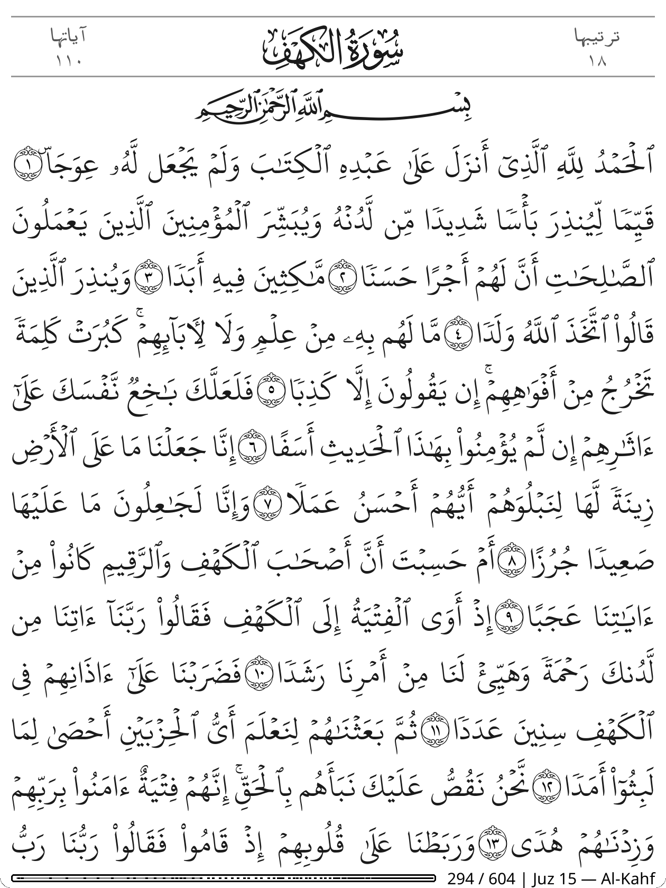</a>
  <a href="screenshots/kahf-ar-en.png">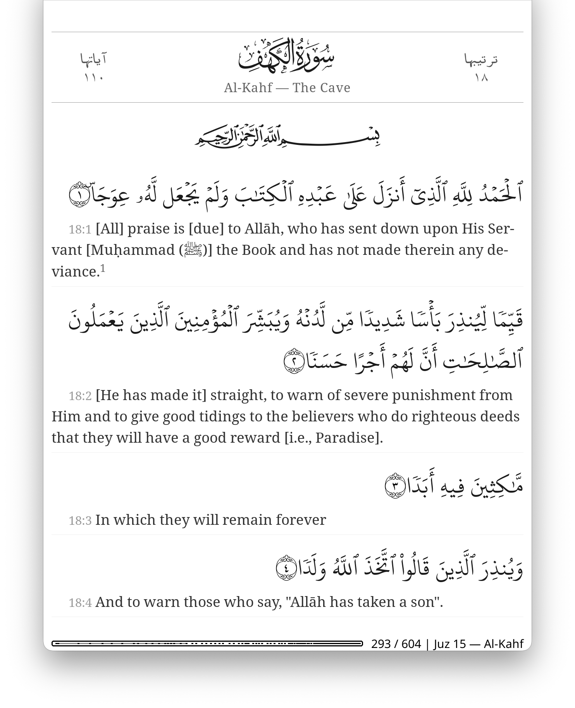</a>
  <a href="screenshots/ibrahim-wbw.png">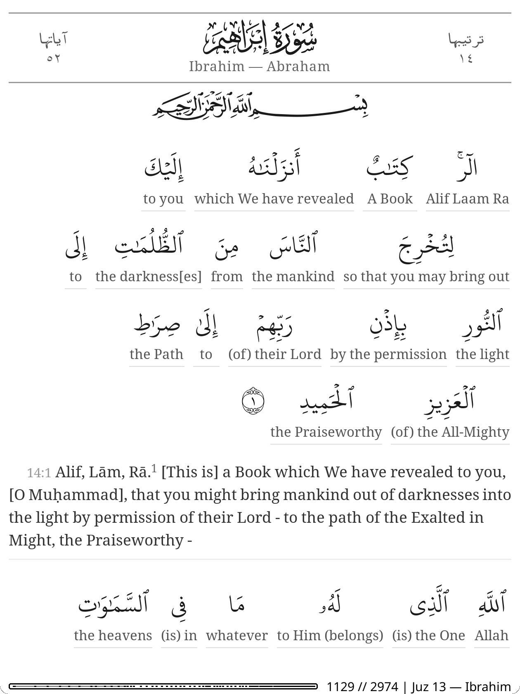</a>
</p>

Pre-built and reproducible Quran EPUBs with correct Arabic rendering, in 42 languages. 

**Download from the [EPUB table](#epubs)** below or see the **[latest release](../../releases/latest)**. 

Best used in **[KOReader](https://koreader.rocks/)**. See [KOReader Settings](#koreader-settings) for ***essential*** setup. 

Extra features with the [Quran Helper KOReader plugin](#koreader-plugin): Offline [WBW](#dictionary) and grammar dictionaries, tafsir & surah overview lookup, juz' and surah name in status bar, and more.

This tool uses validated script/font pairing to avoid the rendering bugs (broken sukun marks, mangled ligatures) common in other Quran EPUBs. Feedback and bug reports welcome — open a Feature Request for desired content or formats.

## Ebook Types

Each translation is available in up to three formats:

- **Bilingual** — Arabic and translation shown together, ayah by ayah. Best for studying or reading with a translation side by side.
- **Interactive** — Arabic text only, tap any ayah (number marker) to see the translation in a footnote popup. Best for reading the Arabic with occasional reference to the translation.
- **Word-by-Word** — Each Arabic word shown with its meaning directly below, forming visual word stacks. A full sentence translation follows each ayah. 8 languages have native word-level glosses; all translations also have an English-gloss WBW variant (plus Indonesian gloss for Malay). Best for vocabulary study and understanding how Arabic maps to the translation word by word.

There is also an **Arabic-only** EPUB with no translation — continuous flowing text. It is identical to the interactive version in visual layout.

All released EPUBs use Riwayat Hafs 'an 'Asim, anchored to the Madinah Mushaf (1405 AH / 604 pages). An experimental build for **Riwayat Warsh 'an Nafi'** is also available — see [Other Versions (Work in Progress)](#other-versions-work-in-progress) for details and known limitations.

<details><summary>Screenshots — Arabic, bilingual, interactive, word-by-word, multilingual</summary>

<p align="center">
  <a href="screenshots/kahf-ar-no-margin-page.png"></a>
  <a href="screenshots/muminun-ar-mid-surah.png">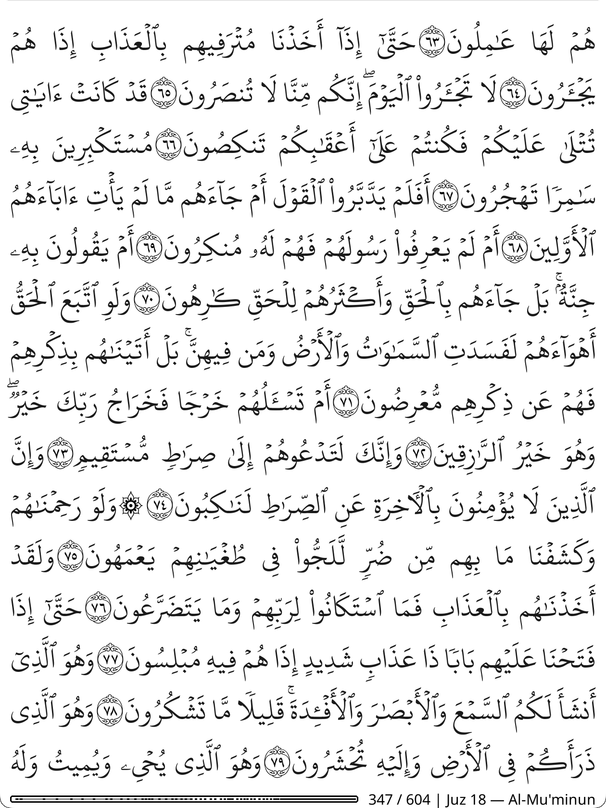</a>
  <a href="screenshots/kahf-ar-en.png"></a>
  <a href="screenshots/arrad-pop-up-trans-eng-sahih.png">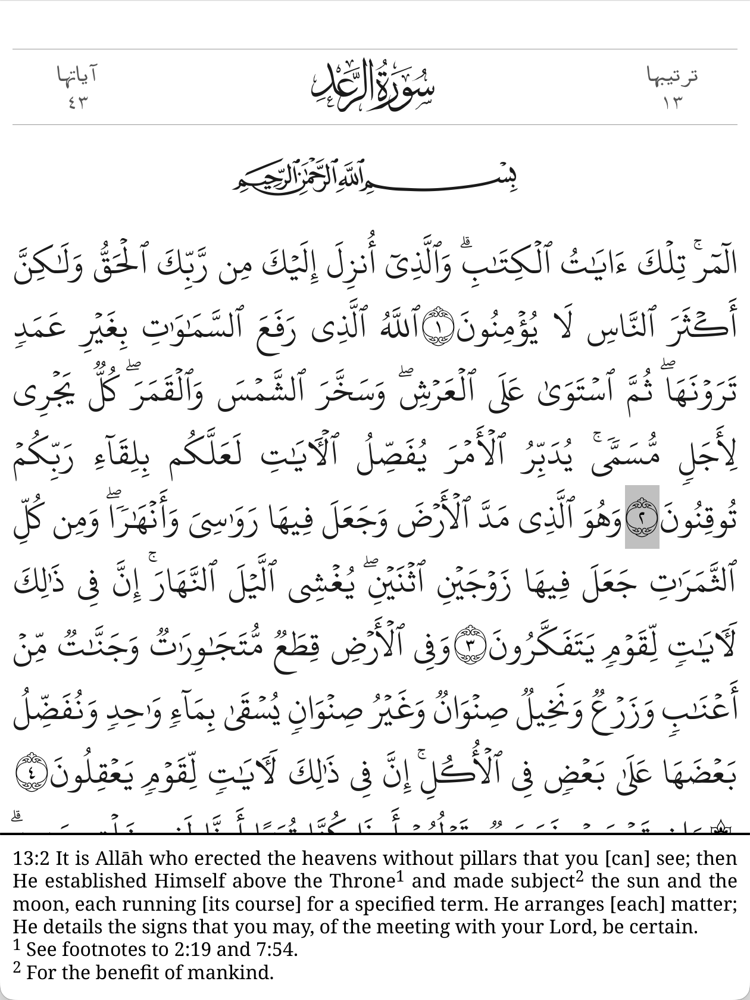</a>
  <a href="screenshots/fatiha-wbw.png">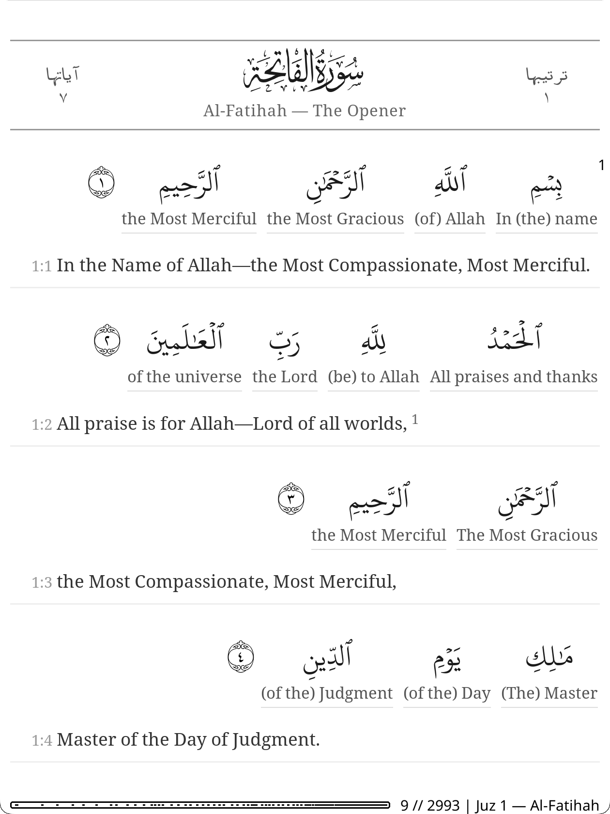</a>
  <a href="screenshots/chinese-biling.png"></a>
  <a href="screenshots/french-biling.png"></a>
  <a href="screenshots/turkish-biling.png">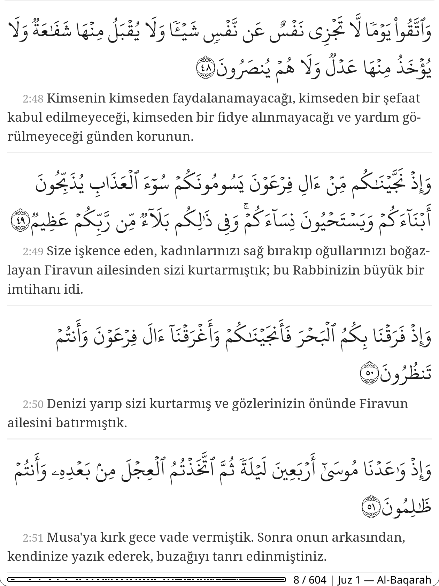</a>
  <a href="screenshots/bangla-biling.png">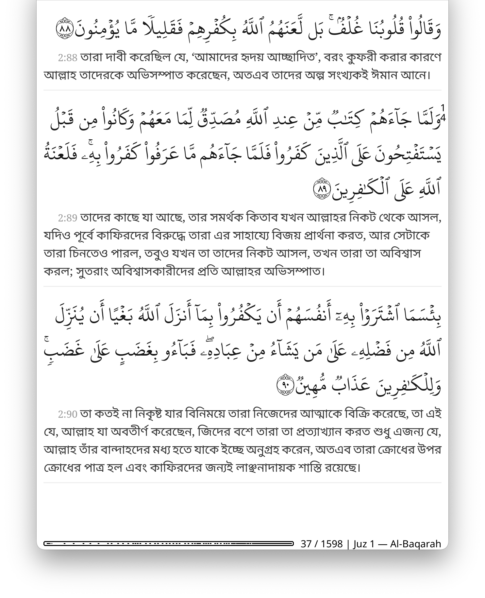</a>
</p>
</details>

## Reader Compatibility

These EPUBs use embedded Arabic fonts and EPUB3 features (like footnotes and interactive lookup) that most proprietary e-reader software does not handle well. In those cases, **[KOReader](https://koreader.rocks/)** is highly recommended — open-source, excellent Arabic rendering, runs on Android, Kobo, Kindle, PocketBook, and Linux.

See [KOReader Settings](#koreader-settings) for essential setup — footnote popups, RTL page turns, mushaf page numbers, and more.

- **Kobo:** Native reader struggles with Arabic. Install KOReader — no jailbreak needed.
- **Kindle:** Stock Kindle does not render Arabic EPUBs correctly. Requires [jailbreaking](https://kindlemodding.org/jailbreaking/) + KOReader.
- **Other e-readers:** Proprietary readers will likely have rendering errors.
- **Apple Books:** Mostly works well on iOS and macOS, no changes needed. Some features may not fully work.
- **Android e-readers:** Most popular e-reader software like Moon+ Reader, Readera, Librera, etc., have various formatting errors and issues with rendering. Use KOReader where possible.
- **Windows/Mac/Linux**: You can also use the Calibre ebook viewer, which mostly works fine.

NB: Translation text uses your e-reader's built-in serif font. For non-Latin scripts (Urdu, Bengali, Hindi, etc.), make sure your device has fonts for that script installed. KOReader ships with Noto fonts covering most scripts. The Quranic fonts are embedded in the EPUB itself.

### Updating EPUBs

Overwrite the old file with the new one, keeping the same filename. KOReader (and most e-readers) store your reading position, highlights, and settings separately — they will be preserved. Do **not** delete the book from within KOReader before replacing, as this will delete your data. After updating, you can force refresh metadata (cover, etc) by long-pressing the book in KOReader and selecting Refresh cached metadata.

### KOReader Settings
Essential Settings for a good reading experience. Footnote popups, RTL page turns, page numbers, and more

<details><summary> (Click to expand/collapse) </summary>

### **Important: Footnote popups**
 KOReader shows footnotes inline (on the page) by default, which breaks the layout of most EPUBs (Bilingual (annotated/with footnotes) and interactive versions) in this collection. Enable popups instead:

1. You must have a book open (be in Reader view). Some settings are per-book unless you long-press to set a new default
2. Disable in-page footnotes: Top Menu → Document icon → Style tweaks → In-page Footnotes → uncheck "In-page EPUB footnotes" (long-press and select "Don't use on all books" to disable for all books)
3. Enable popup footnotes: Top Menu → Gear icon → Taps and Gestures → Links → check "Show Footnotes in Popup"
4. Adjust popup font size: In the same Links menu, in Footnote popup settings, in "Footnote popup font size", lower the relative font size (-8 to -10 recommended) or use an absolute value (e.g. 14). This is because the default pop up font size is relative to 1em, and not to the (shrunken) inline translation in the EPUBs.
5. Tip: check "Allow larger area around links" in Links menu for easier footnote tapping

### **Overlap status bar**
Reclaims the bottom screen space used by the status bar — the bar overlaps the page content instead of shrinking the reading area:

1. You must have a book open (be in Reader view)
2. Top Menu → Gear icon → Status bar → check **Overlap status bar**

### **Margins**

1. You must have a book open (be in Reader view)
2. Bottom Menu → Crop icon → Adjust margins to taste

In cobination with Overlap status bar, this let's you fill the screen to the bottom.

### **Font Size**
Adjust the size of the font for the whole EPUB.

1. You must have a book open (be in Reader view)
2. Bottom Menu → Letter icon → Adjust font size to taste

### **Word spacing**
Makes justified full page content look denser if you prefer smaller/fewer gaps (Interactive and Arabic-only EPUBs):

1. You must have a book open (be in Reader view)
2. Bottom Menu → Letter icon → Word Spacing → Try out Small, or press Dot Menu → Change Scaling and Reduction to experiment.

### **Hide endnotes from page flow**
Bilingual and interactive — without this, the endnotes section appears as regular pages at the end of the book and in the status bar:

1. You must have a book open (be in Reader view) and the book must be compatibe (it must contain non-linear fragments) to see this setting
2. Top Menu → Bookmark icon → Settings → Hide non-linear fragments
3. Long-press the setting (after enabling it) to make it default for all books

### **Mushaf page numbers**
Shows the traditional 604-page Madinah Mushaf pagination in margins and/or status bar:

1. You must have a book open (be in Reader view)
2. Top Menu → Bookmark icon → Settings → Stable page numbers
3. Check "Use stable page numbers" for the status bar and TOC (KOReader counts the mushaf pages as the "real" pages, not the actual page turns you make on your ereader)
4. Check "Show stable page numbers in margin" for showing the mushaf pages in the right margin (at the line of the ayah that begins the mushaf page)
5. Default settings for new books → Pick the same settings as you picked above for Use stable page number and Show stable page numbers to make this the default

You can use one, both, or neither of these settings, depending on what you prefer

### **RTL page turns**
KOReader does not auto-detect RTL page direction from the EPUB. Without this, swiping goes the wrong way:

1. You must have a book open (be in Reader view). Setting is per-book unless you long-press to set a new default
2. Top Menu → Gear icon → Taps and Gestures → Page Turns → check **Invert page turn taps and swipes**
3. Physical buttons: Top Menu → Gear icon → Navigation → Physical Buttons → check **Invert page turn buttons** (this is useful if you read with the buttons on the bottom so they are left-right in orientation, i.e. landscape on devices with side buttons or portrait on devices with bottom buttons)

### **Line heights**
The EPUBs in this collection enforce steady line heights (1.7×) for consistent Arabic diacritic spacing regardless of diacritical complexity.

To adjust:
1. You must have a book open (be in Reader view). Setting is per-book unless you long-press to set a new default
2. Top Menu → Document icon → Style tweaks → Text → Line heights → check "Ignore publisher line heights" to revert to the font's natural line height
3. Combine 2 with a Override font-based normal line-height to set your own value

"Enforce steady line heights" toggle has no additional effect since the EPUB already enforces this.

### **Font weight**
KOReader does not add wight by default. If you feel the Arabic looks thin (not small, but lacking weight):

1. You must have a book open (be in Reader view). Setting is per-book unless you long-press to set a new default
2. Bottom Menu → Contrast icon → Font weight → try +1/2 or more

</details>

## EPUBs

### Arabic

| Riwayah | | |
|---------|---|---|
| Hafs | [epub](../../releases/latest/download/quran_hafs_kfgqpc_inline_ar.epub) | Continuous flowing text, no translation |
| Warsh (experimental) | [epub](../../releases/latest/download/quran_warsh_kfgqpc_inline_ar.epub) | Arabic-only, Riwayat Warsh 'an Nafi' — see [known limitations](#other-riwayat-work-in-progress) |

### English

| Translator | Bilingual | Interactive | WBW |
|-----------|:---------:|:-----------:|:-------------|
| Sahih International | [epub](../../releases/latest/download/quran_hafs_kfgqpc_bilin_ar-en-sahih.epub) | [epub](../../releases/latest/download/quran_hafs_kfgqpc_interactive_ar-en-sahih.epub) | [epub](../../releases/latest/download/quran_hafs_kfgqpc_wbw_ar-en-sahih.epub) |
| M.A.S. Abdel Haleem | [epub](../../releases/latest/download/quran_hafs_kfgqpc_bilin_ar-en-haleem.epub) | [epub](../../releases/latest/download/quran_hafs_kfgqpc_interactive_ar-en-haleem.epub) | [epub](../../releases/latest/download/quran_hafs_kfgqpc_wbw_ar-en-haleem.epub) |
| Sayyid Abul Ala Maududi (Tafhim ul-Quran) | [epub](../../releases/latest/download/quran_hafs_kfgqpc_bilin_ar-en-maududi.epub) | [epub](../../releases/latest/download/quran_hafs_kfgqpc_interactive_ar-en-maududi.epub) | [epub](../../releases/latest/download/quran_hafs_kfgqpc_wbw_ar-en-maududi.epub) |
| Dr. Mustafa Khattab / The Clear Quran | [epub](../../releases/latest/download/quran_hafs_kfgqpc_bilin_ar-en-khattab.epub) | [epub](../../releases/latest/download/quran_hafs_kfgqpc_interactive_ar-en-khattab.epub) | [epub](../../releases/latest/download/quran_hafs_kfgqpc_wbw_ar-en-khattab.epub) |
| Dr. Mustafa Khattab / The Clear Quran (annotated) | [epub](../../releases/latest/download/quran_hafs_kfgqpc_bilin_ar-en-khattab-fn.epub) | [epub](../../releases/latest/download/quran_hafs_kfgqpc_interactive_ar-en-khattab-fn.epub) | [epub](../../releases/latest/download/quran_hafs_kfgqpc_wbw_ar-en-khattab-fn.epub) |

### Other languages

<details><summary>Français, Deutsch, Español, Türkçe, اردو — Urdu, Bahasa Indonesia, Русский, বাংলা — Bengali</summary>

| Language | Translator | Bilingual | Interactive | WBW |
|----------|-----------|:---------:|:-----------:|:-------------|
| Français | Hamidullah | [epub](../../releases/latest/download/quran_hafs_kfgqpc_bilin_ar-fr-hamidullah.epub) | [epub](../../releases/latest/download/quran_hafs_kfgqpc_interactive_ar-fr-hamidullah.epub) | [epub](../../releases/latest/download/quran_hafs_kfgqpc_wbw_ar-fr-hamidullah_enwbw.epub)<sup>en wbw</sup> |
| Deutsch | Bubenheim & Elyas | [epub](../../releases/latest/download/quran_hafs_kfgqpc_bilin_ar-de-bubenheim.epub) | [epub](../../releases/latest/download/quran_hafs_kfgqpc_interactive_ar-de-bubenheim.epub) | [epub](../../releases/latest/download/quran_hafs_kfgqpc_wbw_ar-de-bubenheim_enwbw.epub)<sup>en wbw</sup> |
| Español | Isa Garcia | [epub](../../releases/latest/download/quran_hafs_kfgqpc_bilin_ar-es-garcia.epub) | [epub](../../releases/latest/download/quran_hafs_kfgqpc_interactive_ar-es-garcia.epub) | [epub](../../releases/latest/download/quran_hafs_kfgqpc_wbw_ar-es-garcia_enwbw.epub)<sup>en wbw</sup> |
| Türkçe | Diyanet İşleri | [epub](../../releases/latest/download/quran_hafs_kfgqpc_bilin_ar-tr-diyanet.epub) | [epub](../../releases/latest/download/quran_hafs_kfgqpc_interactive_ar-tr-diyanet.epub) | [epub](../../releases/latest/download/quran_hafs_kfgqpc_wbw_ar-tr-diyanet.epub)<br>[epub](../../releases/latest/download/quran_hafs_kfgqpc_wbw_ar-tr-diyanet_enwbw.epub)<sup>en wbw</sup> |
| اردو — Urdu | Jalandhari | [epub](../../releases/latest/download/quran_hafs_kfgqpc_bilin_ar-ur-jalandhari.epub) | [epub](../../releases/latest/download/quran_hafs_kfgqpc_interactive_ar-ur-jalandhari.epub) | [epub](../../releases/latest/download/quran_hafs_kfgqpc_wbw_ar-ur-jalandhari.epub)<br>[epub](../../releases/latest/download/quran_hafs_kfgqpc_wbw_ar-ur-jalandhari_enwbw.epub)<sup>en wbw</sup> |
| اردو — Urdu | Sayyid Abul Ala Maududi (Tafheem-ul-Quran) | [epub](../../releases/latest/download/quran_hafs_kfgqpc_bilin_ar-ur-maududi.epub) | [epub](../../releases/latest/download/quran_hafs_kfgqpc_interactive_ar-ur-maududi.epub) | [epub](../../releases/latest/download/quran_hafs_kfgqpc_wbw_ar-ur-maududi.epub)<br>[epub](../../releases/latest/download/quran_hafs_kfgqpc_wbw_ar-ur-maududi_enwbw.epub)<sup>en wbw</sup> |
| Bahasa Indonesia | Kementerian Agama | [epub](../../releases/latest/download/quran_hafs_kfgqpc_bilin_ar-id-ministry.epub) | [epub](../../releases/latest/download/quran_hafs_kfgqpc_interactive_ar-id-ministry.epub) | [epub](../../releases/latest/download/quran_hafs_kfgqpc_wbw_ar-id-ministry.epub)<br>[epub](../../releases/latest/download/quran_hafs_kfgqpc_wbw_ar-id-ministry_enwbw.epub)<sup>en wbw</sup> |
| Русский | Kuliev | [epub](../../releases/latest/download/quran_hafs_kfgqpc_bilin_ar-ru-kuliev.epub) | [epub](../../releases/latest/download/quran_hafs_kfgqpc_interactive_ar-ru-kuliev.epub) | [epub](../../releases/latest/download/quran_hafs_kfgqpc_wbw_ar-ru-kuliev_enwbw.epub)<sup>en wbw</sup> |
| বাংলা — Bengali | Taisirul Quran | [epub](../../releases/latest/download/quran_hafs_kfgqpc_bilin_ar-bn-taisirul.epub) | [epub](../../releases/latest/download/quran_hafs_kfgqpc_interactive_ar-bn-taisirul.epub) | [epub](../../releases/latest/download/quran_hafs_kfgqpc_wbw_ar-bn-taisirul.epub)<br>[epub](../../releases/latest/download/quran_hafs_kfgqpc_wbw_ar-bn-taisirul_enwbw.epub)<sup>en wbw</sup> |

</details>

<details><summary>فارسی — Persian, Bahasa Melayu, Português, Italiano, Nederlands, Norsk, Svenska, Bosanski, Soomaali, Hausa, Fulfulde, Kiswahili</summary>

| Language | Translator | Bilingual | Interactive | WBW |
|----------|-----------|:---------:|:-----------:|:-------------|
| فارسی — Persian | Hussein Taji Kal Dari | [epub](../../releases/latest/download/quran_hafs_kfgqpc_bilin_ar-fa-dari.epub) | [epub](../../releases/latest/download/quran_hafs_kfgqpc_interactive_ar-fa-dari.epub) | [epub](../../releases/latest/download/quran_hafs_kfgqpc_wbw_ar-fa-dari.epub)<br>[epub](../../releases/latest/download/quran_hafs_kfgqpc_wbw_ar-fa-dari_enwbw.epub)<sup>en wbw</sup> |
| Bahasa Melayu | Abdullah Muhammad Basmeih | [epub](../../releases/latest/download/quran_hafs_kfgqpc_bilin_ar-ms-basmeih.epub) | [epub](../../releases/latest/download/quran_hafs_kfgqpc_interactive_ar-ms-basmeih.epub) | [epub](../../releases/latest/download/quran_hafs_kfgqpc_wbw_ar-ms-basmeih_enwbw.epub)<sup>en wbw</sup><br>[epub](../../releases/latest/download/quran_hafs_kfgqpc_wbw_ar-ms-basmeih_idwbw.epub)<sup>id wbw</sup> |
| Português | Helmi Nasr | [epub](../../releases/latest/download/quran_hafs_kfgqpc_bilin_ar-pt-nasr.epub) | [epub](../../releases/latest/download/quran_hafs_kfgqpc_interactive_ar-pt-nasr.epub) | [epub](../../releases/latest/download/quran_hafs_kfgqpc_wbw_ar-pt-nasr_enwbw.epub)<sup>en wbw</sup> |
| Italiano | Hamza Roberto Piccardo | [epub](../../releases/latest/download/quran_hafs_kfgqpc_bilin_ar-it-piccardo.epub) | [epub](../../releases/latest/download/quran_hafs_kfgqpc_interactive_ar-it-piccardo.epub) | [epub](../../releases/latest/download/quran_hafs_kfgqpc_wbw_ar-it-piccardo_enwbw.epub)<sup>en wbw</sup> |
| Nederlands | Sofian S. Siregar | [epub](../../releases/latest/download/quran_hafs_kfgqpc_bilin_ar-nl-siregar.epub) | [epub](../../releases/latest/download/quran_hafs_kfgqpc_interactive_ar-nl-siregar.epub) | [epub](../../releases/latest/download/quran_hafs_kfgqpc_wbw_ar-nl-siregar_enwbw.epub)<sup>en wbw</sup> |
| Norsk | Einar Berg | [epub](../../releases/latest/download/quran_hafs_kfgqpc_bilin_ar-no-berg.epub) | [epub](../../releases/latest/download/quran_hafs_kfgqpc_interactive_ar-no-berg.epub) | [epub](../../releases/latest/download/quran_hafs_kfgqpc_wbw_ar-no-berg_enwbw.epub)<sup>en wbw</sup> |
| Svenska | Knut Bernström | [epub](../../releases/latest/download/quran_hafs_kfgqpc_bilin_ar-sv-bernstrom.epub) | [epub](../../releases/latest/download/quran_hafs_kfgqpc_interactive_ar-sv-bernstrom.epub) | [epub](../../releases/latest/download/quran_hafs_kfgqpc_wbw_ar-sv-bernstrom_enwbw.epub)<sup>en wbw</sup> |
| Bosanski | Besim Korkut | [epub](../../releases/latest/download/quran_hafs_kfgqpc_bilin_ar-bs-korkut.epub) | [epub](../../releases/latest/download/quran_hafs_kfgqpc_interactive_ar-bs-korkut.epub) | [epub](../../releases/latest/download/quran_hafs_kfgqpc_wbw_ar-bs-korkut_enwbw.epub)<sup>en wbw</sup> |
| Soomaali | Mahmud Muhammad Abduh | [epub](../../releases/latest/download/quran_hafs_kfgqpc_bilin_ar-so-abduh.epub) | [epub](../../releases/latest/download/quran_hafs_kfgqpc_interactive_ar-so-abduh.epub) | [epub](../../releases/latest/download/quran_hafs_kfgqpc_wbw_ar-so-abduh_enwbw.epub)<sup>en wbw</sup> |
| Hausa | Abubakar Mahmoud Gumi | [epub](../../releases/latest/download/quran_hafs_kfgqpc_bilin_ar-ha-gumi.epub) | [epub](../../releases/latest/download/quran_hafs_kfgqpc_interactive_ar-ha-gumi.epub) | [epub](../../releases/latest/download/quran_hafs_kfgqpc_wbw_ar-ha-gumi_enwbw.epub)<sup>en wbw</sup> |
| Fulfulde — Fula | Rowad Translation Center | [epub](../../releases/latest/download/quran_hafs_kfgqpc_bilin_ar-ff-ruwwad.epub) | [epub](../../releases/latest/download/quran_hafs_kfgqpc_interactive_ar-ff-ruwwad.epub) | [epub](../../releases/latest/download/quran_hafs_kfgqpc_wbw_ar-ff-ruwwad_enwbw.epub)<sup>en wbw</sup> |
| Kiswahili | Ali Muhsin Al-Barwani | [epub](../../releases/latest/download/quran_hafs_kfgqpc_bilin_ar-sw-barwani.epub) | [epub](../../releases/latest/download/quran_hafs_kfgqpc_interactive_ar-sw-barwani.epub) | [epub](../../releases/latest/download/quran_hafs_kfgqpc_wbw_ar-sw-barwani_enwbw.epub)<sup>en wbw</sup> |

</details>

<details><summary>हिन्दी — Hindi, தமிழ் — Tamil, മലയാളം — Malayalam, پښتو — Pashto, کوردی — Kurdish, ئۇيغۇرچە — Uyghur, 中文, 한국어, 日本語, ไทย, Tiếng Việt, Filipino</summary>

| Language | Translator | Bilingual | Interactive | WBW |
|----------|-----------|:---------:|:-----------:|:-------------|
| हिन्दी — Hindi | Maulana Azizul Haque al-Umari | [epub](../../releases/latest/download/quran_hafs_kfgqpc_bilin_ar-hi-umari.epub) | [epub](../../releases/latest/download/quran_hafs_kfgqpc_interactive_ar-hi-umari.epub) | [epub](../../releases/latest/download/quran_hafs_kfgqpc_wbw_ar-hi-umari.epub)<br>[epub](../../releases/latest/download/quran_hafs_kfgqpc_wbw_ar-hi-umari_enwbw.epub)<sup>en wbw</sup> |
| தமிழ் — Tamil | Abdul Hameed Baqavi | [epub](../../releases/latest/download/quran_hafs_kfgqpc_bilin_ar-ta-baqavi.epub) | [epub](../../releases/latest/download/quran_hafs_kfgqpc_interactive_ar-ta-baqavi.epub) | [epub](../../releases/latest/download/quran_hafs_kfgqpc_wbw_ar-ta-baqavi.epub)<br>[epub](../../releases/latest/download/quran_hafs_kfgqpc_wbw_ar-ta-baqavi_enwbw.epub)<sup>en wbw</sup> |
| മലയാളം — Malayalam | Abdul Hameed & Kunhi Mohammed | [epub](../../releases/latest/download/quran_hafs_kfgqpc_bilin_ar-ml-hameed.epub) | [epub](../../releases/latest/download/quran_hafs_kfgqpc_interactive_ar-ml-hameed.epub) | [epub](../../releases/latest/download/quran_hafs_kfgqpc_wbw_ar-ml-hameed_enwbw.epub)<sup>en wbw</sup> |
| پښتو — Pashto | Zakaria Abulsalam | [epub](../../releases/latest/download/quran_hafs_kfgqpc_bilin_ar-ps-abulsalam.epub) | [epub](../../releases/latest/download/quran_hafs_kfgqpc_interactive_ar-ps-abulsalam.epub) | [epub](../../releases/latest/download/quran_hafs_kfgqpc_wbw_ar-ps-abulsalam_enwbw.epub)<sup>en wbw</sup> |
| کوردی — Kurdish | Muhammad Saleh Bamoki | [epub](../../releases/latest/download/quran_hafs_kfgqpc_bilin_ar-ku-bamoki.epub) | [epub](../../releases/latest/download/quran_hafs_kfgqpc_interactive_ar-ku-bamoki.epub) | [epub](../../releases/latest/download/quran_hafs_kfgqpc_wbw_ar-ku-bamoki_enwbw.epub)<sup>en wbw</sup> |
| ئۇيغۇرچە — Uyghur | Muhammad Saleh | [epub](../../releases/latest/download/quran_hafs_kfgqpc_bilin_ar-ug-saleh.epub) | [epub](../../releases/latest/download/quran_hafs_kfgqpc_interactive_ar-ug-saleh.epub) | [epub](../../releases/latest/download/quran_hafs_kfgqpc_wbw_ar-ug-saleh_enwbw.epub)<sup>en wbw</sup> |
| 中文 — Chinese | Ma Jian | [epub](../../releases/latest/download/quran_hafs_kfgqpc_bilin_ar-zh-majian.epub) | [epub](../../releases/latest/download/quran_hafs_kfgqpc_interactive_ar-zh-majian.epub) | [epub](../../releases/latest/download/quran_hafs_kfgqpc_wbw_ar-zh-majian_enwbw.epub)<sup>en wbw</sup> |
| 한국어 — Korean | Hamed Choi | [epub](../../releases/latest/download/quran_hafs_kfgqpc_bilin_ar-ko-choi.epub) | [epub](../../releases/latest/download/quran_hafs_kfgqpc_interactive_ar-ko-choi.epub) | [epub](../../releases/latest/download/quran_hafs_kfgqpc_wbw_ar-ko-choi_enwbw.epub)<sup>en wbw</sup> |
| 日本語 — Japanese | Saeed Sato | [epub](../../releases/latest/download/quran_hafs_kfgqpc_bilin_ar-ja-sato.epub) | [epub](../../releases/latest/download/quran_hafs_kfgqpc_interactive_ar-ja-sato.epub) | [epub](../../releases/latest/download/quran_hafs_kfgqpc_wbw_ar-ja-sato_enwbw.epub)<sup>en wbw</sup> |
| ไทย — Thai | King Fahad Quran Complex | [epub](../../releases/latest/download/quran_hafs_kfgqpc_bilin_ar-th-fahad.epub) | [epub](../../releases/latest/download/quran_hafs_kfgqpc_interactive_ar-th-fahad.epub) | [epub](../../releases/latest/download/quran_hafs_kfgqpc_wbw_ar-th-fahad_enwbw.epub)<sup>en wbw</sup> |
| Tiếng Việt | Ruwwad Center | [epub](../../releases/latest/download/quran_hafs_kfgqpc_bilin_ar-vi-ruwwad.epub) | [epub](../../releases/latest/download/quran_hafs_kfgqpc_interactive_ar-vi-ruwwad.epub) | [epub](../../releases/latest/download/quran_hafs_kfgqpc_wbw_ar-vi-ruwwad_enwbw.epub)<sup>en wbw</sup> |
| Filipino | Dar Al-Salam Center | [epub](../../releases/latest/download/quran_hafs_kfgqpc_bilin_ar-tl-darsalam.epub) | [epub](../../releases/latest/download/quran_hafs_kfgqpc_interactive_ar-tl-darsalam.epub) | [epub](../../releases/latest/download/quran_hafs_kfgqpc_wbw_ar-tl-darsalam_enwbw.epub)<sup>en wbw</sup> |

</details>

<details><summary>Azərbaycanca, Oʻzbekcha, Тоҷикӣ — Tajik, Қазақша — Kazakh, Shqip — Albanian, Polski, Українська — Ukrainian, አማርኛ — Amharic, Yorùbá</summary>

| Language | Translator | Bilingual | Interactive | WBW |
|----------|-----------|:---------:|:-----------:|:-------------|
| Azərbaycanca | Alikhan Musayev | [epub](../../releases/latest/download/quran_hafs_kfgqpc_bilin_ar-az-musayev.epub) | [epub](../../releases/latest/download/quran_hafs_kfgqpc_interactive_ar-az-musayev.epub) | [epub](../../releases/latest/download/quran_hafs_kfgqpc_wbw_ar-az-musayev_enwbw.epub)<sup>en wbw</sup> |
| Oʻzbekcha | Muhammad Sodiq Muhammad Yusuf | [epub](../../releases/latest/download/quran_hafs_kfgqpc_bilin_ar-uz-yusuf.epub) | [epub](../../releases/latest/download/quran_hafs_kfgqpc_interactive_ar-uz-yusuf.epub) | [epub](../../releases/latest/download/quran_hafs_kfgqpc_wbw_ar-uz-yusuf_enwbw.epub)<sup>en wbw</sup> |
| Тоҷикӣ — Tajik | Khawaja Mirof & Khawaja Mir | [epub](../../releases/latest/download/quran_hafs_kfgqpc_bilin_ar-tg-mirof.epub) | [epub](../../releases/latest/download/quran_hafs_kfgqpc_interactive_ar-tg-mirof.epub) | [epub](../../releases/latest/download/quran_hafs_kfgqpc_wbw_ar-tg-mirof_enwbw.epub)<sup>en wbw</sup> |
| Қазақша — Kazakh | Khalifa Altay | [epub](../../releases/latest/download/quran_hafs_kfgqpc_bilin_ar-kk-altay.epub) | [epub](../../releases/latest/download/quran_hafs_kfgqpc_interactive_ar-kk-altay.epub) | [epub](../../releases/latest/download/quran_hafs_kfgqpc_wbw_ar-kk-altay_enwbw.epub)<sup>en wbw</sup> |
| Shqip — Albanian | Sherif Ahmeti | [epub](../../releases/latest/download/quran_hafs_kfgqpc_bilin_ar-sq-ahmeti.epub) | [epub](../../releases/latest/download/quran_hafs_kfgqpc_interactive_ar-sq-ahmeti.epub) | [epub](../../releases/latest/download/quran_hafs_kfgqpc_wbw_ar-sq-ahmeti_enwbw.epub)<sup>en wbw</sup> |
| Polski | Józef Bielawski | [epub](../../releases/latest/download/quran_hafs_kfgqpc_bilin_ar-pl-bielawski.epub) | [epub](../../releases/latest/download/quran_hafs_kfgqpc_interactive_ar-pl-bielawski.epub) | [epub](../../releases/latest/download/quran_hafs_kfgqpc_wbw_ar-pl-bielawski_enwbw.epub)<sup>en wbw</sup> |
| Українська — Ukrainian | Dr. Mikhailo Yaqubovic | [epub](../../releases/latest/download/quran_hafs_kfgqpc_bilin_ar-uk-yaqubovic.epub) | [epub](../../releases/latest/download/quran_hafs_kfgqpc_interactive_ar-uk-yaqubovic.epub) | [epub](../../releases/latest/download/quran_hafs_kfgqpc_wbw_ar-uk-yaqubovic_enwbw.epub)<sup>en wbw</sup> |
| አማርኛ — Amharic | Sadiq and Sani | [epub](../../releases/latest/download/quran_hafs_kfgqpc_bilin_ar-am-sadiq.epub) | [epub](../../releases/latest/download/quran_hafs_kfgqpc_interactive_ar-am-sadiq.epub) | [epub](../../releases/latest/download/quran_hafs_kfgqpc_wbw_ar-am-sadiq_enwbw.epub)<sup>en wbw</sup> |
| Yorùbá | Shaykh Abu Rahimah Mikael Aykyuni | [epub](../../releases/latest/download/quran_hafs_kfgqpc_bilin_ar-yo-mikael.epub) | [epub](../../releases/latest/download/quran_hafs_kfgqpc_interactive_ar-yo-mikael.epub) | [epub](../../releases/latest/download/quran_hafs_kfgqpc_wbw_ar-yo-mikael_enwbw.epub)<sup>en wbw</sup> |

</details>

Word-by-Word download links: **epub** = native-language word gloss, **epub**<sup>en wbw</sup> = English word gloss, **epub**<sup>id wbw</sup> = Indonesian word gloss. Cross-language WBW pairs English (or Indonesian) word-level meanings with a full sentence translation in the target language — useful for readers who understand basic English vocabulary but prefer reading a translation in their own language.

Many translations include translator footnotes where the source data provides them (Sahih International, Hamidullah, Garcia, Hamza Roberto Piccardo, Nasr, and others). Editions marked "with commentary" or "annotated" have especially extensive notes — Tafhim ul-Quran includes Sayyid Abul Ala Maududi's full tafseer-style commentary, and the annotated Clear Quran has 1,270 scholarly footnotes. See [KOReader Settings](#koreader-settings) for footnote popup setup.

**Note on Maududi footnotes:** A small number (~9%) of Tafhim ul-Quran footnotes are truncated in the upstream source data (ending mid-sentence). This is a known issue in the digitized text that all online sources share — not specific to this project.

## Dictionary

Optional English word-by-word StarDict dictionary for KOReader. Long-press any Quranic word while reading to see:

- **Translation** — English word meaning (from Quran.com word-by-word data)
- **Transliteration** — Latin script pronunciation
- **Morphology** — part of speech (Arabic + English), grammatical case/mood, gender/number/person, verb form and pattern (wazn)
- **Lemma and root** — dictionary form and Arabic root letters
- **Root definition** — Lane's Lexicon summary for the root

<details><summary>Screenshot — dictionary popup</summary>

<p align="center">
  <a href="screenshots/kahf-ar-dictionary-kitab.png">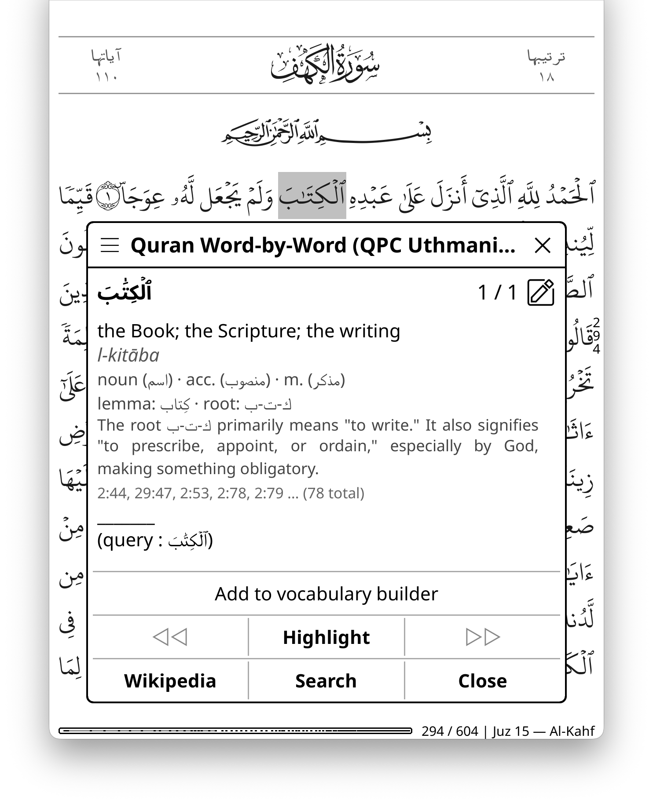</a>
</p>
</details>

22,000+ entries covering every word in the Quran. Headwords use QPC Uthmani Hafs encoding — the same script as the EPUBs above. Other Quran text encodings will not match. This is a standard StarDict dictionary — no plugin required.

**Install:** Download [`quran_qpc_en_stardict_v1.2.zip`](../../raw/main/release/quran_qpc_en_stardict_v1.2.zip) (1.3 MB), unzip into KOReader's `data/dict/` folder (creates a `quran_qpc_en/` subfolder). Subfolder names and nesting does not matter as long as the files are in the `dict` folder. Restart KOReader.

| Platform | Path |
|----------|------|
| Android | `/sdcard/koreader/data/dict/` |
| Kobo | `/mnt/onboard/.adds/koreader/data/dict/` |
| Kindle | `/mnt/us/koreader/data/dict/` |
| Desktop | `~/.config/koreader/data/dict/` |

```
koreader
└── data
    └── dict
        └── quran_qpc_en
            ├── quran_qpc_en.dict
            ├── quran_qpc_en.idx
            └── quran_qpc_en.ifo
```

You can sort your dictionaries in Top menu → Magnifying glass icon → Settings → Dictionary settings. Here you can also set book-specific preferences for the open book.

**Build your own:** `python tools/build_dictionary.py` (requires cached data from Quran.com API, morphology corpus, and Lane's Lexicon — see script for details).

**Known upstream data issues:**
- Transliteration from Quran.com API omits hamza (شَآءَ → `shāa` instead of `shā'a`) and sometimes drops shaddah doubling (ٱلۡحَقُّ → `l-ḥaqu` instead of `l-ḥaqqu`)
- Root definitions from Lane's Lexicon are per-root, not per-lemma — a verb and its derived noun share the same root gloss (e.g. شَآءَ "to will" shows the root شيأ gloss for "thing")
- QPC repurposes three Unicode codepoints for tanween variants (U+0657 for open fathatan, U+065E for open dammatan, U+0656 for kasratan) with custom glyphs in the QPC font. KOReader's dictionary popup uses a standard Arabic font, which renders these as their literal Unicode glyphs (inverted damma, fatha-with-dots, subscript alef). The dictionary builder normalizes headwords to standard tanween (U+064B, U+064C, U+064D) for correct rendering, and includes the original QPC forms as synonym keys for backward compatibility. With the KOReader plugin installed, lookups are normalized automatically for exact matching. Without the plugin, the QPC synonym keys provide exact matching with the original (cosmetically incorrect) rendering

## KOReader Plugin

The **Quran Helper** plugin (v1.6) adds four features to KOReader: juz' (and surah) info in KOReader's status bar, grammar dictionary and i'rab lookup, surah overview lookup, and tafsir (commentary) lookup.

### Install

Download [`quran_koplugin_v1.7.zip`](../../raw/main/release/quran_koplugin_v1.7.zip) (15 KB), unzip `quran.koplugin/` into KOReader's `plugins/` folder:

| Platform | Path |
|----------|------|
| Android | `/sdcard/koreader/plugins/` |
| Kobo | `/mnt/onboard/.adds/koreader/plugins/` |
| Kindle | `/mnt/us/koreader/plugins/` |
| Desktop | `~/.config/koreader/plugins/` |

For the plugin to be installed correctly, the file structure should look like this (no nested folder, and foldername must be `quran.koplugin` exactly; remove "-main" or similar if you downloaded the zip from head):
```
koreader
└── plugins
    └── quran.koplugin
        ├── _meta.lua
        ├── main.lua
        └── ...
```

Restart KOReader. Go to Top Menu → Tool icon → Quran Helper to configure.

### Juz Status Bar

Shows the current juz in KOReader's footer status bar while reading.

- Six juz display formats: `جزء ٣` (default), `Juz 3`, Arabic name (`تلك الرسل`), Arabic name with جزء (`جزء تلك الرسل`), Latin name (`Tilkar-Rusul`), Latin name with Juz' (`Juz' Tilkar-Rusul`)
- Optional surah name appended (off by default), e.g. `جزء ٣ — البقرة` or `Juz 3 — Al-Baqarah`, with five format options including سورة/Surat prefix variants
- Boundary indicator (`*`) when a new juz begins on the current page (e.g., `جزء ٣*`)

**Enable juz' title in status bar** — the juz display is on by default in the plugin, but KOReader needs "External content" enabled in the status bar to show it:

1. You must have a book open (be in Reader view)
2. Top Menu → Gear icon → Status bar → Status bar items → check **External content**. After this you can change the plugin settings on-the-fly.

You can also sort the status bar items in this menu.

<details><summary>Screenshots — status bar, plugin settings</summary>

<p align="center">
  <a href="screenshots/annaml-juzborder-regularpagenumbers-marginso-on.png">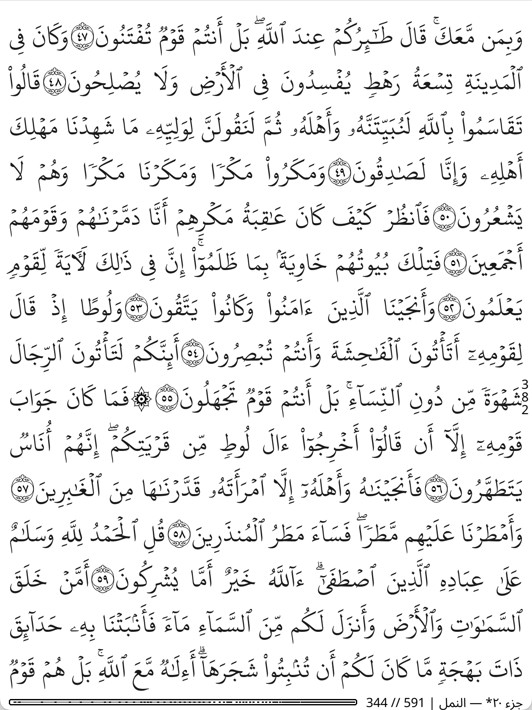</a>
  <a href="screenshots/plugin-settings.png">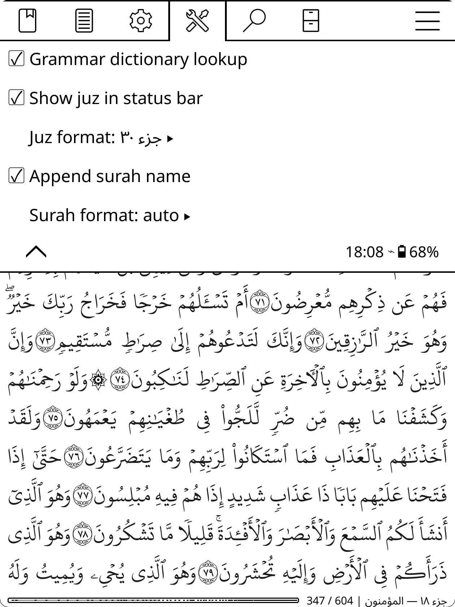</a>
</p>
</details>

**Plugin settings** — configure juz format, surah name display, and other options:

1. You should have a book open (be in Reader view) and status bar visible to see the results immediately for testing
2. Top Menu → Tool icon → Quran Helper
3. Adjust settings as needed

### Grammar Dictionary Lookup

Long-press any ayah number marker while reading to see:

- **Word-by-word translation** — English gloss for each word in the ayah (from Quran.com word-by-word data)
- **Morphology** — 35 POS types, case/mood, gender/number/person, verb form and wazn, passive voice, indefinite state (from EQTB)
- **Syntax roles** — subject, predicate, complement, conjunction, etc. with target word shown (e.g. "predicate (خبر) of ٱللَّهُ") — from the EQTB dependency treebank (full Quran coverage)
- **I'rab** — traditional Arabic grammatical analysis prose (إعراب), ~93% coverage (from QAC)

<details><summary>Screenshots — grammar, i'rab</summary>

<p align="center">
  <a href="screenshots/kahf-ar-grammar-lite-eng.png">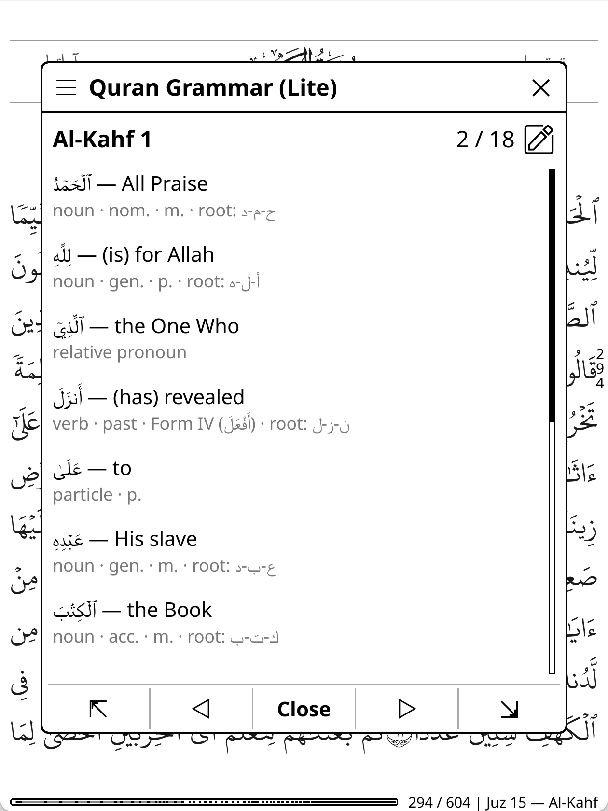</a>
  <a href="screenshots/kahf-ar-irab-ar.png">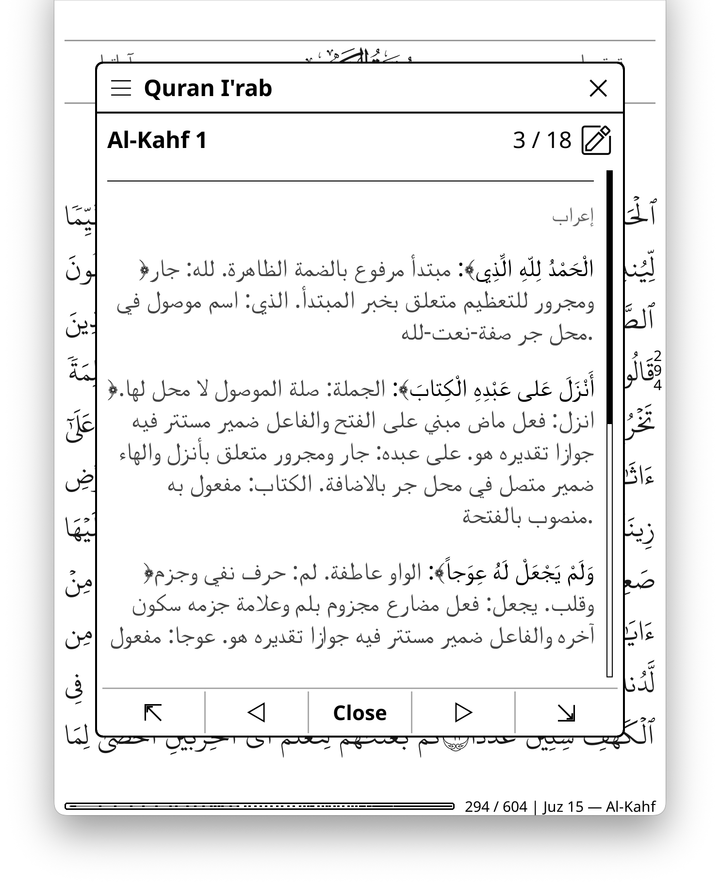</a>
</p>
</details>

6,236 entries covering every ayah in the Quran. The plugin detects the current surah from the table of contents and handles the lookup automatically — just long-press the ayah number. The grammar dictionaries use special keys (e.g. "Al-Baqarah 255") that are not searchable without the plugin — the plugin is required.

**Install:** Pick one or more grammar dictionary variants and unzip into KOReader's `data/dict/` folder (same location as the [word dictionary](#dictionary)):

| Platform | Path |
|----------|------|
| Android | `/sdcard/koreader/data/dict/` |
| Kobo | `/mnt/onboard/.adds/koreader/data/dict/` |
| Kindle | `/mnt/us/koreader/data/dict/` |
| Desktop | `~/.config/koreader/data/dict/` |

```
koreader
└── data
    └── dict
        └── quran_grammar_combined
            ├── quran_grammar_combined.dict
            ├── quran_grammar_combined.idx
            └── quran_grammar_combined.ifo
```

| Variant | Language | Contents | Size |
|---------|----------|----------|------|
| [Combined v1.3](../../raw/main/release/quran_grammar_combined_v1.3.zip) | EN + AR | WBW + morphology + syntax + i'rab | 4.8 MB |
| [Grammar (Lite) v1.3](../../raw/main/release/quran_grammar_lite_v1.3.zip) | EN | WBW + morphology + syntax (no i'rab) | 2.1 MB |
| [I'rab only v1.3](../../raw/main/release/quran_irab_v1.3.zip) | AR | Traditional Arabic grammatical analysis only | 2.2 MB |

**Build your own:** `python tools/build_grammar_dictionary.py --variant all` (requires cached data — see script for details).

**Known upstream data issues:**
- Word-by-word translations from Quran.com API use phrase-level rather than word-level glosses in ~50 chapters (mostly chapters 4+). E.g. three words may all show "O you who believe" instead of individual glosses. Chapters 1–3 have clean word-level data. This is the upstream API data, not a processing error.
- I'rab data covers ~93% of ayahs (5,790 of 6,236). The remaining ~446 ayahs have no i'rab analysis in the QAC source data.

### Surah Overview Lookup

Long-press a surah name header (the decorative calligraphic name at the start of each surah) to see an introduction and overview of that surah. Navigate between surahs with the prev/next buttons or volume keys.

<details><summary>Screenshot — surah overview</summary>

<p align="center">
  <a href="screenshots/kahf-surah-overview-eng.png">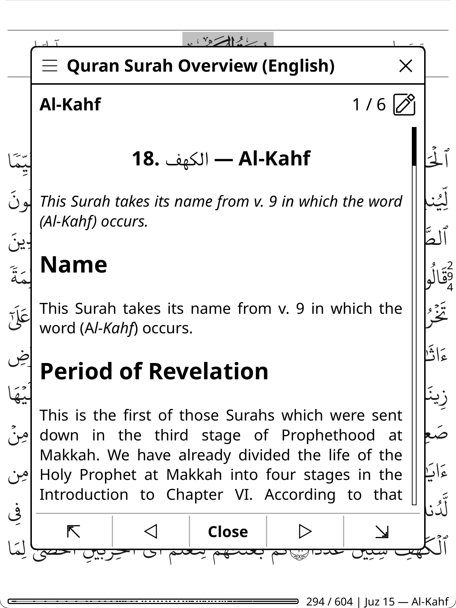</a>
</p>
</details>

**Install:** Pick one or more languages and unzip into KOReader's `data/dict/` folder. You can install multiple languages — all will show in the popup.

| Platform | Path |
|----------|------|
| Android | `/sdcard/koreader/data/dict/` |
| Kobo | `/mnt/onboard/.adds/koreader/data/dict/` |
| Kindle | `/mnt/us/koreader/data/dict/` |
| Desktop | `~/.config/koreader/data/dict/` |

```
koreader
└── data
    └── dict
        └── quran_surah_overview_en
            ├── quran_surah_overview_en.dict
            ├── quran_surah_overview_en.idx
            └── quran_surah_overview_en.ifo
```

| Language | Download | Entries | Size |
|----------|----------|---------|------|
| English | [Surah Overview v1.1](../../raw/main/release/quran_surah_overview_en_v1.1.zip) | 114 | 298 KB |
| Urdu | [Surah Overview v1.1](../../raw/main/release/quran_surah_overview_ur_v1.1.zip) | 114 | 380 KB |
| Indonesian | [Surah Overview v1.1](../../raw/main/release/quran_surah_overview_id_v1.1.zip) | 114 | 65 KB |
| Malayalam | [Surah Overview v1.1](../../raw/main/release/quran_surah_overview_ml_v1.1.zip) | 114 | 429 KB |
| Tamil | [Surah Overview v1.1](../../raw/main/release/quran_surah_overview_ta_v1.1.zip) | 114 | 27 KB |
| Italian | [Surah Overview v1.1](../../raw/main/release/quran_surah_overview_it_v1.1.zip) | 112 | 34 KB |

Source: [Quran.com API v4](https://quran.com/) surah info endpoint.

**Build your own:** `python tools/build_surah_overview.py --all` (or `--language en` for a single language).

### Tafsir (Commentary) Lookup

Long-press any ayah number marker to see tafsir commentary for that ayah (in addition to grammar data, if installed). Each tafsir is a separate dictionary — install whichever ones you want. Navigate between ayahs with prev/next buttons or volume keys.

<details><summary>Screenshots — tafsir popups, tafsir picker</summary>

<p align="center">
  <a href="screenshots/kahf-ar-tafseer-eng.png">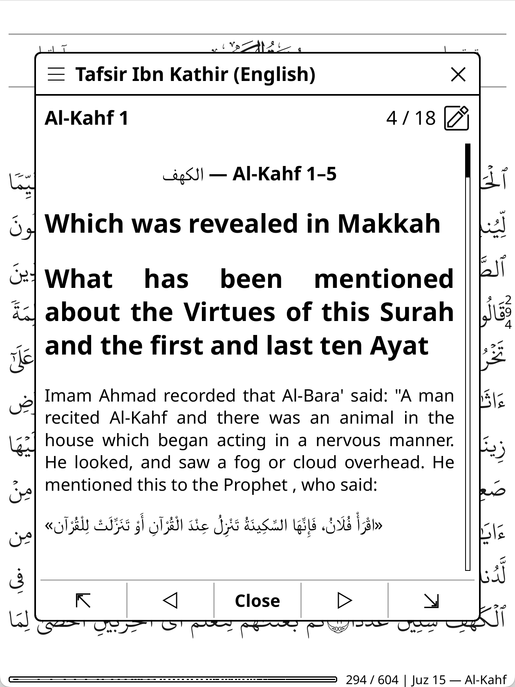</a>
  <a href="screenshots/kahf-ar-tafseer-ar.png">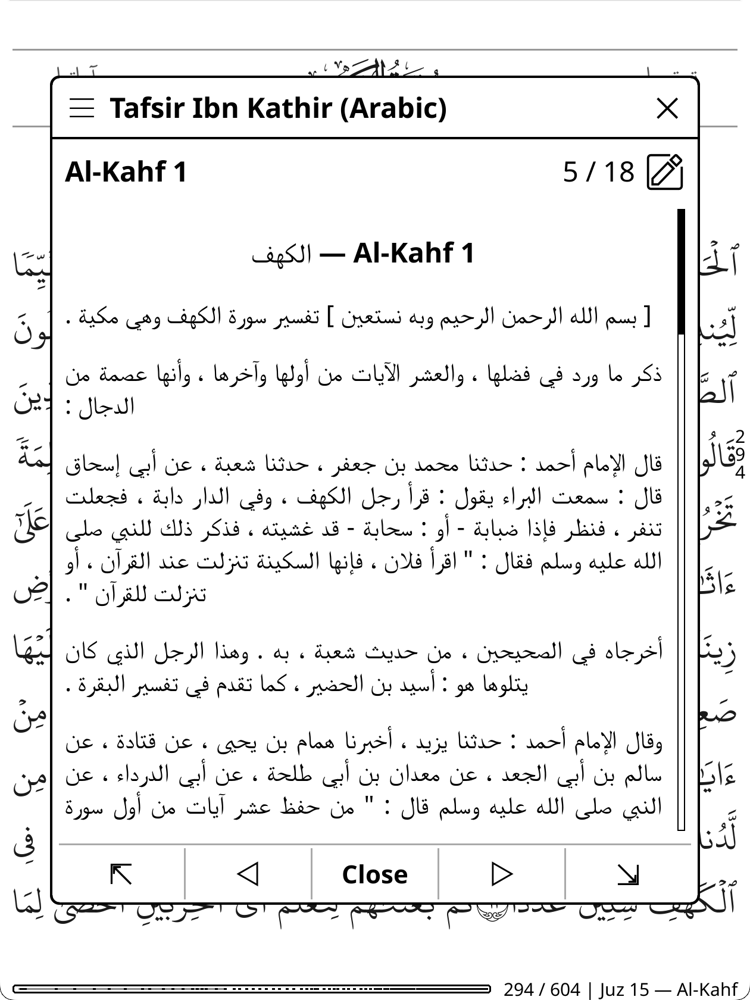</a>
  <a href="screenshots/pick-tafseer-menu.png">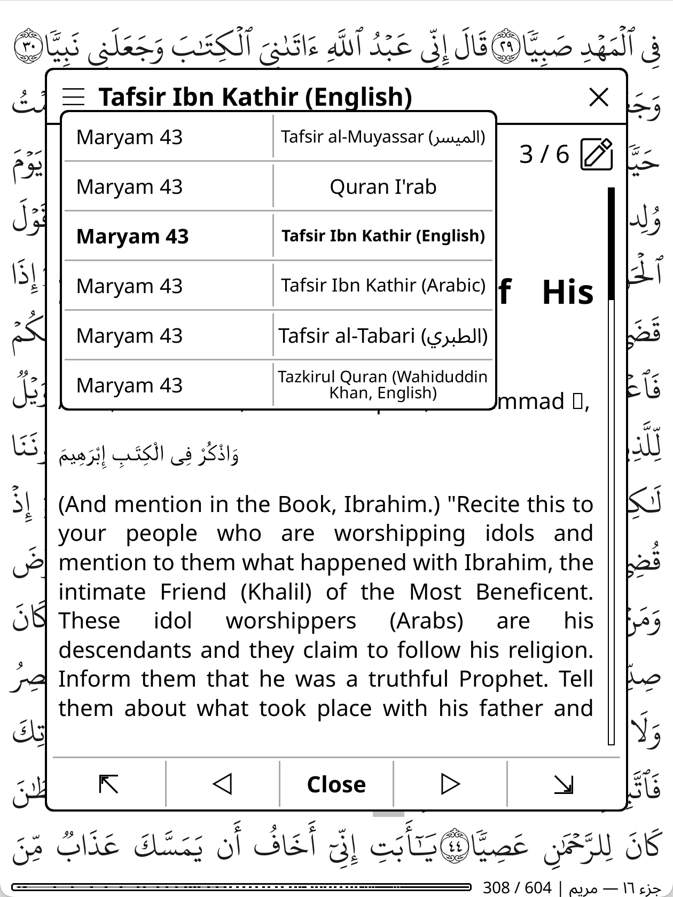</a>
</p>
</details>

Some tafsirs group multiple ayahs under one commentary entry (e.g. Ibn Kathir). The popup title shows the ayah range, and all ayahs in the group are reachable. Like the grammar dictionaries, the tafsir dictionaries use special keys that require the plugin.

**Install:** Pick one or more tafsirs and unzip into KOReader's `data/dict/` folder (same location as the [word dictionary](#dictionary)). You can install multiple tafsirs — all will show in the popup.

| Platform | Path |
|----------|------|
| Android | `/sdcard/koreader/data/dict/` |
| Kobo | `/mnt/onboard/.adds/koreader/data/dict/` |
| Kindle | `/mnt/us/koreader/data/dict/` |
| Desktop | `~/.config/koreader/data/dict/` |

```
koreader
└── data
    └── dict
        └── quran_tafsir_muyassar
            ├── quran_tafsir_muyassar.dict
            ├── quran_tafsir_muyassar.idx
            └── quran_tafsir_muyassar.ifo
```

<details>
<summary><b>Arabic tafsirs (7)</b></summary>

| Tafsir | Download | Size |
|--------|----------|------|
| Tafsir al-Muyassar (المیسر) | [v1.1](../../raw/main/release/quran_tafsir_muyassar_v1.1.zip) | 650 KB |
| Tafsir al-Sa'di (السعدي) | [v1.1](../../raw/main/release/quran_tafsir_saddi_v1.1.zip) | 1.7 MB |
| Tafsir al-Baghawi (البغوي) | [v1.1](../../raw/main/release/quran_tafsir_baghawi_v1.1.zip) | 2.1 MB |
| Tafsir Ibn Kathir (ابن كثير) | [v1.1](../../raw/main/release/quran_tafsir_ibn_kathir_ar_v1.1.zip) | 3.7 MB |
| al-Tafsir al-Wasit (Tantawi) | [v1.1](../../raw/main/release/quran_tafsir_wasit_v1.1.zip) | 4.6 MB |
| Tafsir al-Qurtubi (القرطبي) | [v1.1](../../raw/main/release/quran_tafsir_qurtubi_v1.1.zip) | 5.1 MB |
| Tafsir al-Tabari (الطبري) | [v1.1](../../raw/main/release/quran_tafsir_tabari_v1.1.zip) | 8.2 MB |

</details>

<details>
<summary><b>English tafsirs (3)</b></summary>

| Tafsir | Download | Size |
|--------|----------|------|
| Tazkirul Quran (Wahiduddin Khan) | [v1.1](../../raw/main/release/quran_tafsir_tazkirul_quran_en_v1.1.zip) | 881 KB |
| Tafsir Ibn Kathir (Abridged) | [v1.1](../../raw/main/release/quran_tafsir_ibn_kathir_en_v1.1.zip) | 4.9 MB |
| Ma'ariful Qur'an (Mufti Shafi) | [v1.1](../../raw/main/release/quran_tafsir_maariful_quran_v1.1.zip) | 4.4 MB |

</details>

<details>
<summary><b>Urdu tafsirs (4)</b></summary>

| Tafsir | Download | Size |
|--------|----------|------|
| Tazkir ul Quran (Wahiduddin Khan) | [v1.1](../../raw/main/release/quran_tafsir_tazkir_ul_quran_ur_v1.1.zip) | 1.1 MB |
| Bayan ul Quran (Israr Ahmad) | [v1.1](../../raw/main/release/quran_tafsir_bayan_ul_quran_v1.1.zip) | 2.2 MB |
| Tafsir Ibn Kathir (ابن کثیر) | [v1.1](../../raw/main/release/quran_tafsir_ibn_kathir_ur_v1.1.zip) | 6.5 MB |
| Fi Zilal al-Quran (Qutb) | [v1.1](../../raw/main/release/quran_tafsir_fi_zilal_ur_v1.1.zip) | 7.4 MB |

</details>

<details>
<summary><b>Bengali tafsirs (4)</b></summary>

| Tafsir | Download | Size |
|--------|----------|------|
| Tafsir Ahsanul Bayaan | [v1.1](../../raw/main/release/quran_tafsir_ahsanul_bayaan_v1.1.zip) | 1.9 MB |
| Tafsir Abu Bakr Zakaria | [v1.1](../../raw/main/release/quran_tafsir_abu_bakr_zakaria_v1.1.zip) | 2.6 MB |
| Tafsir Fathul Majid | [v1.1](../../raw/main/release/quran_tafsir_fathul_majid_v1.1.zip) | 3.5 MB |
| Tafsir Ibn Kathir (ইবনে কাসীর) | [v1.1](../../raw/main/release/quran_tafsir_ibn_kathir_bn_v1.1.zip) | 9.5 MB |

</details>

<details>
<summary><b>Russian (1) · Kurdish (1)</b></summary>

| Tafsir | Language | Download | Size |
|--------|----------|----------|------|
| Tafsir al-Sa'di | Russian | [v1.1](../../raw/main/release/quran_tafsir_saddi_ru_v1.1.zip) | 2.2 MB |
| Rebar Kurdish Tafsir | Kurdish | [v1.1](../../raw/main/release/quran_tafsir_rebar_v1.1.zip) | 1.4 MB |

</details>

Source: [Quran.com API v4](https://quran.com/) tafsir endpoints. 20 tafsirs across 6 languages.

**Build your own:** `python tools/build_tafseer_dictionary.py --all` (or `--tafsir muyassar` for a single tafsir). Use `--list` to see all available tafsirs.

## Build Your Own EPUBs

```bash
pip install -e ".[dev]"
quran-ebook build configs/bilingual/en_sahih.yaml
```

Each YAML file in [`configs/`](configs/) defines one EPUB variant. Configs are organized by type: `arabic/`, `bilingual/`, `interactive/`. Build everything with `quran-ebook build --all configs/`.

PRs or FRs are welcome.

## Data Sources

- **Arabic text**: [Quran.com API v4](https://quran.com/) — QPC Uthmani Hafs encoding (Riwayat Hafs 'an 'Asim), Madinah Mushaf V1 (1405 AH) page mapping
- **Translations**: [Quran.com API v4](https://quran.com/) + [fawazahmed0/quran-api](https://github.com/fawazahmed0/quran-api) — 42 languages, 46 translators (see [configs/](configs/) for full list)
- **Surah names**: [Quran.com API v4](https://quran.com/) for most languages; [QuranEnc](https://quranenc.com/) for languages not on the API (e.g. Fulfulde)
- **Surah overviews**: [Quran.com API v4](https://quran.com/) — `/chapters/{id}/info` endpoint, available in English, Urdu, Indonesian, Malayalam, Tamil, Italian
- **Tafsir**: [Quran.com API v4](https://quran.com/) — `/tafsirs/{id}/by_chapter/{ch}` endpoint, 20 tafsirs across 6 languages (Arabic, English, Urdu, Bengali, Russian, Kurdish)
- **Morphology & syntax** (grammar dictionary): [EQTB](https://github.com/kaisdukes/extended-quranic-treebank) (Extended Quranic Treebank) — POS, case, mood, gender, number, person, verb form, dependency relations with head pointers (CC BY 4.0)
- **Morphology** (word dictionary): [mustafa0x/quran-morphology](https://github.com/mustafa0x/quran-morphology) — root, lemma, POS, case, gender, number, person, verb form (GPL-3.0)
- **I'rab**: [Quranic Arabic Corpus](https://corpus.quran.com/) — traditional Arabic grammatical analysis prose (GPL)
- **Root definitions**: [Lane's Lexicon](https://github.com/aliozdenisik/quran-arabic-roots-lane-lexicon) — root meanings (public domain)
- **Primary font (Hafs)**: KFGQPC Uthmanic Script Hafs — King Fahd Complex, via [Tarteel CDN](https://qul.tarteel.ai/)
- **Primary font (Warsh)**: KFGQPC Warsh Uthmanic Script v0.10 — King Fahd Complex, via [thetruetruth/quran-data-kfgqpc](https://github.com/thetruetruth/quran-data-kfgqpc)
- **Symbol font**: [Scheherazade New](https://software.sil.org/scheherazade/) (SIL International) — rub al-hizb markers, surah header numerals, TOC labels, and in-book cover text
- **Basmala font**: [Quran Common](https://qul.tarteel.ai/resources/font/459) (QUL / King Fahd Complex) — ornamental bismillah ligature (U+FDFD)
- **Header font**: [Surah Name V4](https://qul.tarteel.ai/resources/font/457) (QUL / King Fahd Complex) — calligraphic surah name glyphs

## Other Versions (Work in Progress)

### Warsh 'an Nafi'

An experimental Arabic-only EPUB for Riwayat Warsh 'an Nafi' is included in the release. See the [Arabic EPUB table](#arabic-only) for the download link.

**Data source:** [KFGQPC](https://fonts.qurancomplex.gov.sa/) (King Fahd Glorious Quran Printing Complex) via [thetruetruth/quran-data-kfgqpc](https://github.com/thetruetruth/quran-data-kfgqpc). This is the only freely available digital Warsh package with matched text and font. The same data is used by most open-source multi-qiraat projects.

**Font:** KFGQPC Warsh Uthmanic Script v0.10 (2018, Ashfaq Ahmad Niazi). The text encoding is inseparable from its font — Warsh text rendered with a Hafs font produces broken diacritics, and vice versa. The font uses Maghribi orthographic conventions: dot under fa (ف), compact comma-style damma, hamzat al-wasl markers (U+06EC), and the distinctive North African kaf.

**What this edition is:** The Quranic text follows Warsh 'an Nafi' with Madani ayah numbering (6,214 ayahs across 114 surahs, vs 6,236 in Hafs). The basmala is unnumbered and absent from Al-Fatiha's ayah count. 50 surahs have different ayah counts compared to Hafs. All 30 juz boundaries are present and correct for the Warsh tradition (12 of 30 differ from Hafs). Orthographic conventions such as sun-letter assimilation marking (shadda placement) follow the Medina Warsh printing tradition.

**Page numbers:** The KFGQPC data uses a 604-page digital layout that mirrors the Hafs Madinah Mushaf grid structure. These are **not** physical Warsh mushaf page numbers — the printed Warsh Madinah Mushaf has ~576 pages. All 114 surah start pages are identical between the KFGQPC Warsh and Hafs datasets. Page references in the EPUB footer are KFGQPC virtual pages, not references to any specific printed Warsh mushaf.

**What works:**

| Feature | Status |
|---------|--------|
| Arabic text rendering | Correct (matched KFGQPC font + text) |
| Ayah numbering | Correct Warsh/Madani tradition (6,214 ayahs) |
| Ayah markers (ornate) | Correct (KFGQPC font renders Arabic-Indic digits as markers) |
| Juz boundaries & TOC | Correct for Warsh (from KFGQPC data) |
| Hizb/rub markers | Present (from KFGQPC data) |
| Basmala | QPC-encoded text with correct Warsh diacritics (extracted from S27:30) |
| Surah headers | Plain Arabic text in Warsh font (no calligraphic glyph, no side columns) |
| Page numbers in footer | Functional but virtual (see above) |

**Known limitations:**

- **No calligraphic surah headers or ornamental basmala.** The Hafs decorative fonts (surah-name-v4, quran-common) use Mashriqi orthographic marks (different sukun, hamza shapes) that do not match Warsh/Maghribi conventions. No Warsh-specific decorative fonts exist in the digital Quran font ecosystem. The EPUB falls back to plain Arabic text in the Warsh font for both.
- **Single waqf marker type.** The KFGQPC Warsh data uses only U+06D6 (صلى) for pause marking, consistent with the simplified waqf system used in many Medina Warsh mushafs. The multi-symbol waqf system (قلى, مـ, لا, ج, three dots) common in Hafs mushafs is not present in this data source.
- **KOReader plugin:** The Quran navigation plugin hardcodes Hafs ayah counts and juz boundaries. Surah-level navigation works (reads the EPUB TOC), but ayah-level prev/next navigation will be incorrect. The juz status bar reads the EPUB TOC and should display correctly.
- **Dictionaries:** The WBW, grammar, and tafsir dictionaries are keyed to Hafs ayah numbers (6,236 ayahs). Since Warsh has different ayah boundaries in 50 surahs, dictionary lookups will be misaligned for those surahs for now. The surah overview dictionary is also differently keyed.
- **Bilingual / interactive / WBW layouts** are not yet available for Warsh (Arabic-only for now).

### Tajweed (QCF Glyph Fonts)

Experimental support for **tajweed color-coded** Quran text using the Quran Foundation's per-page glyph fonts (QCF V4). Each word is rendered as a single pre-composed glyph with tajweed colors baked into the font via OpenType COLR/CPAL tables. This avoids the Arabic shaping breakage that CSS color spans cause in CREngine.

The EPUB build pipeline is functional — Arabic-only, bilingual, and interactive layouts all build and pass epubcheck. Spacing and sizing tuning is in progress.

**Requires patched KOReader:** QCF V4 tajweed colors need COLR v0 color font support in CREngine. A patch has been submitted as [koreader/crengine#654](https://github.com/koreader/crengine/pull/654). Until merged, tajweed colors only render in a locally patched KOReader build. A plain (non-color) QCF V1 variant works on stock KOReader.

## Credits

Built on the work of many contributors to the Quranic digital ecosystem:

- **[rockneverdies55/quran-epub](https://github.com/rockneverdies55/quran-epub)** — demonstrated the demand for open-source Quran ebooks
- **[bilalsaci/compare-quran-scripts-and-fonts](https://github.com/bilalsaci/compare-quran-scripts-and-fonts)** — identified correct script/font pairings and diagnosed rendering bugs
- **[mohd-akram/mushaf](https://github.com/mohd-akram/mushaf)** — clean EPUB3 structure reference
- **[mostafa-khaled775/quran-epub-builder](https://github.com/mostafa-khaled775/quran-epub-builder)** — multi-qiraat approach reference

**Fonts:** KFGQPC Uthmanic Script (Hafs + Warsh), Quran Common, and Surah Name V4 (King Fahd Complex via [QUL](https://qul.tarteel.ai/)), Scheherazade New ([SIL International](https://software.sil.org/scheherazade/), OFL 1.1).

## License

GPL-3.0

Quran text and translation data sourced from Quran.com API. Font licenses: Scheherazade New (SIL OFL 1.1), KFGQPC Uthmanic Script / Quran Common / Surah Name V4 (King Fahd Complex — use, copy, and distribute permitted; modification not permitted).
