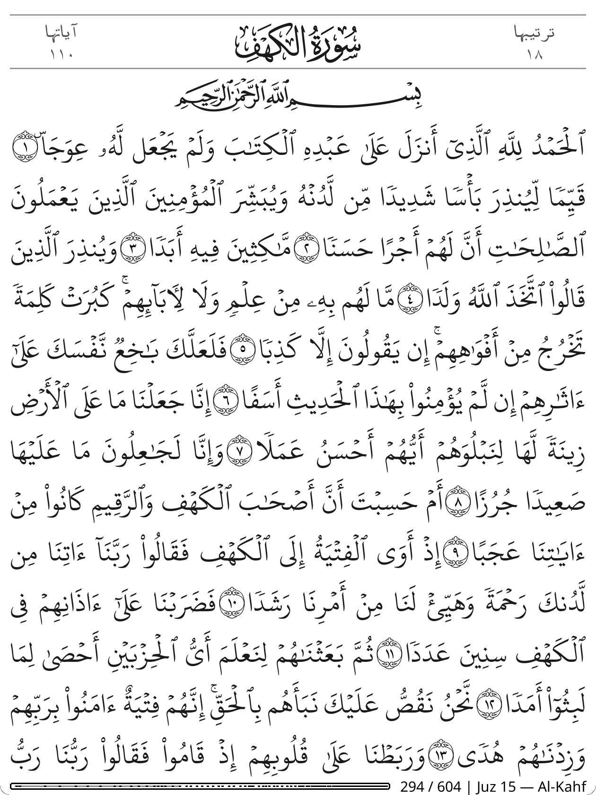
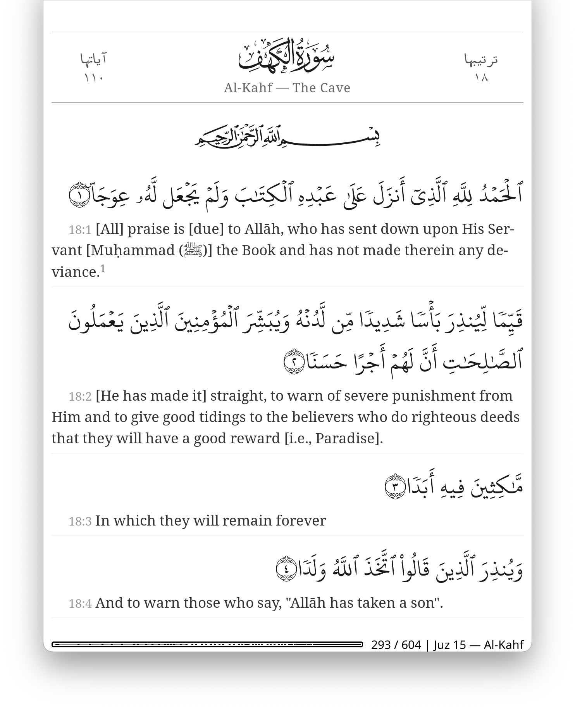
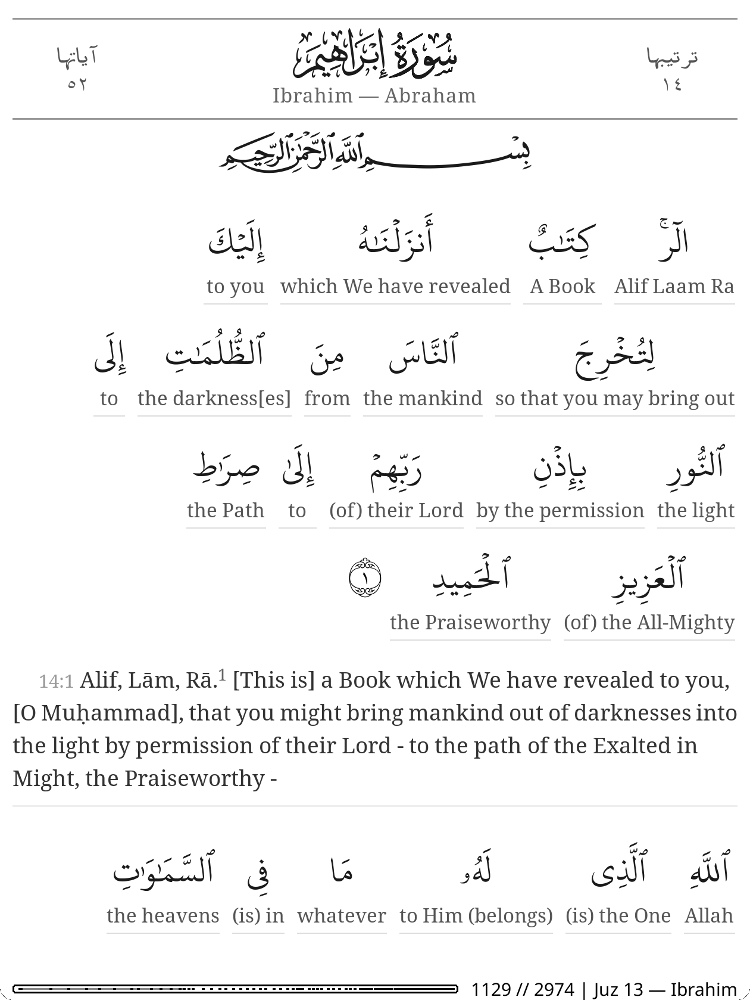
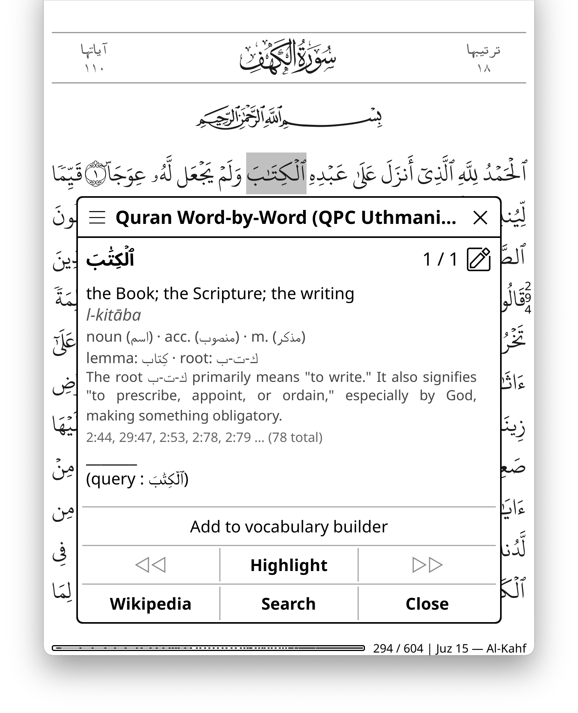
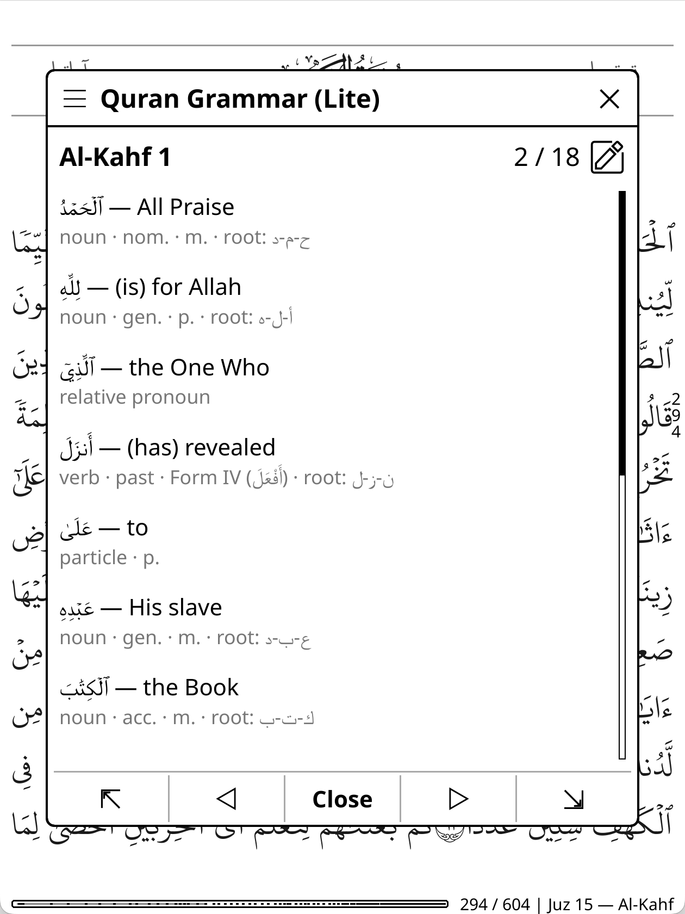
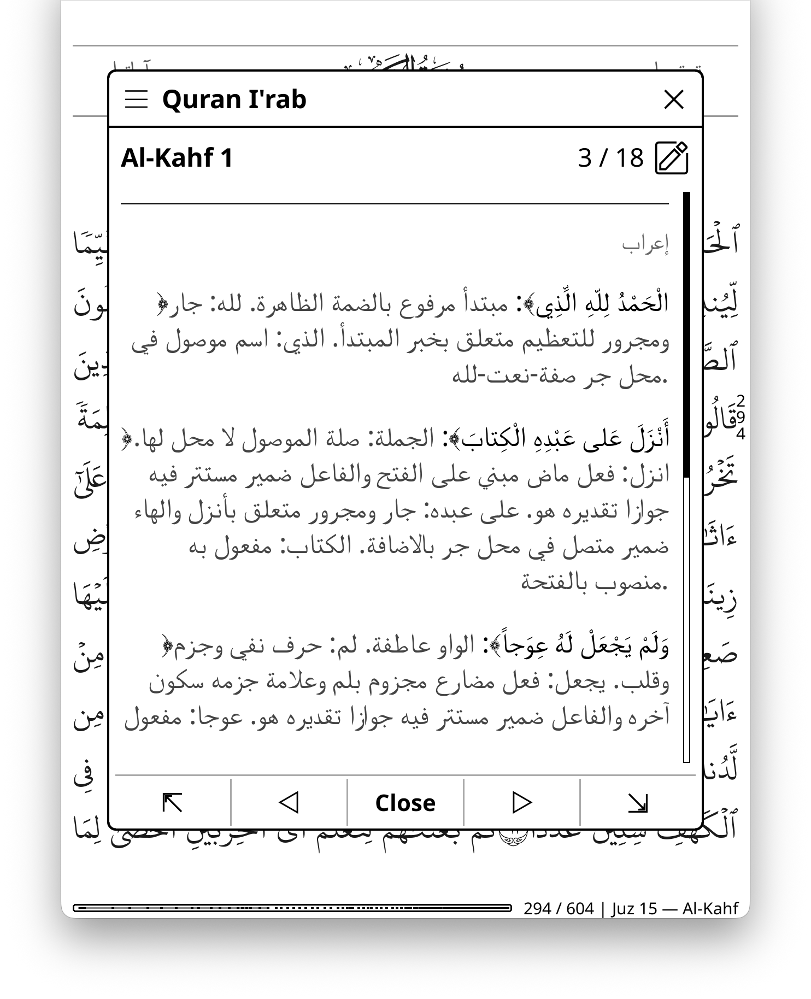
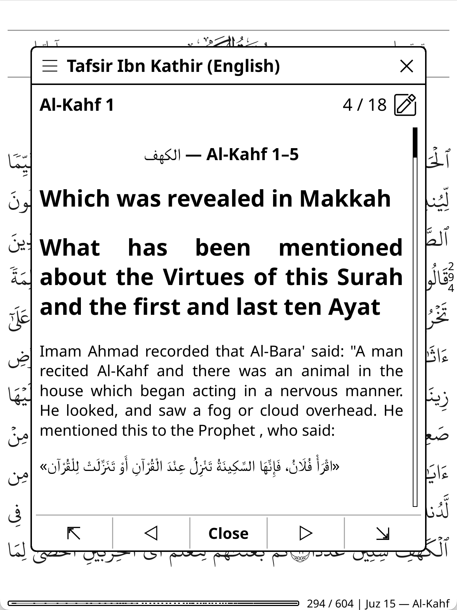
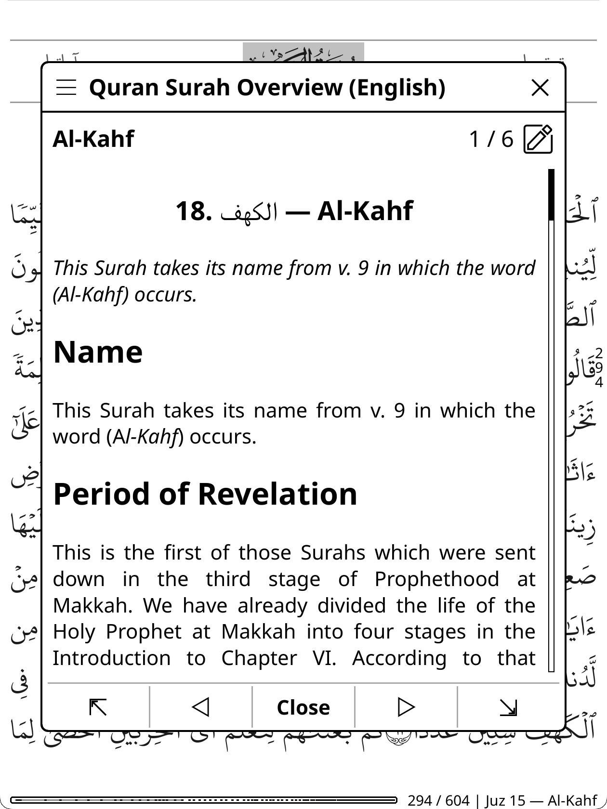
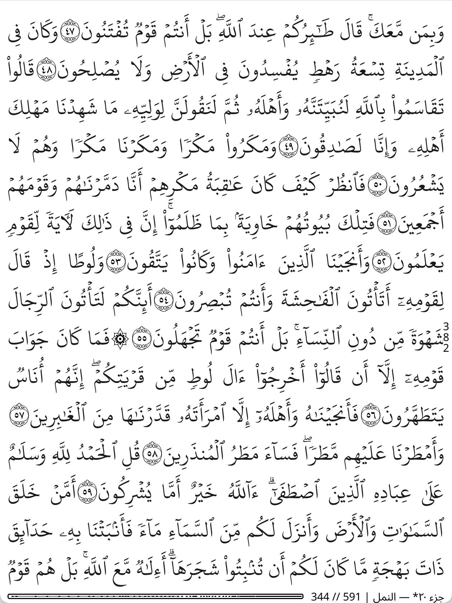

<div align="center">

<h3>الحمد لله رب العالمين، والصلاة والسلام على سيدنا محمد خاتم النبيين وإمام المرسلين</h3>

# Quran Ebook

</div>

<p align="center">
  <a href="../../releases/latest"></a>
</p>

<p align="center">
  <a href="screenshots/kahf-ar-no-margin-page.png"></a>
  <a href="screenshots/kahf-ar-en.png"></a>
  <a href="screenshots/ibrahim-wbw.png"></a>
</p>

Pre-built, reproducible Quran EPUBs with correct Arabic rendering — 50 translations in 42 languages, three Arabic text families, tafsir editions, and word-by-word study layouts — plus a KOReader plugin that turns any of them into a study environment.

<!-- gen:flagship-links:begin -->
**Start here:**
[Arabic, ayah by ayah](https://github.com/zeeyado/quran-ebook/releases/download/test-build/quran_hafs-uthmani_kfgqpc_ayah_ar.epub) ·
[Arabic + English (Sahih International)](https://github.com/zeeyado/quran-ebook/releases/download/test-build/quran_hafs-uthmani_kfgqpc_ayah-inline_ar-en-sahih.epub) ·
[Arabic + English with tafsir popups](https://github.com/zeeyado/quran-ebook/releases/download/test-build/quran_hafs-uthmani_kfgqpc_ayah-inline_ar-en-sahih_tafsir-mukhtasar.epub) ·
[Word-by-word English](https://github.com/zeeyado/quran-ebook/releases/download/test-build/quran_hafs-uthmani_kfgqpc_word-inline_ar-en-sahih.epub) —
or browse the full [download tables](#epubs).
<!-- gen:flagship-links:end -->

Best used in **[KOReader](https://koreader.rocks/)** — see [KOReader settings](#koreader-settings) for *essential* setup, and the [Quran Helper plugin](#koreader-plugin) for the full experience: per-word dictionary with automatic occurrence matching, grammar and i'rab analysis, tafsir lookup, root explorer, cross-reference browsing, and a built-in library manager that installs everything for you.

The EPUBs use validated script/font pairings to avoid the rendering bugs (broken sukun marks, mangled ligatures) common in other Quran ebooks. Feedback and bug reports are welcome — [open an issue](../../issues) for problems, desired content, or formats.

> ### 🧪 Testing channel
>
> This branch is the **release-candidate landing page**. Every download link on it points at the rolling [`test-build`](../../releases/tag/test-build) pre-release, so everything is installable today, exactly as the real release will work:
>
> 1. Download [`quran_koplugin_test.zip`](../../releases/download/test-build/quran_koplugin_test.zip) and install it (see [plugin install](#install)).
> 2. In a Quran book: Quran Helper → Library & assets → **Asset source → Test build**.
> 3. Install books, dictionaries, and data packages from **Library & assets** — updates, checksums, and the plugin's self-update all run against the test channel.
> 4. OPDS feed for downloading books on-device: `https://github.com/zeeyado/quran-ebook/releases/download/test-build/root.xml`
>
> Found anything off — rendering, navigation, installs, wording? [Report it](../../issues). This box disappears at the official release.

## Choose a format

Every translation is available in several layouts; pick by how you read:

- **Ayah-by-ayah** — Arabic with the translation directly beneath each ayah. The study default, and the layout that pairs best with the plugin.
- **Ayah-by-ayah · tap for translation** — the same page shows only Arabic; the translation opens in a popup when you tap the ayah marker. Self-testing reading.
- **Continuous · tap for translation** — the Arabic flows like a mushaf page, translation one tap away on each ayah marker.
- **Word-by-word** — every Arabic word with its meaning stacked beneath it, a full translation after each ayah. Some editions move that translation into the tap popup (*word-by-word · tap for translation*), so you assemble the meaning from the glosses first and tap to check.
- **With tafsir popups** — translation inline, a full tafsir one tap away on every ayah marker ([own table](#with-tafsir-popups)).
- **Arabic with tafsir as the text** — no translation; the tafsir itself rides beneath each ayah or in the popups ([Arabic table](#arabic)).
- **Arabic only** — ayah-by-ayah or continuous flow, nothing else on the page.

## Scripts, riwayat, and numbering

Three Arabic text families, named by **riwayah · script** (they are independent axes):

| Family | Riwayah (reading) | Script (orthography) | Status |
|:--|:--|:--|:--|
| Hafs · Uthmani | Hafs ʿan ʿAsim | Uthmani, KFGQPC (Madinah Mushaf, 604 pages) | stable |
| Hafs · IndoPak Nastaleeq | Hafs ʿan ʿAsim | IndoPak orthography, Nastaleeq style (South Asian print convention) | beta |
| Warsh · Uthmani | Warsh ʿan Nafiʿ | Uthmani, KFGQPC Warsh (Maghribi conventions) | beta |

**Ayah numbering** follows each riwayah's own tradition: Hafs editions use the Kufan count (6,236 ayahs, basmala numbered as Al-Fatiha 1:1); Warsh editions use the Madani count (6,214 ayahs, basmala unnumbered). Where the two diverge, plugin resources (dictionaries, tafsir, word data — all keyed to Hafs numbering) are aligned automatically and labeled with the Hafs number as **"(H n)"**, so you always know which entry you are reading. Warsh page numbers are the KFGQPC data's 604-page virtual layout, not printed Warsh mushaf pages, and Warsh editions have no calligraphic surah headers (no Warsh-convention decorative fonts exist).

### Beta editions & feedback

IndoPak and Warsh editions are marked **beta** for one reason: they can only graduate through **community feedback**. The maintainer reads standard QPC Hafs and cannot personally proof these scripts, and the formatting work done for them (marker splitting, spacing control) may have introduced artifacts. If you read them, please [report](../../issues) anything you notice — specifically:

- text errors: wrong or missing marks, qirāʾah-specific spellings
- ayah-marker artifacts: gaps, wrong-side placement, markers starting a line
- line height and spacing (Nastaleeq's tall metrics — cramped or excessive leading)
- overlapping marks, clipped ascenders/descenders
- anything odd at page boundaries

"Looks perfect on my device" is equally valuable feedback. Other editions marked *· beta* (e.g. Ibn Kathir popups, the word-by-word pilot layouts) are newer builds still collecting the same kind of feedback.

## EPUBs

<!-- gen:epub-tables:begin -->

**679 editions** — 50 translations in 42 languages, three Arabic text families (Hafs·Uthmani, Hafs·IndoPak, Warsh·Uthmani), and every layout below. All tables are generated from [catalog.json](https://github.com/zeeyado/quran-ebook/releases/download/test-build/catalog.json).

### Arabic

| Format | Hafs · Uthmani | Hafs · IndoPak Nastaleeq · beta | Warsh · Uthmani · beta |
|:--|:-:|:-:|:-:|
| Ayah-by-ayah | [epub](https://github.com/zeeyado/quran-ebook/releases/download/test-build/quran_hafs-uthmani_kfgqpc_ayah_ar.epub) | [epub](https://github.com/zeeyado/quran-ebook/releases/download/test-build/quran_hafs-indopak_nastaleeq_ayah_ar.epub) | [epub](https://github.com/zeeyado/quran-ebook/releases/download/test-build/quran_warsh-uthmani_kfgqpc_ayah_ar.epub) |
| Continuous flow | [epub](https://github.com/zeeyado/quran-ebook/releases/download/test-build/quran_hafs-uthmani_kfgqpc_flow_ar.epub) | [epub](https://github.com/zeeyado/quran-ebook/releases/download/test-build/quran_hafs-indopak_nastaleeq_flow_ar.epub) | [epub](https://github.com/zeeyado/quran-ebook/releases/download/test-build/quran_warsh-uthmani_kfgqpc_flow_ar.epub) |
| Word-by-word · English word glosses · beta | [epub](https://github.com/zeeyado/quran-ebook/releases/download/test-build/quran_hafs-uthmani_kfgqpc_word-inline_ar_gloss-en.epub) | — | — |

The ayah-by-ayah edition pairs best with the [KOReader plugin](#koreader-plugin) — dynamic per-ayah content, theme bands; prefer a translated ayah-by-ayah edition if you want one fixed translation alongside the Arabic.

#### Arabic with tafsir as the text

| Tafsir | Format | Hafs · Uthmani | Hafs · IndoPak Nastaleeq · beta | Warsh · Uthmani · beta |
|:--|:--|:-:|:-:|:-:|
| المختصر في التفسير (Arabic) | Ayah-by-ayah | [epub](https://github.com/zeeyado/quran-ebook/releases/download/test-build/quran_hafs-uthmani_kfgqpc_ayah-inline_ar_tafsir-mukhtasar-ar.epub) | [epub](https://github.com/zeeyado/quran-ebook/releases/download/test-build/quran_hafs-indopak_nastaleeq_ayah-inline_ar_tafsir-mukhtasar-ar.epub) | [epub](https://github.com/zeeyado/quran-ebook/releases/download/test-build/quran_warsh-uthmani_kfgqpc_ayah-inline_ar_tafsir-mukhtasar-ar.epub) |
| Al-Mukhtasar (English) | Ayah-by-ayah | [epub](https://github.com/zeeyado/quran-ebook/releases/download/test-build/quran_hafs-uthmani_kfgqpc_ayah-inline_ar_tafsir-mukhtasar-en.epub) | [epub](https://github.com/zeeyado/quran-ebook/releases/download/test-build/quran_hafs-indopak_nastaleeq_ayah-inline_ar_tafsir-mukhtasar-en.epub) | [epub](https://github.com/zeeyado/quran-ebook/releases/download/test-build/quran_warsh-uthmani_kfgqpc_ayah-inline_ar_tafsir-mukhtasar-en.epub) |
| تفسير ابن كثير (Arabic) · beta | Ayah-by-ayah · tap for translation | [epub](https://github.com/zeeyado/quran-ebook/releases/download/test-build/quran_hafs-uthmani_kfgqpc_ayah-popup_ar_tafsir-ibnkathir-ar.epub) | — | — |
| المختصر في التفسير (Arabic) | Ayah-by-ayah · tap for translation | [epub](https://github.com/zeeyado/quran-ebook/releases/download/test-build/quran_hafs-uthmani_kfgqpc_ayah-popup_ar_tafsir-mukhtasar-ar.epub) | [epub](https://github.com/zeeyado/quran-ebook/releases/download/test-build/quran_hafs-indopak_nastaleeq_ayah-popup_ar_tafsir-mukhtasar-ar.epub) | [epub](https://github.com/zeeyado/quran-ebook/releases/download/test-build/quran_warsh-uthmani_kfgqpc_ayah-popup_ar_tafsir-mukhtasar-ar.epub) |
| التفسير الميسر (Arabic) | Ayah-by-ayah · tap for translation | [epub](https://github.com/zeeyado/quran-ebook/releases/download/test-build/quran_hafs-uthmani_kfgqpc_ayah-popup_ar_tafsir-muyassar-ar.epub) | — | — |
| Al-Mukhtasar (English) | Ayah-by-ayah · tap for translation | [epub](https://github.com/zeeyado/quran-ebook/releases/download/test-build/quran_hafs-uthmani_kfgqpc_ayah-popup_ar_tafsir-mukhtasar-en.epub) | [epub](https://github.com/zeeyado/quran-ebook/releases/download/test-build/quran_hafs-indopak_nastaleeq_ayah-popup_ar_tafsir-mukhtasar-en.epub) | [epub](https://github.com/zeeyado/quran-ebook/releases/download/test-build/quran_warsh-uthmani_kfgqpc_ayah-popup_ar_tafsir-mukhtasar-en.epub) |
| تفسير ابن كثير (Arabic) · beta | Continuous · tap for translation | [epub](https://github.com/zeeyado/quran-ebook/releases/download/test-build/quran_hafs-uthmani_kfgqpc_flow-popup_ar_tafsir-ibnkathir-ar.epub) | — | — |
| المختصر في التفسير (Arabic) | Continuous · tap for translation | [epub](https://github.com/zeeyado/quran-ebook/releases/download/test-build/quran_hafs-uthmani_kfgqpc_flow-popup_ar_tafsir-mukhtasar-ar.epub) | [epub](https://github.com/zeeyado/quran-ebook/releases/download/test-build/quran_hafs-indopak_nastaleeq_flow-popup_ar_tafsir-mukhtasar-ar.epub) | [epub](https://github.com/zeeyado/quran-ebook/releases/download/test-build/quran_warsh-uthmani_kfgqpc_flow-popup_ar_tafsir-mukhtasar-ar.epub) |
| التفسير الميسر (Arabic) | Continuous · tap for translation | [epub](https://github.com/zeeyado/quran-ebook/releases/download/test-build/quran_hafs-uthmani_kfgqpc_flow-popup_ar_tafsir-muyassar-ar.epub) | — | — |
| Al-Mukhtasar (English) | Continuous · tap for translation | [epub](https://github.com/zeeyado/quran-ebook/releases/download/test-build/quran_hafs-uthmani_kfgqpc_flow-popup_ar_tafsir-mukhtasar-en.epub) | [epub](https://github.com/zeeyado/quran-ebook/releases/download/test-build/quran_hafs-indopak_nastaleeq_flow-popup_ar_tafsir-mukhtasar-en.epub) | [epub](https://github.com/zeeyado/quran-ebook/releases/download/test-build/quran_warsh-uthmani_kfgqpc_flow-popup_ar_tafsir-mukhtasar-en.epub) |
| Al-Mukhtasar (English) | Word-by-word · English word glosses | [epub](https://github.com/zeeyado/quran-ebook/releases/download/test-build/quran_hafs-uthmani_kfgqpc_word-inline_ar_tafsir-mukhtasar-en.epub) | [epub](https://github.com/zeeyado/quran-ebook/releases/download/test-build/quran_hafs-indopak_nastaleeq_word-inline_ar_tafsir-mukhtasar-en.epub) | — |

The tafsir rides in place of a translation — inline beneath each ayah (ayah-by-ayah) or in tap popups.

### English

| Translation | Format | Hafs · Uthmani | Hafs · IndoPak Nastaleeq · beta | Warsh · Uthmani · beta |
|:--|:--|:-:|:-:|:-:|
| Sahih International | Ayah-by-ayah | [epub](https://github.com/zeeyado/quran-ebook/releases/download/test-build/quran_hafs-uthmani_kfgqpc_ayah-inline_ar-en-sahih.epub) | [epub](https://github.com/zeeyado/quran-ebook/releases/download/test-build/quran_hafs-indopak_nastaleeq_ayah-inline_ar-en-sahih.epub) | [epub](https://github.com/zeeyado/quran-ebook/releases/download/test-build/quran_warsh-uthmani_kfgqpc_ayah-inline_ar-en-sahih.epub) |
|  | Ayah-by-ayah · tap for translation | [epub](https://github.com/zeeyado/quran-ebook/releases/download/test-build/quran_hafs-uthmani_kfgqpc_ayah-popup_ar-en-sahih.epub) | [epub](https://github.com/zeeyado/quran-ebook/releases/download/test-build/quran_hafs-indopak_nastaleeq_ayah-popup_ar-en-sahih.epub) | [epub](https://github.com/zeeyado/quran-ebook/releases/download/test-build/quran_warsh-uthmani_kfgqpc_ayah-popup_ar-en-sahih.epub) |
|  | Continuous · tap for translation | [epub](https://github.com/zeeyado/quran-ebook/releases/download/test-build/quran_hafs-uthmani_kfgqpc_flow-popup_ar-en-sahih.epub) | [epub](https://github.com/zeeyado/quran-ebook/releases/download/test-build/quran_hafs-indopak_nastaleeq_flow-popup_ar-en-sahih.epub) | [epub](https://github.com/zeeyado/quran-ebook/releases/download/test-build/quran_warsh-uthmani_kfgqpc_flow-popup_ar-en-sahih.epub) |
|  | Word-by-word | [epub](https://github.com/zeeyado/quran-ebook/releases/download/test-build/quran_hafs-uthmani_kfgqpc_word-inline_ar-en-sahih.epub) | [epub](https://github.com/zeeyado/quran-ebook/releases/download/test-build/quran_hafs-indopak_nastaleeq_word-inline_ar-en-sahih.epub) | — |
|  | Word-by-word · tap for translation | [epub](https://github.com/zeeyado/quran-ebook/releases/download/test-build/quran_hafs-uthmani_kfgqpc_word-popup_ar-en-sahih.epub) | — | — |
| Al-Hilali & Khan | Ayah-by-ayah | [epub](https://github.com/zeeyado/quran-ebook/releases/download/test-build/quran_hafs-uthmani_kfgqpc_ayah-inline_ar-en-hilali-khan.epub) | [epub](https://github.com/zeeyado/quran-ebook/releases/download/test-build/quran_hafs-indopak_nastaleeq_ayah-inline_ar-en-hilali-khan.epub) | [epub](https://github.com/zeeyado/quran-ebook/releases/download/test-build/quran_warsh-uthmani_kfgqpc_ayah-inline_ar-en-hilali-khan.epub) |
|  | Ayah-by-ayah · tap for translation | [epub](https://github.com/zeeyado/quran-ebook/releases/download/test-build/quran_hafs-uthmani_kfgqpc_ayah-popup_ar-en-hilali-khan.epub) | [epub](https://github.com/zeeyado/quran-ebook/releases/download/test-build/quran_hafs-indopak_nastaleeq_ayah-popup_ar-en-hilali-khan.epub) | [epub](https://github.com/zeeyado/quran-ebook/releases/download/test-build/quran_warsh-uthmani_kfgqpc_ayah-popup_ar-en-hilali-khan.epub) |
|  | Continuous · tap for translation | [epub](https://github.com/zeeyado/quran-ebook/releases/download/test-build/quran_hafs-uthmani_kfgqpc_flow-popup_ar-en-hilali-khan.epub) | [epub](https://github.com/zeeyado/quran-ebook/releases/download/test-build/quran_hafs-indopak_nastaleeq_flow-popup_ar-en-hilali-khan.epub) | [epub](https://github.com/zeeyado/quran-ebook/releases/download/test-build/quran_warsh-uthmani_kfgqpc_flow-popup_ar-en-hilali-khan.epub) |
|  | Word-by-word | [epub](https://github.com/zeeyado/quran-ebook/releases/download/test-build/quran_hafs-uthmani_kfgqpc_word-inline_ar-en-hilali-khan.epub) | [epub](https://github.com/zeeyado/quran-ebook/releases/download/test-build/quran_hafs-indopak_nastaleeq_word-inline_ar-en-hilali-khan.epub) | — |
| Dr. Mustafa Khattab (The Clear Quran) | Ayah-by-ayah | [epub](https://github.com/zeeyado/quran-ebook/releases/download/test-build/quran_hafs-uthmani_kfgqpc_ayah-inline_ar-en-khattab.epub) | [epub](https://github.com/zeeyado/quran-ebook/releases/download/test-build/quran_hafs-indopak_nastaleeq_ayah-inline_ar-en-khattab.epub) | [epub](https://github.com/zeeyado/quran-ebook/releases/download/test-build/quran_warsh-uthmani_kfgqpc_ayah-inline_ar-en-khattab.epub) |
|  | Ayah-by-ayah · tap for translation | [epub](https://github.com/zeeyado/quran-ebook/releases/download/test-build/quran_hafs-uthmani_kfgqpc_ayah-popup_ar-en-khattab.epub) | [epub](https://github.com/zeeyado/quran-ebook/releases/download/test-build/quran_hafs-indopak_nastaleeq_ayah-popup_ar-en-khattab.epub) | [epub](https://github.com/zeeyado/quran-ebook/releases/download/test-build/quran_warsh-uthmani_kfgqpc_ayah-popup_ar-en-khattab.epub) |
|  | Continuous · tap for translation | [epub](https://github.com/zeeyado/quran-ebook/releases/download/test-build/quran_hafs-uthmani_kfgqpc_flow-popup_ar-en-khattab.epub) | [epub](https://github.com/zeeyado/quran-ebook/releases/download/test-build/quran_hafs-indopak_nastaleeq_flow-popup_ar-en-khattab.epub) | [epub](https://github.com/zeeyado/quran-ebook/releases/download/test-build/quran_warsh-uthmani_kfgqpc_flow-popup_ar-en-khattab.epub) |
|  | Word-by-word | [epub](https://github.com/zeeyado/quran-ebook/releases/download/test-build/quran_hafs-uthmani_kfgqpc_word-inline_ar-en-khattab.epub) | [epub](https://github.com/zeeyado/quran-ebook/releases/download/test-build/quran_hafs-indopak_nastaleeq_word-inline_ar-en-khattab.epub) | — |
| Dr. Mustafa Khattab (The Clear Quran, Annotated) | Ayah-by-ayah | [epub](https://github.com/zeeyado/quran-ebook/releases/download/test-build/quran_hafs-uthmani_kfgqpc_ayah-inline_ar-en-khattab-fn.epub) | [epub](https://github.com/zeeyado/quran-ebook/releases/download/test-build/quran_hafs-indopak_nastaleeq_ayah-inline_ar-en-khattab-fn.epub) | [epub](https://github.com/zeeyado/quran-ebook/releases/download/test-build/quran_warsh-uthmani_kfgqpc_ayah-inline_ar-en-khattab-fn.epub) |
|  | Ayah-by-ayah · tap for translation | [epub](https://github.com/zeeyado/quran-ebook/releases/download/test-build/quran_hafs-uthmani_kfgqpc_ayah-popup_ar-en-khattab-fn.epub) | [epub](https://github.com/zeeyado/quran-ebook/releases/download/test-build/quran_hafs-indopak_nastaleeq_ayah-popup_ar-en-khattab-fn.epub) | [epub](https://github.com/zeeyado/quran-ebook/releases/download/test-build/quran_warsh-uthmani_kfgqpc_ayah-popup_ar-en-khattab-fn.epub) |
|  | Continuous · tap for translation | [epub](https://github.com/zeeyado/quran-ebook/releases/download/test-build/quran_hafs-uthmani_kfgqpc_flow-popup_ar-en-khattab-fn.epub) | [epub](https://github.com/zeeyado/quran-ebook/releases/download/test-build/quran_hafs-indopak_nastaleeq_flow-popup_ar-en-khattab-fn.epub) | [epub](https://github.com/zeeyado/quran-ebook/releases/download/test-build/quran_warsh-uthmani_kfgqpc_flow-popup_ar-en-khattab-fn.epub) |
|  | Word-by-word | [epub](https://github.com/zeeyado/quran-ebook/releases/download/test-build/quran_hafs-uthmani_kfgqpc_word-inline_ar-en-khattab-fn.epub) | [epub](https://github.com/zeeyado/quran-ebook/releases/download/test-build/quran_hafs-indopak_nastaleeq_word-inline_ar-en-khattab-fn.epub) | — |
| M.A.S. Abdel Haleem | Ayah-by-ayah | [epub](https://github.com/zeeyado/quran-ebook/releases/download/test-build/quran_hafs-uthmani_kfgqpc_ayah-inline_ar-en-haleem.epub) | [epub](https://github.com/zeeyado/quran-ebook/releases/download/test-build/quran_hafs-indopak_nastaleeq_ayah-inline_ar-en-haleem.epub) | [epub](https://github.com/zeeyado/quran-ebook/releases/download/test-build/quran_warsh-uthmani_kfgqpc_ayah-inline_ar-en-haleem.epub) |
|  | Ayah-by-ayah · tap for translation | [epub](https://github.com/zeeyado/quran-ebook/releases/download/test-build/quran_hafs-uthmani_kfgqpc_ayah-popup_ar-en-haleem.epub) | [epub](https://github.com/zeeyado/quran-ebook/releases/download/test-build/quran_hafs-indopak_nastaleeq_ayah-popup_ar-en-haleem.epub) | [epub](https://github.com/zeeyado/quran-ebook/releases/download/test-build/quran_warsh-uthmani_kfgqpc_ayah-popup_ar-en-haleem.epub) |
|  | Continuous · tap for translation | [epub](https://github.com/zeeyado/quran-ebook/releases/download/test-build/quran_hafs-uthmani_kfgqpc_flow-popup_ar-en-haleem.epub) | [epub](https://github.com/zeeyado/quran-ebook/releases/download/test-build/quran_hafs-indopak_nastaleeq_flow-popup_ar-en-haleem.epub) | [epub](https://github.com/zeeyado/quran-ebook/releases/download/test-build/quran_warsh-uthmani_kfgqpc_flow-popup_ar-en-haleem.epub) |
|  | Word-by-word | [epub](https://github.com/zeeyado/quran-ebook/releases/download/test-build/quran_hafs-uthmani_kfgqpc_word-inline_ar-en-haleem.epub) | [epub](https://github.com/zeeyado/quran-ebook/releases/download/test-build/quran_hafs-indopak_nastaleeq_word-inline_ar-en-haleem.epub) | — |
| Muhammad Asad (The Message of the Quran) | Ayah-by-ayah | [epub](https://github.com/zeeyado/quran-ebook/releases/download/test-build/quran_hafs-uthmani_kfgqpc_ayah-inline_ar-en-asad.epub) | [epub](https://github.com/zeeyado/quran-ebook/releases/download/test-build/quran_hafs-indopak_nastaleeq_ayah-inline_ar-en-asad.epub) | [epub](https://github.com/zeeyado/quran-ebook/releases/download/test-build/quran_warsh-uthmani_kfgqpc_ayah-inline_ar-en-asad.epub) |
|  | Ayah-by-ayah · tap for translation | [epub](https://github.com/zeeyado/quran-ebook/releases/download/test-build/quran_hafs-uthmani_kfgqpc_ayah-popup_ar-en-asad.epub) | [epub](https://github.com/zeeyado/quran-ebook/releases/download/test-build/quran_hafs-indopak_nastaleeq_ayah-popup_ar-en-asad.epub) | [epub](https://github.com/zeeyado/quran-ebook/releases/download/test-build/quran_warsh-uthmani_kfgqpc_ayah-popup_ar-en-asad.epub) |
|  | Continuous · tap for translation | [epub](https://github.com/zeeyado/quran-ebook/releases/download/test-build/quran_hafs-uthmani_kfgqpc_flow-popup_ar-en-asad.epub) | [epub](https://github.com/zeeyado/quran-ebook/releases/download/test-build/quran_hafs-indopak_nastaleeq_flow-popup_ar-en-asad.epub) | [epub](https://github.com/zeeyado/quran-ebook/releases/download/test-build/quran_warsh-uthmani_kfgqpc_flow-popup_ar-en-asad.epub) |
|  | Word-by-word | [epub](https://github.com/zeeyado/quran-ebook/releases/download/test-build/quran_hafs-uthmani_kfgqpc_word-inline_ar-en-asad.epub) | [epub](https://github.com/zeeyado/quran-ebook/releases/download/test-build/quran_hafs-indopak_nastaleeq_word-inline_ar-en-asad.epub) | — |
| Muhammad Asad (The Message of the Quran, Annotated) | Ayah-by-ayah | [epub](https://github.com/zeeyado/quran-ebook/releases/download/test-build/quran_hafs-uthmani_kfgqpc_ayah-inline_ar-en-asad-fn.epub) | [epub](https://github.com/zeeyado/quran-ebook/releases/download/test-build/quran_hafs-indopak_nastaleeq_ayah-inline_ar-en-asad-fn.epub) | [epub](https://github.com/zeeyado/quran-ebook/releases/download/test-build/quran_warsh-uthmani_kfgqpc_ayah-inline_ar-en-asad-fn.epub) |
|  | Ayah-by-ayah · tap for translation | [epub](https://github.com/zeeyado/quran-ebook/releases/download/test-build/quran_hafs-uthmani_kfgqpc_ayah-popup_ar-en-asad-fn.epub) | [epub](https://github.com/zeeyado/quran-ebook/releases/download/test-build/quran_hafs-indopak_nastaleeq_ayah-popup_ar-en-asad-fn.epub) | [epub](https://github.com/zeeyado/quran-ebook/releases/download/test-build/quran_warsh-uthmani_kfgqpc_ayah-popup_ar-en-asad-fn.epub) |
|  | Continuous · tap for translation | [epub](https://github.com/zeeyado/quran-ebook/releases/download/test-build/quran_hafs-uthmani_kfgqpc_flow-popup_ar-en-asad-fn.epub) | [epub](https://github.com/zeeyado/quran-ebook/releases/download/test-build/quran_hafs-indopak_nastaleeq_flow-popup_ar-en-asad-fn.epub) | [epub](https://github.com/zeeyado/quran-ebook/releases/download/test-build/quran_warsh-uthmani_kfgqpc_flow-popup_ar-en-asad-fn.epub) |
|  | Word-by-word | [epub](https://github.com/zeeyado/quran-ebook/releases/download/test-build/quran_hafs-uthmani_kfgqpc_word-inline_ar-en-asad-fn.epub) | [epub](https://github.com/zeeyado/quran-ebook/releases/download/test-build/quran_hafs-indopak_nastaleeq_word-inline_ar-en-asad-fn.epub) | — |
| Sayyid Abul Ala Maududi (Tafhim ul-Quran) | Ayah-by-ayah | [epub](https://github.com/zeeyado/quran-ebook/releases/download/test-build/quran_hafs-uthmani_kfgqpc_ayah-inline_ar-en-maududi.epub) | [epub](https://github.com/zeeyado/quran-ebook/releases/download/test-build/quran_hafs-indopak_nastaleeq_ayah-inline_ar-en-maududi.epub) | [epub](https://github.com/zeeyado/quran-ebook/releases/download/test-build/quran_warsh-uthmani_kfgqpc_ayah-inline_ar-en-maududi.epub) |
|  | Ayah-by-ayah · tap for translation | [epub](https://github.com/zeeyado/quran-ebook/releases/download/test-build/quran_hafs-uthmani_kfgqpc_ayah-popup_ar-en-maududi.epub) | [epub](https://github.com/zeeyado/quran-ebook/releases/download/test-build/quran_hafs-indopak_nastaleeq_ayah-popup_ar-en-maududi.epub) | [epub](https://github.com/zeeyado/quran-ebook/releases/download/test-build/quran_warsh-uthmani_kfgqpc_ayah-popup_ar-en-maududi.epub) |
|  | Continuous · tap for translation | [epub](https://github.com/zeeyado/quran-ebook/releases/download/test-build/quran_hafs-uthmani_kfgqpc_flow-popup_ar-en-maududi.epub) | [epub](https://github.com/zeeyado/quran-ebook/releases/download/test-build/quran_hafs-indopak_nastaleeq_flow-popup_ar-en-maududi.epub) | [epub](https://github.com/zeeyado/quran-ebook/releases/download/test-build/quran_warsh-uthmani_kfgqpc_flow-popup_ar-en-maududi.epub) |
|  | Word-by-word | [epub](https://github.com/zeeyado/quran-ebook/releases/download/test-build/quran_hafs-uthmani_kfgqpc_word-inline_ar-en-maududi.epub) | [epub](https://github.com/zeeyado/quran-ebook/releases/download/test-build/quran_hafs-indopak_nastaleeq_word-inline_ar-en-maududi.epub) | — |

### Other languages

<details><summary>Shqip — Albanian</summary>

| Translation | Format | Hafs · Uthmani | Hafs · IndoPak Nastaleeq · beta | Warsh · Uthmani · beta |
|:--|:--|:-:|:-:|:-:|
| Sherif Ahmeti | Ayah-by-ayah | [epub](https://github.com/zeeyado/quran-ebook/releases/download/test-build/quran_hafs-uthmani_kfgqpc_ayah-inline_ar-sq-ahmeti.epub) | [epub](https://github.com/zeeyado/quran-ebook/releases/download/test-build/quran_hafs-indopak_nastaleeq_ayah-inline_ar-sq-ahmeti.epub) | [epub](https://github.com/zeeyado/quran-ebook/releases/download/test-build/quran_warsh-uthmani_kfgqpc_ayah-inline_ar-sq-ahmeti.epub) |
|  | Ayah-by-ayah · tap for translation | [epub](https://github.com/zeeyado/quran-ebook/releases/download/test-build/quran_hafs-uthmani_kfgqpc_ayah-popup_ar-sq-ahmeti.epub) | [epub](https://github.com/zeeyado/quran-ebook/releases/download/test-build/quran_hafs-indopak_nastaleeq_ayah-popup_ar-sq-ahmeti.epub) | [epub](https://github.com/zeeyado/quran-ebook/releases/download/test-build/quran_warsh-uthmani_kfgqpc_ayah-popup_ar-sq-ahmeti.epub) |
|  | Continuous · tap for translation | [epub](https://github.com/zeeyado/quran-ebook/releases/download/test-build/quran_hafs-uthmani_kfgqpc_flow-popup_ar-sq-ahmeti.epub) | [epub](https://github.com/zeeyado/quran-ebook/releases/download/test-build/quran_hafs-indopak_nastaleeq_flow-popup_ar-sq-ahmeti.epub) | [epub](https://github.com/zeeyado/quran-ebook/releases/download/test-build/quran_warsh-uthmani_kfgqpc_flow-popup_ar-sq-ahmeti.epub) |
|  | Word-by-word · English word glosses | [epub](https://github.com/zeeyado/quran-ebook/releases/download/test-build/quran_hafs-uthmani_kfgqpc_word-inline_ar-sq-ahmeti_gloss-en.epub) | [epub](https://github.com/zeeyado/quran-ebook/releases/download/test-build/quran_hafs-indopak_nastaleeq_word-inline_ar-sq-ahmeti_gloss-en.epub) | — |

</details>
<details><summary>አማርኛ — Amharic</summary>

| Translation | Format | Hafs · Uthmani | Hafs · IndoPak Nastaleeq · beta | Warsh · Uthmani · beta |
|:--|:--|:-:|:-:|:-:|
| ሙሐመድ ሳዲቅ & ሙሐመድ ሳኒ ሐቢብ | Ayah-by-ayah | [epub](https://github.com/zeeyado/quran-ebook/releases/download/test-build/quran_hafs-uthmani_kfgqpc_ayah-inline_ar-am-sadiq.epub) | [epub](https://github.com/zeeyado/quran-ebook/releases/download/test-build/quran_hafs-indopak_nastaleeq_ayah-inline_ar-am-sadiq.epub) | [epub](https://github.com/zeeyado/quran-ebook/releases/download/test-build/quran_warsh-uthmani_kfgqpc_ayah-inline_ar-am-sadiq.epub) |
|  | Ayah-by-ayah · tap for translation | [epub](https://github.com/zeeyado/quran-ebook/releases/download/test-build/quran_hafs-uthmani_kfgqpc_ayah-popup_ar-am-sadiq.epub) | [epub](https://github.com/zeeyado/quran-ebook/releases/download/test-build/quran_hafs-indopak_nastaleeq_ayah-popup_ar-am-sadiq.epub) | [epub](https://github.com/zeeyado/quran-ebook/releases/download/test-build/quran_warsh-uthmani_kfgqpc_ayah-popup_ar-am-sadiq.epub) |
|  | Continuous · tap for translation | [epub](https://github.com/zeeyado/quran-ebook/releases/download/test-build/quran_hafs-uthmani_kfgqpc_flow-popup_ar-am-sadiq.epub) | [epub](https://github.com/zeeyado/quran-ebook/releases/download/test-build/quran_hafs-indopak_nastaleeq_flow-popup_ar-am-sadiq.epub) | [epub](https://github.com/zeeyado/quran-ebook/releases/download/test-build/quran_warsh-uthmani_kfgqpc_flow-popup_ar-am-sadiq.epub) |
|  | Word-by-word · English word glosses | [epub](https://github.com/zeeyado/quran-ebook/releases/download/test-build/quran_hafs-uthmani_kfgqpc_word-inline_ar-am-sadiq_gloss-en.epub) | [epub](https://github.com/zeeyado/quran-ebook/releases/download/test-build/quran_hafs-indopak_nastaleeq_word-inline_ar-am-sadiq_gloss-en.epub) | — |

</details>
<details><summary>Azərbaycanca — Azerbaijani</summary>

| Translation | Format | Hafs · Uthmani | Hafs · IndoPak Nastaleeq · beta | Warsh · Uthmani · beta |
|:--|:--|:-:|:-:|:-:|
| Əlixan Musayev | Ayah-by-ayah | [epub](https://github.com/zeeyado/quran-ebook/releases/download/test-build/quran_hafs-uthmani_kfgqpc_ayah-inline_ar-az-musayev.epub) | [epub](https://github.com/zeeyado/quran-ebook/releases/download/test-build/quran_hafs-indopak_nastaleeq_ayah-inline_ar-az-musayev.epub) | [epub](https://github.com/zeeyado/quran-ebook/releases/download/test-build/quran_warsh-uthmani_kfgqpc_ayah-inline_ar-az-musayev.epub) |
|  | Ayah-by-ayah · tap for translation | [epub](https://github.com/zeeyado/quran-ebook/releases/download/test-build/quran_hafs-uthmani_kfgqpc_ayah-popup_ar-az-musayev.epub) | [epub](https://github.com/zeeyado/quran-ebook/releases/download/test-build/quran_hafs-indopak_nastaleeq_ayah-popup_ar-az-musayev.epub) | [epub](https://github.com/zeeyado/quran-ebook/releases/download/test-build/quran_warsh-uthmani_kfgqpc_ayah-popup_ar-az-musayev.epub) |
|  | Continuous · tap for translation | [epub](https://github.com/zeeyado/quran-ebook/releases/download/test-build/quran_hafs-uthmani_kfgqpc_flow-popup_ar-az-musayev.epub) | [epub](https://github.com/zeeyado/quran-ebook/releases/download/test-build/quran_hafs-indopak_nastaleeq_flow-popup_ar-az-musayev.epub) | [epub](https://github.com/zeeyado/quran-ebook/releases/download/test-build/quran_warsh-uthmani_kfgqpc_flow-popup_ar-az-musayev.epub) |
|  | Word-by-word · English word glosses | [epub](https://github.com/zeeyado/quran-ebook/releases/download/test-build/quran_hafs-uthmani_kfgqpc_word-inline_ar-az-musayev_gloss-en.epub) | [epub](https://github.com/zeeyado/quran-ebook/releases/download/test-build/quran_hafs-indopak_nastaleeq_word-inline_ar-az-musayev_gloss-en.epub) | — |

</details>
<details><summary>বাংলা — Bengali</summary>

| Translation | Format | Hafs · Uthmani | Hafs · IndoPak Nastaleeq · beta | Warsh · Uthmani · beta |
|:--|:--|:-:|:-:|:-:|
| তাইসীরুল কুরআন | Ayah-by-ayah | [epub](https://github.com/zeeyado/quran-ebook/releases/download/test-build/quran_hafs-uthmani_kfgqpc_ayah-inline_ar-bn-taisirul.epub) | [epub](https://github.com/zeeyado/quran-ebook/releases/download/test-build/quran_hafs-indopak_nastaleeq_ayah-inline_ar-bn-taisirul.epub) | [epub](https://github.com/zeeyado/quran-ebook/releases/download/test-build/quran_warsh-uthmani_kfgqpc_ayah-inline_ar-bn-taisirul.epub) |
|  | Ayah-by-ayah · tap for translation | [epub](https://github.com/zeeyado/quran-ebook/releases/download/test-build/quran_hafs-uthmani_kfgqpc_ayah-popup_ar-bn-taisirul.epub) | [epub](https://github.com/zeeyado/quran-ebook/releases/download/test-build/quran_hafs-indopak_nastaleeq_ayah-popup_ar-bn-taisirul.epub) | [epub](https://github.com/zeeyado/quran-ebook/releases/download/test-build/quran_warsh-uthmani_kfgqpc_ayah-popup_ar-bn-taisirul.epub) |
|  | Continuous · tap for translation | [epub](https://github.com/zeeyado/quran-ebook/releases/download/test-build/quran_hafs-uthmani_kfgqpc_flow-popup_ar-bn-taisirul.epub) | [epub](https://github.com/zeeyado/quran-ebook/releases/download/test-build/quran_hafs-indopak_nastaleeq_flow-popup_ar-bn-taisirul.epub) | [epub](https://github.com/zeeyado/quran-ebook/releases/download/test-build/quran_warsh-uthmani_kfgqpc_flow-popup_ar-bn-taisirul.epub) |
|  | Word-by-word | [epub](https://github.com/zeeyado/quran-ebook/releases/download/test-build/quran_hafs-uthmani_kfgqpc_word-inline_ar-bn-taisirul.epub) | [epub](https://github.com/zeeyado/quran-ebook/releases/download/test-build/quran_hafs-indopak_nastaleeq_word-inline_ar-bn-taisirul.epub) | — |
|  | Word-by-word · English word glosses | [epub](https://github.com/zeeyado/quran-ebook/releases/download/test-build/quran_hafs-uthmani_kfgqpc_word-inline_ar-bn-taisirul_gloss-en.epub) | [epub](https://github.com/zeeyado/quran-ebook/releases/download/test-build/quran_hafs-indopak_nastaleeq_word-inline_ar-bn-taisirul_gloss-en.epub) | — |

</details>
<details><summary>Bosanski — Bosnian</summary>

| Translation | Format | Hafs · Uthmani | Hafs · IndoPak Nastaleeq · beta | Warsh · Uthmani · beta |
|:--|:--|:-:|:-:|:-:|
| Besim Korkut | Ayah-by-ayah | [epub](https://github.com/zeeyado/quran-ebook/releases/download/test-build/quran_hafs-uthmani_kfgqpc_ayah-inline_ar-bs-korkut.epub) | [epub](https://github.com/zeeyado/quran-ebook/releases/download/test-build/quran_hafs-indopak_nastaleeq_ayah-inline_ar-bs-korkut.epub) | [epub](https://github.com/zeeyado/quran-ebook/releases/download/test-build/quran_warsh-uthmani_kfgqpc_ayah-inline_ar-bs-korkut.epub) |
|  | Ayah-by-ayah · tap for translation | [epub](https://github.com/zeeyado/quran-ebook/releases/download/test-build/quran_hafs-uthmani_kfgqpc_ayah-popup_ar-bs-korkut.epub) | [epub](https://github.com/zeeyado/quran-ebook/releases/download/test-build/quran_hafs-indopak_nastaleeq_ayah-popup_ar-bs-korkut.epub) | [epub](https://github.com/zeeyado/quran-ebook/releases/download/test-build/quran_warsh-uthmani_kfgqpc_ayah-popup_ar-bs-korkut.epub) |
|  | Continuous · tap for translation | [epub](https://github.com/zeeyado/quran-ebook/releases/download/test-build/quran_hafs-uthmani_kfgqpc_flow-popup_ar-bs-korkut.epub) | [epub](https://github.com/zeeyado/quran-ebook/releases/download/test-build/quran_hafs-indopak_nastaleeq_flow-popup_ar-bs-korkut.epub) | [epub](https://github.com/zeeyado/quran-ebook/releases/download/test-build/quran_warsh-uthmani_kfgqpc_flow-popup_ar-bs-korkut.epub) |
|  | Word-by-word · English word glosses | [epub](https://github.com/zeeyado/quran-ebook/releases/download/test-build/quran_hafs-uthmani_kfgqpc_word-inline_ar-bs-korkut_gloss-en.epub) | [epub](https://github.com/zeeyado/quran-ebook/releases/download/test-build/quran_hafs-indopak_nastaleeq_word-inline_ar-bs-korkut_gloss-en.epub) | — |

</details>
<details><summary>中文 — Chinese</summary>

| Translation | Format | Hafs · Uthmani | Hafs · IndoPak Nastaleeq · beta | Warsh · Uthmani · beta |
|:--|:--|:-:|:-:|:-:|
| 马坚 | Ayah-by-ayah | [epub](https://github.com/zeeyado/quran-ebook/releases/download/test-build/quran_hafs-uthmani_kfgqpc_ayah-inline_ar-zh-majian.epub) | [epub](https://github.com/zeeyado/quran-ebook/releases/download/test-build/quran_hafs-indopak_nastaleeq_ayah-inline_ar-zh-majian.epub) | [epub](https://github.com/zeeyado/quran-ebook/releases/download/test-build/quran_warsh-uthmani_kfgqpc_ayah-inline_ar-zh-majian.epub) |
|  | Ayah-by-ayah · tap for translation | [epub](https://github.com/zeeyado/quran-ebook/releases/download/test-build/quran_hafs-uthmani_kfgqpc_ayah-popup_ar-zh-majian.epub) | [epub](https://github.com/zeeyado/quran-ebook/releases/download/test-build/quran_hafs-indopak_nastaleeq_ayah-popup_ar-zh-majian.epub) | [epub](https://github.com/zeeyado/quran-ebook/releases/download/test-build/quran_warsh-uthmani_kfgqpc_ayah-popup_ar-zh-majian.epub) |
|  | Continuous · tap for translation | [epub](https://github.com/zeeyado/quran-ebook/releases/download/test-build/quran_hafs-uthmani_kfgqpc_flow-popup_ar-zh-majian.epub) | [epub](https://github.com/zeeyado/quran-ebook/releases/download/test-build/quran_hafs-indopak_nastaleeq_flow-popup_ar-zh-majian.epub) | [epub](https://github.com/zeeyado/quran-ebook/releases/download/test-build/quran_warsh-uthmani_kfgqpc_flow-popup_ar-zh-majian.epub) |
|  | Word-by-word · English word glosses | [epub](https://github.com/zeeyado/quran-ebook/releases/download/test-build/quran_hafs-uthmani_kfgqpc_word-inline_ar-zh-majian_gloss-en.epub) | [epub](https://github.com/zeeyado/quran-ebook/releases/download/test-build/quran_hafs-indopak_nastaleeq_word-inline_ar-zh-majian_gloss-en.epub) | — |

</details>
<details><summary>Nederlands — Dutch</summary>

| Translation | Format | Hafs · Uthmani | Hafs · IndoPak Nastaleeq · beta | Warsh · Uthmani · beta |
|:--|:--|:-:|:-:|:-:|
| Sofian S. Siregar | Ayah-by-ayah | [epub](https://github.com/zeeyado/quran-ebook/releases/download/test-build/quran_hafs-uthmani_kfgqpc_ayah-inline_ar-nl-siregar.epub) | [epub](https://github.com/zeeyado/quran-ebook/releases/download/test-build/quran_hafs-indopak_nastaleeq_ayah-inline_ar-nl-siregar.epub) | [epub](https://github.com/zeeyado/quran-ebook/releases/download/test-build/quran_warsh-uthmani_kfgqpc_ayah-inline_ar-nl-siregar.epub) |
|  | Ayah-by-ayah · tap for translation | [epub](https://github.com/zeeyado/quran-ebook/releases/download/test-build/quran_hafs-uthmani_kfgqpc_ayah-popup_ar-nl-siregar.epub) | [epub](https://github.com/zeeyado/quran-ebook/releases/download/test-build/quran_hafs-indopak_nastaleeq_ayah-popup_ar-nl-siregar.epub) | [epub](https://github.com/zeeyado/quran-ebook/releases/download/test-build/quran_warsh-uthmani_kfgqpc_ayah-popup_ar-nl-siregar.epub) |
|  | Continuous · tap for translation | [epub](https://github.com/zeeyado/quran-ebook/releases/download/test-build/quran_hafs-uthmani_kfgqpc_flow-popup_ar-nl-siregar.epub) | [epub](https://github.com/zeeyado/quran-ebook/releases/download/test-build/quran_hafs-indopak_nastaleeq_flow-popup_ar-nl-siregar.epub) | [epub](https://github.com/zeeyado/quran-ebook/releases/download/test-build/quran_warsh-uthmani_kfgqpc_flow-popup_ar-nl-siregar.epub) |
|  | Word-by-word · English word glosses | [epub](https://github.com/zeeyado/quran-ebook/releases/download/test-build/quran_hafs-uthmani_kfgqpc_word-inline_ar-nl-siregar_gloss-en.epub) | [epub](https://github.com/zeeyado/quran-ebook/releases/download/test-build/quran_hafs-indopak_nastaleeq_word-inline_ar-nl-siregar_gloss-en.epub) | — |

</details>
<details><summary>Filipino</summary>

| Translation | Format | Hafs · Uthmani | Hafs · IndoPak Nastaleeq · beta | Warsh · Uthmani · beta |
|:--|:--|:-:|:-:|:-:|
| Dar Al-Salam Center | Ayah-by-ayah | [epub](https://github.com/zeeyado/quran-ebook/releases/download/test-build/quran_hafs-uthmani_kfgqpc_ayah-inline_ar-tl-darsalam.epub) | [epub](https://github.com/zeeyado/quran-ebook/releases/download/test-build/quran_hafs-indopak_nastaleeq_ayah-inline_ar-tl-darsalam.epub) | [epub](https://github.com/zeeyado/quran-ebook/releases/download/test-build/quran_warsh-uthmani_kfgqpc_ayah-inline_ar-tl-darsalam.epub) |
|  | Ayah-by-ayah · tap for translation | [epub](https://github.com/zeeyado/quran-ebook/releases/download/test-build/quran_hafs-uthmani_kfgqpc_ayah-popup_ar-tl-darsalam.epub) | [epub](https://github.com/zeeyado/quran-ebook/releases/download/test-build/quran_hafs-indopak_nastaleeq_ayah-popup_ar-tl-darsalam.epub) | [epub](https://github.com/zeeyado/quran-ebook/releases/download/test-build/quran_warsh-uthmani_kfgqpc_ayah-popup_ar-tl-darsalam.epub) |
|  | Continuous · tap for translation | [epub](https://github.com/zeeyado/quran-ebook/releases/download/test-build/quran_hafs-uthmani_kfgqpc_flow-popup_ar-tl-darsalam.epub) | [epub](https://github.com/zeeyado/quran-ebook/releases/download/test-build/quran_hafs-indopak_nastaleeq_flow-popup_ar-tl-darsalam.epub) | [epub](https://github.com/zeeyado/quran-ebook/releases/download/test-build/quran_warsh-uthmani_kfgqpc_flow-popup_ar-tl-darsalam.epub) |
|  | Word-by-word · English word glosses | [epub](https://github.com/zeeyado/quran-ebook/releases/download/test-build/quran_hafs-uthmani_kfgqpc_word-inline_ar-tl-darsalam_gloss-en.epub) | [epub](https://github.com/zeeyado/quran-ebook/releases/download/test-build/quran_hafs-indopak_nastaleeq_word-inline_ar-tl-darsalam_gloss-en.epub) | — |

</details>
<details><summary>Français — French</summary>

| Translation | Format | Hafs · Uthmani | Hafs · IndoPak Nastaleeq · beta | Warsh · Uthmani · beta |
|:--|:--|:-:|:-:|:-:|
| Muhammad Hamidullah | Ayah-by-ayah | [epub](https://github.com/zeeyado/quran-ebook/releases/download/test-build/quran_hafs-uthmani_kfgqpc_ayah-inline_ar-fr-hamidullah.epub) | [epub](https://github.com/zeeyado/quran-ebook/releases/download/test-build/quran_hafs-indopak_nastaleeq_ayah-inline_ar-fr-hamidullah.epub) | [epub](https://github.com/zeeyado/quran-ebook/releases/download/test-build/quran_warsh-uthmani_kfgqpc_ayah-inline_ar-fr-hamidullah.epub) |
|  | Ayah-by-ayah · tap for translation | [epub](https://github.com/zeeyado/quran-ebook/releases/download/test-build/quran_hafs-uthmani_kfgqpc_ayah-popup_ar-fr-hamidullah.epub) | [epub](https://github.com/zeeyado/quran-ebook/releases/download/test-build/quran_hafs-indopak_nastaleeq_ayah-popup_ar-fr-hamidullah.epub) | [epub](https://github.com/zeeyado/quran-ebook/releases/download/test-build/quran_warsh-uthmani_kfgqpc_ayah-popup_ar-fr-hamidullah.epub) |
|  | Continuous · tap for translation | [epub](https://github.com/zeeyado/quran-ebook/releases/download/test-build/quran_hafs-uthmani_kfgqpc_flow-popup_ar-fr-hamidullah.epub) | [epub](https://github.com/zeeyado/quran-ebook/releases/download/test-build/quran_hafs-indopak_nastaleeq_flow-popup_ar-fr-hamidullah.epub) | [epub](https://github.com/zeeyado/quran-ebook/releases/download/test-build/quran_warsh-uthmani_kfgqpc_flow-popup_ar-fr-hamidullah.epub) |
|  | Word-by-word · English word glosses | [epub](https://github.com/zeeyado/quran-ebook/releases/download/test-build/quran_hafs-uthmani_kfgqpc_word-inline_ar-fr-hamidullah_gloss-en.epub) | [epub](https://github.com/zeeyado/quran-ebook/releases/download/test-build/quran_hafs-indopak_nastaleeq_word-inline_ar-fr-hamidullah_gloss-en.epub) | — |

</details>
<details><summary>Fulfulde</summary>

| Translation | Format | Hafs · Uthmani | Hafs · IndoPak Nastaleeq · beta | Warsh · Uthmani · beta |
|:--|:--|:-:|:-:|:-:|
| Rowad Translation Center | Ayah-by-ayah | [epub](https://github.com/zeeyado/quran-ebook/releases/download/test-build/quran_hafs-uthmani_kfgqpc_ayah-inline_ar-ff-ruwwad.epub) | [epub](https://github.com/zeeyado/quran-ebook/releases/download/test-build/quran_hafs-indopak_nastaleeq_ayah-inline_ar-ff-ruwwad.epub) | [epub](https://github.com/zeeyado/quran-ebook/releases/download/test-build/quran_warsh-uthmani_kfgqpc_ayah-inline_ar-ff-ruwwad.epub) |
|  | Ayah-by-ayah · tap for translation | [epub](https://github.com/zeeyado/quran-ebook/releases/download/test-build/quran_hafs-uthmani_kfgqpc_ayah-popup_ar-ff-ruwwad.epub) | [epub](https://github.com/zeeyado/quran-ebook/releases/download/test-build/quran_hafs-indopak_nastaleeq_ayah-popup_ar-ff-ruwwad.epub) | [epub](https://github.com/zeeyado/quran-ebook/releases/download/test-build/quran_warsh-uthmani_kfgqpc_ayah-popup_ar-ff-ruwwad.epub) |
|  | Continuous · tap for translation | [epub](https://github.com/zeeyado/quran-ebook/releases/download/test-build/quran_hafs-uthmani_kfgqpc_flow-popup_ar-ff-ruwwad.epub) | [epub](https://github.com/zeeyado/quran-ebook/releases/download/test-build/quran_hafs-indopak_nastaleeq_flow-popup_ar-ff-ruwwad.epub) | [epub](https://github.com/zeeyado/quran-ebook/releases/download/test-build/quran_warsh-uthmani_kfgqpc_flow-popup_ar-ff-ruwwad.epub) |
|  | Word-by-word · English word glosses | [epub](https://github.com/zeeyado/quran-ebook/releases/download/test-build/quran_hafs-uthmani_kfgqpc_word-inline_ar-ff-ruwwad_gloss-en.epub) | [epub](https://github.com/zeeyado/quran-ebook/releases/download/test-build/quran_hafs-indopak_nastaleeq_word-inline_ar-ff-ruwwad_gloss-en.epub) | — |

</details>
<details><summary>Deutsch — German</summary>

| Translation | Format | Hafs · Uthmani | Hafs · IndoPak Nastaleeq · beta | Warsh · Uthmani · beta |
|:--|:--|:-:|:-:|:-:|
| Frank Bubenheim and Dr. Nadeem Elyas | Ayah-by-ayah | [epub](https://github.com/zeeyado/quran-ebook/releases/download/test-build/quran_hafs-uthmani_kfgqpc_ayah-inline_ar-de-bubenheim.epub) | [epub](https://github.com/zeeyado/quran-ebook/releases/download/test-build/quran_hafs-indopak_nastaleeq_ayah-inline_ar-de-bubenheim.epub) | [epub](https://github.com/zeeyado/quran-ebook/releases/download/test-build/quran_warsh-uthmani_kfgqpc_ayah-inline_ar-de-bubenheim.epub) |
|  | Ayah-by-ayah · tap for translation | [epub](https://github.com/zeeyado/quran-ebook/releases/download/test-build/quran_hafs-uthmani_kfgqpc_ayah-popup_ar-de-bubenheim.epub) | [epub](https://github.com/zeeyado/quran-ebook/releases/download/test-build/quran_hafs-indopak_nastaleeq_ayah-popup_ar-de-bubenheim.epub) | [epub](https://github.com/zeeyado/quran-ebook/releases/download/test-build/quran_warsh-uthmani_kfgqpc_ayah-popup_ar-de-bubenheim.epub) |
|  | Continuous · tap for translation | [epub](https://github.com/zeeyado/quran-ebook/releases/download/test-build/quran_hafs-uthmani_kfgqpc_flow-popup_ar-de-bubenheim.epub) | [epub](https://github.com/zeeyado/quran-ebook/releases/download/test-build/quran_hafs-indopak_nastaleeq_flow-popup_ar-de-bubenheim.epub) | [epub](https://github.com/zeeyado/quran-ebook/releases/download/test-build/quran_warsh-uthmani_kfgqpc_flow-popup_ar-de-bubenheim.epub) |
|  | Word-by-word · English word glosses | [epub](https://github.com/zeeyado/quran-ebook/releases/download/test-build/quran_hafs-uthmani_kfgqpc_word-inline_ar-de-bubenheim_gloss-en.epub) | [epub](https://github.com/zeeyado/quran-ebook/releases/download/test-build/quran_hafs-indopak_nastaleeq_word-inline_ar-de-bubenheim_gloss-en.epub) | — |

</details>
<details><summary>Hausa</summary>

| Translation | Format | Hafs · Uthmani | Hafs · IndoPak Nastaleeq · beta | Warsh · Uthmani · beta |
|:--|:--|:-:|:-:|:-:|
| Abubakar Mahmoud Gumi | Ayah-by-ayah | [epub](https://github.com/zeeyado/quran-ebook/releases/download/test-build/quran_hafs-uthmani_kfgqpc_ayah-inline_ar-ha-gumi.epub) | [epub](https://github.com/zeeyado/quran-ebook/releases/download/test-build/quran_hafs-indopak_nastaleeq_ayah-inline_ar-ha-gumi.epub) | [epub](https://github.com/zeeyado/quran-ebook/releases/download/test-build/quran_warsh-uthmani_kfgqpc_ayah-inline_ar-ha-gumi.epub) |
|  | Ayah-by-ayah · tap for translation | [epub](https://github.com/zeeyado/quran-ebook/releases/download/test-build/quran_hafs-uthmani_kfgqpc_ayah-popup_ar-ha-gumi.epub) | [epub](https://github.com/zeeyado/quran-ebook/releases/download/test-build/quran_hafs-indopak_nastaleeq_ayah-popup_ar-ha-gumi.epub) | [epub](https://github.com/zeeyado/quran-ebook/releases/download/test-build/quran_warsh-uthmani_kfgqpc_ayah-popup_ar-ha-gumi.epub) |
|  | Continuous · tap for translation | [epub](https://github.com/zeeyado/quran-ebook/releases/download/test-build/quran_hafs-uthmani_kfgqpc_flow-popup_ar-ha-gumi.epub) | [epub](https://github.com/zeeyado/quran-ebook/releases/download/test-build/quran_hafs-indopak_nastaleeq_flow-popup_ar-ha-gumi.epub) | [epub](https://github.com/zeeyado/quran-ebook/releases/download/test-build/quran_warsh-uthmani_kfgqpc_flow-popup_ar-ha-gumi.epub) |
|  | Word-by-word · English word glosses | [epub](https://github.com/zeeyado/quran-ebook/releases/download/test-build/quran_hafs-uthmani_kfgqpc_word-inline_ar-ha-gumi_gloss-en.epub) | [epub](https://github.com/zeeyado/quran-ebook/releases/download/test-build/quran_hafs-indopak_nastaleeq_word-inline_ar-ha-gumi_gloss-en.epub) | — |

</details>
<details><summary>हिन्दी — Hindi</summary>

| Translation | Format | Hafs · Uthmani | Hafs · IndoPak Nastaleeq · beta | Warsh · Uthmani · beta |
|:--|:--|:-:|:-:|:-:|
| अज़ीज़ुल हक़ उमरी | Ayah-by-ayah | [epub](https://github.com/zeeyado/quran-ebook/releases/download/test-build/quran_hafs-uthmani_kfgqpc_ayah-inline_ar-hi-umari.epub) | [epub](https://github.com/zeeyado/quran-ebook/releases/download/test-build/quran_hafs-indopak_nastaleeq_ayah-inline_ar-hi-umari.epub) | [epub](https://github.com/zeeyado/quran-ebook/releases/download/test-build/quran_warsh-uthmani_kfgqpc_ayah-inline_ar-hi-umari.epub) |
|  | Ayah-by-ayah · tap for translation | [epub](https://github.com/zeeyado/quran-ebook/releases/download/test-build/quran_hafs-uthmani_kfgqpc_ayah-popup_ar-hi-umari.epub) | [epub](https://github.com/zeeyado/quran-ebook/releases/download/test-build/quran_hafs-indopak_nastaleeq_ayah-popup_ar-hi-umari.epub) | [epub](https://github.com/zeeyado/quran-ebook/releases/download/test-build/quran_warsh-uthmani_kfgqpc_ayah-popup_ar-hi-umari.epub) |
|  | Continuous · tap for translation | [epub](https://github.com/zeeyado/quran-ebook/releases/download/test-build/quran_hafs-uthmani_kfgqpc_flow-popup_ar-hi-umari.epub) | [epub](https://github.com/zeeyado/quran-ebook/releases/download/test-build/quran_hafs-indopak_nastaleeq_flow-popup_ar-hi-umari.epub) | [epub](https://github.com/zeeyado/quran-ebook/releases/download/test-build/quran_warsh-uthmani_kfgqpc_flow-popup_ar-hi-umari.epub) |
|  | Word-by-word · English word glosses | [epub](https://github.com/zeeyado/quran-ebook/releases/download/test-build/quran_hafs-uthmani_kfgqpc_word-inline_ar-hi-umari_gloss-en.epub) | [epub](https://github.com/zeeyado/quran-ebook/releases/download/test-build/quran_hafs-indopak_nastaleeq_word-inline_ar-hi-umari_gloss-en.epub) | — |
|  | Word-by-word | [epub](https://github.com/zeeyado/quran-ebook/releases/download/test-build/quran_hafs-uthmani_kfgqpc_word-inline_ar-hi-umari.epub) | [epub](https://github.com/zeeyado/quran-ebook/releases/download/test-build/quran_hafs-indopak_nastaleeq_word-inline_ar-hi-umari.epub) | — |

</details>
<details><summary>Bahasa Indonesia — Indonesian</summary>

| Translation | Format | Hafs · Uthmani | Hafs · IndoPak Nastaleeq · beta | Warsh · Uthmani · beta |
|:--|:--|:-:|:-:|:-:|
| Kementerian Agama Republik Indonesia | Ayah-by-ayah | [epub](https://github.com/zeeyado/quran-ebook/releases/download/test-build/quran_hafs-uthmani_kfgqpc_ayah-inline_ar-id-ministry.epub) | [epub](https://github.com/zeeyado/quran-ebook/releases/download/test-build/quran_hafs-indopak_nastaleeq_ayah-inline_ar-id-ministry.epub) | [epub](https://github.com/zeeyado/quran-ebook/releases/download/test-build/quran_warsh-uthmani_kfgqpc_ayah-inline_ar-id-ministry.epub) |
|  | Ayah-by-ayah · tap for translation | [epub](https://github.com/zeeyado/quran-ebook/releases/download/test-build/quran_hafs-uthmani_kfgqpc_ayah-popup_ar-id-ministry.epub) | [epub](https://github.com/zeeyado/quran-ebook/releases/download/test-build/quran_hafs-indopak_nastaleeq_ayah-popup_ar-id-ministry.epub) | [epub](https://github.com/zeeyado/quran-ebook/releases/download/test-build/quran_warsh-uthmani_kfgqpc_ayah-popup_ar-id-ministry.epub) |
|  | Continuous · tap for translation | [epub](https://github.com/zeeyado/quran-ebook/releases/download/test-build/quran_hafs-uthmani_kfgqpc_flow-popup_ar-id-ministry.epub) | [epub](https://github.com/zeeyado/quran-ebook/releases/download/test-build/quran_hafs-indopak_nastaleeq_flow-popup_ar-id-ministry.epub) | [epub](https://github.com/zeeyado/quran-ebook/releases/download/test-build/quran_warsh-uthmani_kfgqpc_flow-popup_ar-id-ministry.epub) |
|  | Word-by-word · English word glosses | [epub](https://github.com/zeeyado/quran-ebook/releases/download/test-build/quran_hafs-uthmani_kfgqpc_word-inline_ar-id-ministry_gloss-en.epub) | [epub](https://github.com/zeeyado/quran-ebook/releases/download/test-build/quran_hafs-indopak_nastaleeq_word-inline_ar-id-ministry_gloss-en.epub) | — |
|  | Word-by-word | [epub](https://github.com/zeeyado/quran-ebook/releases/download/test-build/quran_hafs-uthmani_kfgqpc_word-inline_ar-id-ministry.epub) | [epub](https://github.com/zeeyado/quran-ebook/releases/download/test-build/quran_hafs-indopak_nastaleeq_word-inline_ar-id-ministry.epub) | — |

</details>
<details><summary>Italiano — Italian</summary>

| Translation | Format | Hafs · Uthmani | Hafs · IndoPak Nastaleeq · beta | Warsh · Uthmani · beta |
|:--|:--|:-:|:-:|:-:|
| Hamza Roberto Piccardo | Ayah-by-ayah | [epub](https://github.com/zeeyado/quran-ebook/releases/download/test-build/quran_hafs-uthmani_kfgqpc_ayah-inline_ar-it-piccardo.epub) | [epub](https://github.com/zeeyado/quran-ebook/releases/download/test-build/quran_hafs-indopak_nastaleeq_ayah-inline_ar-it-piccardo.epub) | [epub](https://github.com/zeeyado/quran-ebook/releases/download/test-build/quran_warsh-uthmani_kfgqpc_ayah-inline_ar-it-piccardo.epub) |
|  | Ayah-by-ayah · tap for translation | [epub](https://github.com/zeeyado/quran-ebook/releases/download/test-build/quran_hafs-uthmani_kfgqpc_ayah-popup_ar-it-piccardo.epub) | [epub](https://github.com/zeeyado/quran-ebook/releases/download/test-build/quran_hafs-indopak_nastaleeq_ayah-popup_ar-it-piccardo.epub) | [epub](https://github.com/zeeyado/quran-ebook/releases/download/test-build/quran_warsh-uthmani_kfgqpc_ayah-popup_ar-it-piccardo.epub) |
|  | Continuous · tap for translation | [epub](https://github.com/zeeyado/quran-ebook/releases/download/test-build/quran_hafs-uthmani_kfgqpc_flow-popup_ar-it-piccardo.epub) | [epub](https://github.com/zeeyado/quran-ebook/releases/download/test-build/quran_hafs-indopak_nastaleeq_flow-popup_ar-it-piccardo.epub) | [epub](https://github.com/zeeyado/quran-ebook/releases/download/test-build/quran_warsh-uthmani_kfgqpc_flow-popup_ar-it-piccardo.epub) |
|  | Word-by-word · English word glosses | [epub](https://github.com/zeeyado/quran-ebook/releases/download/test-build/quran_hafs-uthmani_kfgqpc_word-inline_ar-it-piccardo_gloss-en.epub) | [epub](https://github.com/zeeyado/quran-ebook/releases/download/test-build/quran_hafs-indopak_nastaleeq_word-inline_ar-it-piccardo_gloss-en.epub) | — |

</details>
<details><summary>日本語 — Japanese</summary>

| Translation | Format | Hafs · Uthmani | Hafs · IndoPak Nastaleeq · beta | Warsh · Uthmani · beta |
|:--|:--|:-:|:-:|:-:|
| サイード佐藤 | Ayah-by-ayah | [epub](https://github.com/zeeyado/quran-ebook/releases/download/test-build/quran_hafs-uthmani_kfgqpc_ayah-inline_ar-ja-sato.epub) | [epub](https://github.com/zeeyado/quran-ebook/releases/download/test-build/quran_hafs-indopak_nastaleeq_ayah-inline_ar-ja-sato.epub) | [epub](https://github.com/zeeyado/quran-ebook/releases/download/test-build/quran_warsh-uthmani_kfgqpc_ayah-inline_ar-ja-sato.epub) |
|  | Ayah-by-ayah · tap for translation | [epub](https://github.com/zeeyado/quran-ebook/releases/download/test-build/quran_hafs-uthmani_kfgqpc_ayah-popup_ar-ja-sato.epub) | [epub](https://github.com/zeeyado/quran-ebook/releases/download/test-build/quran_hafs-indopak_nastaleeq_ayah-popup_ar-ja-sato.epub) | [epub](https://github.com/zeeyado/quran-ebook/releases/download/test-build/quran_warsh-uthmani_kfgqpc_ayah-popup_ar-ja-sato.epub) |
|  | Continuous · tap for translation | [epub](https://github.com/zeeyado/quran-ebook/releases/download/test-build/quran_hafs-uthmani_kfgqpc_flow-popup_ar-ja-sato.epub) | [epub](https://github.com/zeeyado/quran-ebook/releases/download/test-build/quran_hafs-indopak_nastaleeq_flow-popup_ar-ja-sato.epub) | [epub](https://github.com/zeeyado/quran-ebook/releases/download/test-build/quran_warsh-uthmani_kfgqpc_flow-popup_ar-ja-sato.epub) |
|  | Word-by-word · English word glosses | [epub](https://github.com/zeeyado/quran-ebook/releases/download/test-build/quran_hafs-uthmani_kfgqpc_word-inline_ar-ja-sato_gloss-en.epub) | [epub](https://github.com/zeeyado/quran-ebook/releases/download/test-build/quran_hafs-indopak_nastaleeq_word-inline_ar-ja-sato_gloss-en.epub) | — |

</details>
<details><summary>Қазақша — Kazakh</summary>

| Translation | Format | Hafs · Uthmani | Hafs · IndoPak Nastaleeq · beta | Warsh · Uthmani · beta |
|:--|:--|:-:|:-:|:-:|
| Халифа Алтай | Ayah-by-ayah | [epub](https://github.com/zeeyado/quran-ebook/releases/download/test-build/quran_hafs-uthmani_kfgqpc_ayah-inline_ar-kk-altay.epub) | [epub](https://github.com/zeeyado/quran-ebook/releases/download/test-build/quran_hafs-indopak_nastaleeq_ayah-inline_ar-kk-altay.epub) | [epub](https://github.com/zeeyado/quran-ebook/releases/download/test-build/quran_warsh-uthmani_kfgqpc_ayah-inline_ar-kk-altay.epub) |
|  | Ayah-by-ayah · tap for translation | [epub](https://github.com/zeeyado/quran-ebook/releases/download/test-build/quran_hafs-uthmani_kfgqpc_ayah-popup_ar-kk-altay.epub) | [epub](https://github.com/zeeyado/quran-ebook/releases/download/test-build/quran_hafs-indopak_nastaleeq_ayah-popup_ar-kk-altay.epub) | [epub](https://github.com/zeeyado/quran-ebook/releases/download/test-build/quran_warsh-uthmani_kfgqpc_ayah-popup_ar-kk-altay.epub) |
|  | Continuous · tap for translation | [epub](https://github.com/zeeyado/quran-ebook/releases/download/test-build/quran_hafs-uthmani_kfgqpc_flow-popup_ar-kk-altay.epub) | [epub](https://github.com/zeeyado/quran-ebook/releases/download/test-build/quran_hafs-indopak_nastaleeq_flow-popup_ar-kk-altay.epub) | [epub](https://github.com/zeeyado/quran-ebook/releases/download/test-build/quran_warsh-uthmani_kfgqpc_flow-popup_ar-kk-altay.epub) |
|  | Word-by-word · English word glosses | [epub](https://github.com/zeeyado/quran-ebook/releases/download/test-build/quran_hafs-uthmani_kfgqpc_word-inline_ar-kk-altay_gloss-en.epub) | [epub](https://github.com/zeeyado/quran-ebook/releases/download/test-build/quran_hafs-indopak_nastaleeq_word-inline_ar-kk-altay_gloss-en.epub) | — |

</details>
<details><summary>한국어 — Korean</summary>

| Translation | Format | Hafs · Uthmani | Hafs · IndoPak Nastaleeq · beta | Warsh · Uthmani · beta |
|:--|:--|:-:|:-:|:-:|
| 최영길 | Ayah-by-ayah | [epub](https://github.com/zeeyado/quran-ebook/releases/download/test-build/quran_hafs-uthmani_kfgqpc_ayah-inline_ar-ko-choi.epub) | [epub](https://github.com/zeeyado/quran-ebook/releases/download/test-build/quran_hafs-indopak_nastaleeq_ayah-inline_ar-ko-choi.epub) | [epub](https://github.com/zeeyado/quran-ebook/releases/download/test-build/quran_warsh-uthmani_kfgqpc_ayah-inline_ar-ko-choi.epub) |
|  | Ayah-by-ayah · tap for translation | [epub](https://github.com/zeeyado/quran-ebook/releases/download/test-build/quran_hafs-uthmani_kfgqpc_ayah-popup_ar-ko-choi.epub) | [epub](https://github.com/zeeyado/quran-ebook/releases/download/test-build/quran_hafs-indopak_nastaleeq_ayah-popup_ar-ko-choi.epub) | [epub](https://github.com/zeeyado/quran-ebook/releases/download/test-build/quran_warsh-uthmani_kfgqpc_ayah-popup_ar-ko-choi.epub) |
|  | Continuous · tap for translation | [epub](https://github.com/zeeyado/quran-ebook/releases/download/test-build/quran_hafs-uthmani_kfgqpc_flow-popup_ar-ko-choi.epub) | [epub](https://github.com/zeeyado/quran-ebook/releases/download/test-build/quran_hafs-indopak_nastaleeq_flow-popup_ar-ko-choi.epub) | [epub](https://github.com/zeeyado/quran-ebook/releases/download/test-build/quran_warsh-uthmani_kfgqpc_flow-popup_ar-ko-choi.epub) |
|  | Word-by-word · English word glosses | [epub](https://github.com/zeeyado/quran-ebook/releases/download/test-build/quran_hafs-uthmani_kfgqpc_word-inline_ar-ko-choi_gloss-en.epub) | [epub](https://github.com/zeeyado/quran-ebook/releases/download/test-build/quran_hafs-indopak_nastaleeq_word-inline_ar-ko-choi_gloss-en.epub) | — |

</details>
<details><summary>کوردی — Kurdish</summary>

| Translation | Format | Hafs · Uthmani | Hafs · IndoPak Nastaleeq · beta | Warsh · Uthmani · beta |
|:--|:--|:-:|:-:|:-:|
| محمد صالح باموکی | Ayah-by-ayah | [epub](https://github.com/zeeyado/quran-ebook/releases/download/test-build/quran_hafs-uthmani_kfgqpc_ayah-inline_ar-ku-bamoki.epub) | [epub](https://github.com/zeeyado/quran-ebook/releases/download/test-build/quran_hafs-indopak_nastaleeq_ayah-inline_ar-ku-bamoki.epub) | [epub](https://github.com/zeeyado/quran-ebook/releases/download/test-build/quran_warsh-uthmani_kfgqpc_ayah-inline_ar-ku-bamoki.epub) |
|  | Ayah-by-ayah · tap for translation | [epub](https://github.com/zeeyado/quran-ebook/releases/download/test-build/quran_hafs-uthmani_kfgqpc_ayah-popup_ar-ku-bamoki.epub) | [epub](https://github.com/zeeyado/quran-ebook/releases/download/test-build/quran_hafs-indopak_nastaleeq_ayah-popup_ar-ku-bamoki.epub) | [epub](https://github.com/zeeyado/quran-ebook/releases/download/test-build/quran_warsh-uthmani_kfgqpc_ayah-popup_ar-ku-bamoki.epub) |
|  | Continuous · tap for translation | [epub](https://github.com/zeeyado/quran-ebook/releases/download/test-build/quran_hafs-uthmani_kfgqpc_flow-popup_ar-ku-bamoki.epub) | [epub](https://github.com/zeeyado/quran-ebook/releases/download/test-build/quran_hafs-indopak_nastaleeq_flow-popup_ar-ku-bamoki.epub) | [epub](https://github.com/zeeyado/quran-ebook/releases/download/test-build/quran_warsh-uthmani_kfgqpc_flow-popup_ar-ku-bamoki.epub) |
|  | Word-by-word · English word glosses | [epub](https://github.com/zeeyado/quran-ebook/releases/download/test-build/quran_hafs-uthmani_kfgqpc_word-inline_ar-ku-bamoki_gloss-en.epub) | [epub](https://github.com/zeeyado/quran-ebook/releases/download/test-build/quran_hafs-indopak_nastaleeq_word-inline_ar-ku-bamoki_gloss-en.epub) | — |

</details>
<details><summary>Bahasa Melayu — Malay</summary>

| Translation | Format | Hafs · Uthmani | Hafs · IndoPak Nastaleeq · beta | Warsh · Uthmani · beta |
|:--|:--|:-:|:-:|:-:|
| Abdullah Muhammad Basmeih | Ayah-by-ayah | [epub](https://github.com/zeeyado/quran-ebook/releases/download/test-build/quran_hafs-uthmani_kfgqpc_ayah-inline_ar-ms-basmeih.epub) | [epub](https://github.com/zeeyado/quran-ebook/releases/download/test-build/quran_hafs-indopak_nastaleeq_ayah-inline_ar-ms-basmeih.epub) | [epub](https://github.com/zeeyado/quran-ebook/releases/download/test-build/quran_warsh-uthmani_kfgqpc_ayah-inline_ar-ms-basmeih.epub) |
|  | Ayah-by-ayah · tap for translation | [epub](https://github.com/zeeyado/quran-ebook/releases/download/test-build/quran_hafs-uthmani_kfgqpc_ayah-popup_ar-ms-basmeih.epub) | [epub](https://github.com/zeeyado/quran-ebook/releases/download/test-build/quran_hafs-indopak_nastaleeq_ayah-popup_ar-ms-basmeih.epub) | [epub](https://github.com/zeeyado/quran-ebook/releases/download/test-build/quran_warsh-uthmani_kfgqpc_ayah-popup_ar-ms-basmeih.epub) |
|  | Continuous · tap for translation | [epub](https://github.com/zeeyado/quran-ebook/releases/download/test-build/quran_hafs-uthmani_kfgqpc_flow-popup_ar-ms-basmeih.epub) | [epub](https://github.com/zeeyado/quran-ebook/releases/download/test-build/quran_hafs-indopak_nastaleeq_flow-popup_ar-ms-basmeih.epub) | [epub](https://github.com/zeeyado/quran-ebook/releases/download/test-build/quran_warsh-uthmani_kfgqpc_flow-popup_ar-ms-basmeih.epub) |
|  | Word-by-word · English word glosses | [epub](https://github.com/zeeyado/quran-ebook/releases/download/test-build/quran_hafs-uthmani_kfgqpc_word-inline_ar-ms-basmeih_gloss-en.epub) | [epub](https://github.com/zeeyado/quran-ebook/releases/download/test-build/quran_hafs-indopak_nastaleeq_word-inline_ar-ms-basmeih_gloss-en.epub) | — |
|  | Word-by-word · Indonesian word glosses | [epub](https://github.com/zeeyado/quran-ebook/releases/download/test-build/quran_hafs-uthmani_kfgqpc_word-inline_ar-ms-basmeih_gloss-id.epub) | [epub](https://github.com/zeeyado/quran-ebook/releases/download/test-build/quran_hafs-indopak_nastaleeq_word-inline_ar-ms-basmeih_gloss-id.epub) | — |

</details>
<details><summary>മലയാളം — Malayalam</summary>

| Translation | Format | Hafs · Uthmani | Hafs · IndoPak Nastaleeq · beta | Warsh · Uthmani · beta |
|:--|:--|:-:|:-:|:-:|
| അബ്ദുൽ ഹമീദ് & കുഞ്ഞിമുഹമ്മദ് | Ayah-by-ayah | [epub](https://github.com/zeeyado/quran-ebook/releases/download/test-build/quran_hafs-uthmani_kfgqpc_ayah-inline_ar-ml-hameed.epub) | [epub](https://github.com/zeeyado/quran-ebook/releases/download/test-build/quran_hafs-indopak_nastaleeq_ayah-inline_ar-ml-hameed.epub) | [epub](https://github.com/zeeyado/quran-ebook/releases/download/test-build/quran_warsh-uthmani_kfgqpc_ayah-inline_ar-ml-hameed.epub) |
|  | Ayah-by-ayah · tap for translation | [epub](https://github.com/zeeyado/quran-ebook/releases/download/test-build/quran_hafs-uthmani_kfgqpc_ayah-popup_ar-ml-hameed.epub) | [epub](https://github.com/zeeyado/quran-ebook/releases/download/test-build/quran_hafs-indopak_nastaleeq_ayah-popup_ar-ml-hameed.epub) | [epub](https://github.com/zeeyado/quran-ebook/releases/download/test-build/quran_warsh-uthmani_kfgqpc_ayah-popup_ar-ml-hameed.epub) |
|  | Continuous · tap for translation | [epub](https://github.com/zeeyado/quran-ebook/releases/download/test-build/quran_hafs-uthmani_kfgqpc_flow-popup_ar-ml-hameed.epub) | [epub](https://github.com/zeeyado/quran-ebook/releases/download/test-build/quran_hafs-indopak_nastaleeq_flow-popup_ar-ml-hameed.epub) | [epub](https://github.com/zeeyado/quran-ebook/releases/download/test-build/quran_warsh-uthmani_kfgqpc_flow-popup_ar-ml-hameed.epub) |
|  | Word-by-word · English word glosses | [epub](https://github.com/zeeyado/quran-ebook/releases/download/test-build/quran_hafs-uthmani_kfgqpc_word-inline_ar-ml-hameed_gloss-en.epub) | [epub](https://github.com/zeeyado/quran-ebook/releases/download/test-build/quran_hafs-indopak_nastaleeq_word-inline_ar-ml-hameed_gloss-en.epub) | — |

</details>
<details><summary>Norsk — Norwegian</summary>

| Translation | Format | Hafs · Uthmani | Hafs · IndoPak Nastaleeq · beta | Warsh · Uthmani · beta |
|:--|:--|:-:|:-:|:-:|
| Einar Berg | Ayah-by-ayah | [epub](https://github.com/zeeyado/quran-ebook/releases/download/test-build/quran_hafs-uthmani_kfgqpc_ayah-inline_ar-no-berg.epub) | [epub](https://github.com/zeeyado/quran-ebook/releases/download/test-build/quran_hafs-indopak_nastaleeq_ayah-inline_ar-no-berg.epub) | [epub](https://github.com/zeeyado/quran-ebook/releases/download/test-build/quran_warsh-uthmani_kfgqpc_ayah-inline_ar-no-berg.epub) |
|  | Ayah-by-ayah · tap for translation | [epub](https://github.com/zeeyado/quran-ebook/releases/download/test-build/quran_hafs-uthmani_kfgqpc_ayah-popup_ar-no-berg.epub) | [epub](https://github.com/zeeyado/quran-ebook/releases/download/test-build/quran_hafs-indopak_nastaleeq_ayah-popup_ar-no-berg.epub) | [epub](https://github.com/zeeyado/quran-ebook/releases/download/test-build/quran_warsh-uthmani_kfgqpc_ayah-popup_ar-no-berg.epub) |
|  | Continuous · tap for translation | [epub](https://github.com/zeeyado/quran-ebook/releases/download/test-build/quran_hafs-uthmani_kfgqpc_flow-popup_ar-no-berg.epub) | [epub](https://github.com/zeeyado/quran-ebook/releases/download/test-build/quran_hafs-indopak_nastaleeq_flow-popup_ar-no-berg.epub) | [epub](https://github.com/zeeyado/quran-ebook/releases/download/test-build/quran_warsh-uthmani_kfgqpc_flow-popup_ar-no-berg.epub) |
|  | Word-by-word · English word glosses | [epub](https://github.com/zeeyado/quran-ebook/releases/download/test-build/quran_hafs-uthmani_kfgqpc_word-inline_ar-no-berg_gloss-en.epub) | [epub](https://github.com/zeeyado/quran-ebook/releases/download/test-build/quran_hafs-indopak_nastaleeq_word-inline_ar-no-berg_gloss-en.epub) | — |

</details>
<details><summary>پښتو — Pashto</summary>

| Translation | Format | Hafs · Uthmani | Hafs · IndoPak Nastaleeq · beta | Warsh · Uthmani · beta |
|:--|:--|:-:|:-:|:-:|
| ابو زکریا عبدالسلام | Ayah-by-ayah | [epub](https://github.com/zeeyado/quran-ebook/releases/download/test-build/quran_hafs-uthmani_kfgqpc_ayah-inline_ar-ps-abulsalam.epub) | [epub](https://github.com/zeeyado/quran-ebook/releases/download/test-build/quran_hafs-indopak_nastaleeq_ayah-inline_ar-ps-abulsalam.epub) | [epub](https://github.com/zeeyado/quran-ebook/releases/download/test-build/quran_warsh-uthmani_kfgqpc_ayah-inline_ar-ps-abulsalam.epub) |
|  | Ayah-by-ayah · tap for translation | [epub](https://github.com/zeeyado/quran-ebook/releases/download/test-build/quran_hafs-uthmani_kfgqpc_ayah-popup_ar-ps-abulsalam.epub) | [epub](https://github.com/zeeyado/quran-ebook/releases/download/test-build/quran_hafs-indopak_nastaleeq_ayah-popup_ar-ps-abulsalam.epub) | [epub](https://github.com/zeeyado/quran-ebook/releases/download/test-build/quran_warsh-uthmani_kfgqpc_ayah-popup_ar-ps-abulsalam.epub) |
|  | Continuous · tap for translation | [epub](https://github.com/zeeyado/quran-ebook/releases/download/test-build/quran_hafs-uthmani_kfgqpc_flow-popup_ar-ps-abulsalam.epub) | [epub](https://github.com/zeeyado/quran-ebook/releases/download/test-build/quran_hafs-indopak_nastaleeq_flow-popup_ar-ps-abulsalam.epub) | [epub](https://github.com/zeeyado/quran-ebook/releases/download/test-build/quran_warsh-uthmani_kfgqpc_flow-popup_ar-ps-abulsalam.epub) |
|  | Word-by-word · English word glosses | [epub](https://github.com/zeeyado/quran-ebook/releases/download/test-build/quran_hafs-uthmani_kfgqpc_word-inline_ar-ps-abulsalam_gloss-en.epub) | [epub](https://github.com/zeeyado/quran-ebook/releases/download/test-build/quran_hafs-indopak_nastaleeq_word-inline_ar-ps-abulsalam_gloss-en.epub) | — |

</details>
<details><summary>فارسی — Persian</summary>

| Translation | Format | Hafs · Uthmani | Hafs · IndoPak Nastaleeq · beta | Warsh · Uthmani · beta |
|:--|:--|:-:|:-:|:-:|
| حسین تاجی گله داری | Ayah-by-ayah | [epub](https://github.com/zeeyado/quran-ebook/releases/download/test-build/quran_hafs-uthmani_kfgqpc_ayah-inline_ar-fa-dari.epub) | [epub](https://github.com/zeeyado/quran-ebook/releases/download/test-build/quran_hafs-indopak_nastaleeq_ayah-inline_ar-fa-dari.epub) | [epub](https://github.com/zeeyado/quran-ebook/releases/download/test-build/quran_warsh-uthmani_kfgqpc_ayah-inline_ar-fa-dari.epub) |
|  | Ayah-by-ayah · tap for translation | [epub](https://github.com/zeeyado/quran-ebook/releases/download/test-build/quran_hafs-uthmani_kfgqpc_ayah-popup_ar-fa-dari.epub) | [epub](https://github.com/zeeyado/quran-ebook/releases/download/test-build/quran_hafs-indopak_nastaleeq_ayah-popup_ar-fa-dari.epub) | [epub](https://github.com/zeeyado/quran-ebook/releases/download/test-build/quran_warsh-uthmani_kfgqpc_ayah-popup_ar-fa-dari.epub) |
|  | Continuous · tap for translation | [epub](https://github.com/zeeyado/quran-ebook/releases/download/test-build/quran_hafs-uthmani_kfgqpc_flow-popup_ar-fa-dari.epub) | [epub](https://github.com/zeeyado/quran-ebook/releases/download/test-build/quran_hafs-indopak_nastaleeq_flow-popup_ar-fa-dari.epub) | [epub](https://github.com/zeeyado/quran-ebook/releases/download/test-build/quran_warsh-uthmani_kfgqpc_flow-popup_ar-fa-dari.epub) |
|  | Word-by-word · English word glosses | [epub](https://github.com/zeeyado/quran-ebook/releases/download/test-build/quran_hafs-uthmani_kfgqpc_word-inline_ar-fa-dari_gloss-en.epub) | [epub](https://github.com/zeeyado/quran-ebook/releases/download/test-build/quran_hafs-indopak_nastaleeq_word-inline_ar-fa-dari_gloss-en.epub) | — |
|  | Word-by-word | [epub](https://github.com/zeeyado/quran-ebook/releases/download/test-build/quran_hafs-uthmani_kfgqpc_word-inline_ar-fa-dari.epub) | [epub](https://github.com/zeeyado/quran-ebook/releases/download/test-build/quran_hafs-indopak_nastaleeq_word-inline_ar-fa-dari.epub) | — |

</details>
<details><summary>Polski — Polish</summary>

| Translation | Format | Hafs · Uthmani | Hafs · IndoPak Nastaleeq · beta | Warsh · Uthmani · beta |
|:--|:--|:-:|:-:|:-:|
| Józef Bielawski | Ayah-by-ayah | [epub](https://github.com/zeeyado/quran-ebook/releases/download/test-build/quran_hafs-uthmani_kfgqpc_ayah-inline_ar-pl-bielawski.epub) | [epub](https://github.com/zeeyado/quran-ebook/releases/download/test-build/quran_hafs-indopak_nastaleeq_ayah-inline_ar-pl-bielawski.epub) | [epub](https://github.com/zeeyado/quran-ebook/releases/download/test-build/quran_warsh-uthmani_kfgqpc_ayah-inline_ar-pl-bielawski.epub) |
|  | Ayah-by-ayah · tap for translation | [epub](https://github.com/zeeyado/quran-ebook/releases/download/test-build/quran_hafs-uthmani_kfgqpc_ayah-popup_ar-pl-bielawski.epub) | [epub](https://github.com/zeeyado/quran-ebook/releases/download/test-build/quran_hafs-indopak_nastaleeq_ayah-popup_ar-pl-bielawski.epub) | [epub](https://github.com/zeeyado/quran-ebook/releases/download/test-build/quran_warsh-uthmani_kfgqpc_ayah-popup_ar-pl-bielawski.epub) |
|  | Continuous · tap for translation | [epub](https://github.com/zeeyado/quran-ebook/releases/download/test-build/quran_hafs-uthmani_kfgqpc_flow-popup_ar-pl-bielawski.epub) | [epub](https://github.com/zeeyado/quran-ebook/releases/download/test-build/quran_hafs-indopak_nastaleeq_flow-popup_ar-pl-bielawski.epub) | [epub](https://github.com/zeeyado/quran-ebook/releases/download/test-build/quran_warsh-uthmani_kfgqpc_flow-popup_ar-pl-bielawski.epub) |
|  | Word-by-word · English word glosses | [epub](https://github.com/zeeyado/quran-ebook/releases/download/test-build/quran_hafs-uthmani_kfgqpc_word-inline_ar-pl-bielawski_gloss-en.epub) | [epub](https://github.com/zeeyado/quran-ebook/releases/download/test-build/quran_hafs-indopak_nastaleeq_word-inline_ar-pl-bielawski_gloss-en.epub) | — |

</details>
<details><summary>Português — Portuguese</summary>

| Translation | Format | Hafs · Uthmani | Hafs · IndoPak Nastaleeq · beta | Warsh · Uthmani · beta |
|:--|:--|:-:|:-:|:-:|
| Helmi Nasr | Ayah-by-ayah | [epub](https://github.com/zeeyado/quran-ebook/releases/download/test-build/quran_hafs-uthmani_kfgqpc_ayah-inline_ar-pt-nasr.epub) | [epub](https://github.com/zeeyado/quran-ebook/releases/download/test-build/quran_hafs-indopak_nastaleeq_ayah-inline_ar-pt-nasr.epub) | [epub](https://github.com/zeeyado/quran-ebook/releases/download/test-build/quran_warsh-uthmani_kfgqpc_ayah-inline_ar-pt-nasr.epub) |
|  | Ayah-by-ayah · tap for translation | [epub](https://github.com/zeeyado/quran-ebook/releases/download/test-build/quran_hafs-uthmani_kfgqpc_ayah-popup_ar-pt-nasr.epub) | [epub](https://github.com/zeeyado/quran-ebook/releases/download/test-build/quran_hafs-indopak_nastaleeq_ayah-popup_ar-pt-nasr.epub) | [epub](https://github.com/zeeyado/quran-ebook/releases/download/test-build/quran_warsh-uthmani_kfgqpc_ayah-popup_ar-pt-nasr.epub) |
|  | Continuous · tap for translation | [epub](https://github.com/zeeyado/quran-ebook/releases/download/test-build/quran_hafs-uthmani_kfgqpc_flow-popup_ar-pt-nasr.epub) | [epub](https://github.com/zeeyado/quran-ebook/releases/download/test-build/quran_hafs-indopak_nastaleeq_flow-popup_ar-pt-nasr.epub) | [epub](https://github.com/zeeyado/quran-ebook/releases/download/test-build/quran_warsh-uthmani_kfgqpc_flow-popup_ar-pt-nasr.epub) |
|  | Word-by-word · English word glosses | [epub](https://github.com/zeeyado/quran-ebook/releases/download/test-build/quran_hafs-uthmani_kfgqpc_word-inline_ar-pt-nasr_gloss-en.epub) | [epub](https://github.com/zeeyado/quran-ebook/releases/download/test-build/quran_hafs-indopak_nastaleeq_word-inline_ar-pt-nasr_gloss-en.epub) | — |

</details>
<details><summary>Русский — Russian</summary>

| Translation | Format | Hafs · Uthmani | Hafs · IndoPak Nastaleeq · beta | Warsh · Uthmani · beta |
|:--|:--|:-:|:-:|:-:|
| Эльмир Кулиев | Ayah-by-ayah | [epub](https://github.com/zeeyado/quran-ebook/releases/download/test-build/quran_hafs-uthmani_kfgqpc_ayah-inline_ar-ru-kuliev.epub) | [epub](https://github.com/zeeyado/quran-ebook/releases/download/test-build/quran_hafs-indopak_nastaleeq_ayah-inline_ar-ru-kuliev.epub) | [epub](https://github.com/zeeyado/quran-ebook/releases/download/test-build/quran_warsh-uthmani_kfgqpc_ayah-inline_ar-ru-kuliev.epub) |
|  | Ayah-by-ayah · tap for translation | [epub](https://github.com/zeeyado/quran-ebook/releases/download/test-build/quran_hafs-uthmani_kfgqpc_ayah-popup_ar-ru-kuliev.epub) | [epub](https://github.com/zeeyado/quran-ebook/releases/download/test-build/quran_hafs-indopak_nastaleeq_ayah-popup_ar-ru-kuliev.epub) | [epub](https://github.com/zeeyado/quran-ebook/releases/download/test-build/quran_warsh-uthmani_kfgqpc_ayah-popup_ar-ru-kuliev.epub) |
|  | Continuous · tap for translation | [epub](https://github.com/zeeyado/quran-ebook/releases/download/test-build/quran_hafs-uthmani_kfgqpc_flow-popup_ar-ru-kuliev.epub) | [epub](https://github.com/zeeyado/quran-ebook/releases/download/test-build/quran_hafs-indopak_nastaleeq_flow-popup_ar-ru-kuliev.epub) | [epub](https://github.com/zeeyado/quran-ebook/releases/download/test-build/quran_warsh-uthmani_kfgqpc_flow-popup_ar-ru-kuliev.epub) |
|  | Word-by-word · English word glosses | [epub](https://github.com/zeeyado/quran-ebook/releases/download/test-build/quran_hafs-uthmani_kfgqpc_word-inline_ar-ru-kuliev_gloss-en.epub) | [epub](https://github.com/zeeyado/quran-ebook/releases/download/test-build/quran_hafs-indopak_nastaleeq_word-inline_ar-ru-kuliev_gloss-en.epub) | — |

</details>
<details><summary>Soomaali — Somali</summary>

| Translation | Format | Hafs · Uthmani | Hafs · IndoPak Nastaleeq · beta | Warsh · Uthmani · beta |
|:--|:--|:-:|:-:|:-:|
| Mahmud Muhammad Abduh | Ayah-by-ayah | [epub](https://github.com/zeeyado/quran-ebook/releases/download/test-build/quran_hafs-uthmani_kfgqpc_ayah-inline_ar-so-abduh.epub) | [epub](https://github.com/zeeyado/quran-ebook/releases/download/test-build/quran_hafs-indopak_nastaleeq_ayah-inline_ar-so-abduh.epub) | [epub](https://github.com/zeeyado/quran-ebook/releases/download/test-build/quran_warsh-uthmani_kfgqpc_ayah-inline_ar-so-abduh.epub) |
|  | Ayah-by-ayah · tap for translation | [epub](https://github.com/zeeyado/quran-ebook/releases/download/test-build/quran_hafs-uthmani_kfgqpc_ayah-popup_ar-so-abduh.epub) | [epub](https://github.com/zeeyado/quran-ebook/releases/download/test-build/quran_hafs-indopak_nastaleeq_ayah-popup_ar-so-abduh.epub) | [epub](https://github.com/zeeyado/quran-ebook/releases/download/test-build/quran_warsh-uthmani_kfgqpc_ayah-popup_ar-so-abduh.epub) |
|  | Continuous · tap for translation | [epub](https://github.com/zeeyado/quran-ebook/releases/download/test-build/quran_hafs-uthmani_kfgqpc_flow-popup_ar-so-abduh.epub) | [epub](https://github.com/zeeyado/quran-ebook/releases/download/test-build/quran_hafs-indopak_nastaleeq_flow-popup_ar-so-abduh.epub) | [epub](https://github.com/zeeyado/quran-ebook/releases/download/test-build/quran_warsh-uthmani_kfgqpc_flow-popup_ar-so-abduh.epub) |
|  | Word-by-word · English word glosses | [epub](https://github.com/zeeyado/quran-ebook/releases/download/test-build/quran_hafs-uthmani_kfgqpc_word-inline_ar-so-abduh_gloss-en.epub) | [epub](https://github.com/zeeyado/quran-ebook/releases/download/test-build/quran_hafs-indopak_nastaleeq_word-inline_ar-so-abduh_gloss-en.epub) | — |

</details>
<details><summary>Español — Spanish</summary>

| Translation | Format | Hafs · Uthmani | Hafs · IndoPak Nastaleeq · beta | Warsh · Uthmani · beta |
|:--|:--|:-:|:-:|:-:|
| Sheikh Isa Garcia | Ayah-by-ayah | [epub](https://github.com/zeeyado/quran-ebook/releases/download/test-build/quran_hafs-uthmani_kfgqpc_ayah-inline_ar-es-garcia.epub) | [epub](https://github.com/zeeyado/quran-ebook/releases/download/test-build/quran_hafs-indopak_nastaleeq_ayah-inline_ar-es-garcia.epub) | [epub](https://github.com/zeeyado/quran-ebook/releases/download/test-build/quran_warsh-uthmani_kfgqpc_ayah-inline_ar-es-garcia.epub) |
|  | Ayah-by-ayah · tap for translation | [epub](https://github.com/zeeyado/quran-ebook/releases/download/test-build/quran_hafs-uthmani_kfgqpc_ayah-popup_ar-es-garcia.epub) | [epub](https://github.com/zeeyado/quran-ebook/releases/download/test-build/quran_hafs-indopak_nastaleeq_ayah-popup_ar-es-garcia.epub) | [epub](https://github.com/zeeyado/quran-ebook/releases/download/test-build/quran_warsh-uthmani_kfgqpc_ayah-popup_ar-es-garcia.epub) |
|  | Continuous · tap for translation | [epub](https://github.com/zeeyado/quran-ebook/releases/download/test-build/quran_hafs-uthmani_kfgqpc_flow-popup_ar-es-garcia.epub) | [epub](https://github.com/zeeyado/quran-ebook/releases/download/test-build/quran_hafs-indopak_nastaleeq_flow-popup_ar-es-garcia.epub) | [epub](https://github.com/zeeyado/quran-ebook/releases/download/test-build/quran_warsh-uthmani_kfgqpc_flow-popup_ar-es-garcia.epub) |
|  | Word-by-word · English word glosses | [epub](https://github.com/zeeyado/quran-ebook/releases/download/test-build/quran_hafs-uthmani_kfgqpc_word-inline_ar-es-garcia_gloss-en.epub) | [epub](https://github.com/zeeyado/quran-ebook/releases/download/test-build/quran_hafs-indopak_nastaleeq_word-inline_ar-es-garcia_gloss-en.epub) | — |

</details>
<details><summary>Kiswahili — Swahili</summary>

| Translation | Format | Hafs · Uthmani | Hafs · IndoPak Nastaleeq · beta | Warsh · Uthmani · beta |
|:--|:--|:-:|:-:|:-:|
| Ali Muhsin Al-Barwani | Ayah-by-ayah | [epub](https://github.com/zeeyado/quran-ebook/releases/download/test-build/quran_hafs-uthmani_kfgqpc_ayah-inline_ar-sw-barwani.epub) | [epub](https://github.com/zeeyado/quran-ebook/releases/download/test-build/quran_hafs-indopak_nastaleeq_ayah-inline_ar-sw-barwani.epub) | [epub](https://github.com/zeeyado/quran-ebook/releases/download/test-build/quran_warsh-uthmani_kfgqpc_ayah-inline_ar-sw-barwani.epub) |
|  | Ayah-by-ayah · tap for translation | [epub](https://github.com/zeeyado/quran-ebook/releases/download/test-build/quran_hafs-uthmani_kfgqpc_ayah-popup_ar-sw-barwani.epub) | [epub](https://github.com/zeeyado/quran-ebook/releases/download/test-build/quran_hafs-indopak_nastaleeq_ayah-popup_ar-sw-barwani.epub) | [epub](https://github.com/zeeyado/quran-ebook/releases/download/test-build/quran_warsh-uthmani_kfgqpc_ayah-popup_ar-sw-barwani.epub) |
|  | Continuous · tap for translation | [epub](https://github.com/zeeyado/quran-ebook/releases/download/test-build/quran_hafs-uthmani_kfgqpc_flow-popup_ar-sw-barwani.epub) | [epub](https://github.com/zeeyado/quran-ebook/releases/download/test-build/quran_hafs-indopak_nastaleeq_flow-popup_ar-sw-barwani.epub) | [epub](https://github.com/zeeyado/quran-ebook/releases/download/test-build/quran_warsh-uthmani_kfgqpc_flow-popup_ar-sw-barwani.epub) |
|  | Word-by-word · English word glosses | [epub](https://github.com/zeeyado/quran-ebook/releases/download/test-build/quran_hafs-uthmani_kfgqpc_word-inline_ar-sw-barwani_gloss-en.epub) | [epub](https://github.com/zeeyado/quran-ebook/releases/download/test-build/quran_hafs-indopak_nastaleeq_word-inline_ar-sw-barwani_gloss-en.epub) | — |

</details>
<details><summary>Svenska — Swedish</summary>

| Translation | Format | Hafs · Uthmani | Hafs · IndoPak Nastaleeq · beta | Warsh · Uthmani · beta |
|:--|:--|:-:|:-:|:-:|
| Knut Bernström | Ayah-by-ayah | [epub](https://github.com/zeeyado/quran-ebook/releases/download/test-build/quran_hafs-uthmani_kfgqpc_ayah-inline_ar-sv-bernstrom.epub) | [epub](https://github.com/zeeyado/quran-ebook/releases/download/test-build/quran_hafs-indopak_nastaleeq_ayah-inline_ar-sv-bernstrom.epub) | [epub](https://github.com/zeeyado/quran-ebook/releases/download/test-build/quran_warsh-uthmani_kfgqpc_ayah-inline_ar-sv-bernstrom.epub) |
|  | Ayah-by-ayah · tap for translation | [epub](https://github.com/zeeyado/quran-ebook/releases/download/test-build/quran_hafs-uthmani_kfgqpc_ayah-popup_ar-sv-bernstrom.epub) | [epub](https://github.com/zeeyado/quran-ebook/releases/download/test-build/quran_hafs-indopak_nastaleeq_ayah-popup_ar-sv-bernstrom.epub) | [epub](https://github.com/zeeyado/quran-ebook/releases/download/test-build/quran_warsh-uthmani_kfgqpc_ayah-popup_ar-sv-bernstrom.epub) |
|  | Continuous · tap for translation | [epub](https://github.com/zeeyado/quran-ebook/releases/download/test-build/quran_hafs-uthmani_kfgqpc_flow-popup_ar-sv-bernstrom.epub) | [epub](https://github.com/zeeyado/quran-ebook/releases/download/test-build/quran_hafs-indopak_nastaleeq_flow-popup_ar-sv-bernstrom.epub) | [epub](https://github.com/zeeyado/quran-ebook/releases/download/test-build/quran_warsh-uthmani_kfgqpc_flow-popup_ar-sv-bernstrom.epub) |
|  | Word-by-word · English word glosses | [epub](https://github.com/zeeyado/quran-ebook/releases/download/test-build/quran_hafs-uthmani_kfgqpc_word-inline_ar-sv-bernstrom_gloss-en.epub) | [epub](https://github.com/zeeyado/quran-ebook/releases/download/test-build/quran_hafs-indopak_nastaleeq_word-inline_ar-sv-bernstrom_gloss-en.epub) | — |

</details>
<details><summary>Тоҷикӣ — Tajik</summary>

| Translation | Format | Hafs · Uthmani | Hafs · IndoPak Nastaleeq · beta | Warsh · Uthmani · beta |
|:--|:--|:-:|:-:|:-:|
| Хоҷа Мироф & Хоҷа Мир | Ayah-by-ayah | [epub](https://github.com/zeeyado/quran-ebook/releases/download/test-build/quran_hafs-uthmani_kfgqpc_ayah-inline_ar-tg-mirof.epub) | [epub](https://github.com/zeeyado/quran-ebook/releases/download/test-build/quran_hafs-indopak_nastaleeq_ayah-inline_ar-tg-mirof.epub) | [epub](https://github.com/zeeyado/quran-ebook/releases/download/test-build/quran_warsh-uthmani_kfgqpc_ayah-inline_ar-tg-mirof.epub) |
|  | Ayah-by-ayah · tap for translation | [epub](https://github.com/zeeyado/quran-ebook/releases/download/test-build/quran_hafs-uthmani_kfgqpc_ayah-popup_ar-tg-mirof.epub) | [epub](https://github.com/zeeyado/quran-ebook/releases/download/test-build/quran_hafs-indopak_nastaleeq_ayah-popup_ar-tg-mirof.epub) | [epub](https://github.com/zeeyado/quran-ebook/releases/download/test-build/quran_warsh-uthmani_kfgqpc_ayah-popup_ar-tg-mirof.epub) |
|  | Continuous · tap for translation | [epub](https://github.com/zeeyado/quran-ebook/releases/download/test-build/quran_hafs-uthmani_kfgqpc_flow-popup_ar-tg-mirof.epub) | [epub](https://github.com/zeeyado/quran-ebook/releases/download/test-build/quran_hafs-indopak_nastaleeq_flow-popup_ar-tg-mirof.epub) | [epub](https://github.com/zeeyado/quran-ebook/releases/download/test-build/quran_warsh-uthmani_kfgqpc_flow-popup_ar-tg-mirof.epub) |
|  | Word-by-word · English word glosses | [epub](https://github.com/zeeyado/quran-ebook/releases/download/test-build/quran_hafs-uthmani_kfgqpc_word-inline_ar-tg-mirof_gloss-en.epub) | [epub](https://github.com/zeeyado/quran-ebook/releases/download/test-build/quran_hafs-indopak_nastaleeq_word-inline_ar-tg-mirof_gloss-en.epub) | — |

</details>
<details><summary>தமிழ் — Tamil</summary>

| Translation | Format | Hafs · Uthmani | Hafs · IndoPak Nastaleeq · beta | Warsh · Uthmani · beta |
|:--|:--|:-:|:-:|:-:|
| அப்துல் ஹமீத் பாகவி | Ayah-by-ayah | [epub](https://github.com/zeeyado/quran-ebook/releases/download/test-build/quran_hafs-uthmani_kfgqpc_ayah-inline_ar-ta-baqavi.epub) | [epub](https://github.com/zeeyado/quran-ebook/releases/download/test-build/quran_hafs-indopak_nastaleeq_ayah-inline_ar-ta-baqavi.epub) | [epub](https://github.com/zeeyado/quran-ebook/releases/download/test-build/quran_warsh-uthmani_kfgqpc_ayah-inline_ar-ta-baqavi.epub) |
|  | Ayah-by-ayah · tap for translation | [epub](https://github.com/zeeyado/quran-ebook/releases/download/test-build/quran_hafs-uthmani_kfgqpc_ayah-popup_ar-ta-baqavi.epub) | [epub](https://github.com/zeeyado/quran-ebook/releases/download/test-build/quran_hafs-indopak_nastaleeq_ayah-popup_ar-ta-baqavi.epub) | [epub](https://github.com/zeeyado/quran-ebook/releases/download/test-build/quran_warsh-uthmani_kfgqpc_ayah-popup_ar-ta-baqavi.epub) |
|  | Continuous · tap for translation | [epub](https://github.com/zeeyado/quran-ebook/releases/download/test-build/quran_hafs-uthmani_kfgqpc_flow-popup_ar-ta-baqavi.epub) | [epub](https://github.com/zeeyado/quran-ebook/releases/download/test-build/quran_hafs-indopak_nastaleeq_flow-popup_ar-ta-baqavi.epub) | [epub](https://github.com/zeeyado/quran-ebook/releases/download/test-build/quran_warsh-uthmani_kfgqpc_flow-popup_ar-ta-baqavi.epub) |
|  | Word-by-word · English word glosses | [epub](https://github.com/zeeyado/quran-ebook/releases/download/test-build/quran_hafs-uthmani_kfgqpc_word-inline_ar-ta-baqavi_gloss-en.epub) | [epub](https://github.com/zeeyado/quran-ebook/releases/download/test-build/quran_hafs-indopak_nastaleeq_word-inline_ar-ta-baqavi_gloss-en.epub) | — |
|  | Word-by-word | [epub](https://github.com/zeeyado/quran-ebook/releases/download/test-build/quran_hafs-uthmani_kfgqpc_word-inline_ar-ta-baqavi.epub) | [epub](https://github.com/zeeyado/quran-ebook/releases/download/test-build/quran_hafs-indopak_nastaleeq_word-inline_ar-ta-baqavi.epub) | — |

</details>
<details><summary>ไทย — Thai</summary>

| Translation | Format | Hafs · Uthmani | Hafs · IndoPak Nastaleeq · beta | Warsh · Uthmani · beta |
|:--|:--|:-:|:-:|:-:|
| ศูนย์กษัตริย์ฟะฮัดเพื่อการจัดพิมพ์อัลกุรอาน | Ayah-by-ayah | [epub](https://github.com/zeeyado/quran-ebook/releases/download/test-build/quran_hafs-uthmani_kfgqpc_ayah-inline_ar-th-fahad.epub) | [epub](https://github.com/zeeyado/quran-ebook/releases/download/test-build/quran_hafs-indopak_nastaleeq_ayah-inline_ar-th-fahad.epub) | [epub](https://github.com/zeeyado/quran-ebook/releases/download/test-build/quran_warsh-uthmani_kfgqpc_ayah-inline_ar-th-fahad.epub) |
|  | Ayah-by-ayah · tap for translation | [epub](https://github.com/zeeyado/quran-ebook/releases/download/test-build/quran_hafs-uthmani_kfgqpc_ayah-popup_ar-th-fahad.epub) | [epub](https://github.com/zeeyado/quran-ebook/releases/download/test-build/quran_hafs-indopak_nastaleeq_ayah-popup_ar-th-fahad.epub) | [epub](https://github.com/zeeyado/quran-ebook/releases/download/test-build/quran_warsh-uthmani_kfgqpc_ayah-popup_ar-th-fahad.epub) |
|  | Continuous · tap for translation | [epub](https://github.com/zeeyado/quran-ebook/releases/download/test-build/quran_hafs-uthmani_kfgqpc_flow-popup_ar-th-fahad.epub) | [epub](https://github.com/zeeyado/quran-ebook/releases/download/test-build/quran_hafs-indopak_nastaleeq_flow-popup_ar-th-fahad.epub) | [epub](https://github.com/zeeyado/quran-ebook/releases/download/test-build/quran_warsh-uthmani_kfgqpc_flow-popup_ar-th-fahad.epub) |
|  | Word-by-word · English word glosses | [epub](https://github.com/zeeyado/quran-ebook/releases/download/test-build/quran_hafs-uthmani_kfgqpc_word-inline_ar-th-fahad_gloss-en.epub) | [epub](https://github.com/zeeyado/quran-ebook/releases/download/test-build/quran_hafs-indopak_nastaleeq_word-inline_ar-th-fahad_gloss-en.epub) | — |

</details>
<details><summary>Türkçe — Turkish</summary>

| Translation | Format | Hafs · Uthmani | Hafs · IndoPak Nastaleeq · beta | Warsh · Uthmani · beta |
|:--|:--|:-:|:-:|:-:|
| Diyanet İşleri Başkanlığı | Ayah-by-ayah | [epub](https://github.com/zeeyado/quran-ebook/releases/download/test-build/quran_hafs-uthmani_kfgqpc_ayah-inline_ar-tr-diyanet.epub) | [epub](https://github.com/zeeyado/quran-ebook/releases/download/test-build/quran_hafs-indopak_nastaleeq_ayah-inline_ar-tr-diyanet.epub) | [epub](https://github.com/zeeyado/quran-ebook/releases/download/test-build/quran_warsh-uthmani_kfgqpc_ayah-inline_ar-tr-diyanet.epub) |
|  | Ayah-by-ayah · tap for translation | [epub](https://github.com/zeeyado/quran-ebook/releases/download/test-build/quran_hafs-uthmani_kfgqpc_ayah-popup_ar-tr-diyanet.epub) | [epub](https://github.com/zeeyado/quran-ebook/releases/download/test-build/quran_hafs-indopak_nastaleeq_ayah-popup_ar-tr-diyanet.epub) | [epub](https://github.com/zeeyado/quran-ebook/releases/download/test-build/quran_warsh-uthmani_kfgqpc_ayah-popup_ar-tr-diyanet.epub) |
|  | Continuous · tap for translation | [epub](https://github.com/zeeyado/quran-ebook/releases/download/test-build/quran_hafs-uthmani_kfgqpc_flow-popup_ar-tr-diyanet.epub) | [epub](https://github.com/zeeyado/quran-ebook/releases/download/test-build/quran_hafs-indopak_nastaleeq_flow-popup_ar-tr-diyanet.epub) | [epub](https://github.com/zeeyado/quran-ebook/releases/download/test-build/quran_warsh-uthmani_kfgqpc_flow-popup_ar-tr-diyanet.epub) |
|  | Word-by-word · English word glosses | [epub](https://github.com/zeeyado/quran-ebook/releases/download/test-build/quran_hafs-uthmani_kfgqpc_word-inline_ar-tr-diyanet_gloss-en.epub) | [epub](https://github.com/zeeyado/quran-ebook/releases/download/test-build/quran_hafs-indopak_nastaleeq_word-inline_ar-tr-diyanet_gloss-en.epub) | — |
|  | Word-by-word | [epub](https://github.com/zeeyado/quran-ebook/releases/download/test-build/quran_hafs-uthmani_kfgqpc_word-inline_ar-tr-diyanet.epub) | [epub](https://github.com/zeeyado/quran-ebook/releases/download/test-build/quran_hafs-indopak_nastaleeq_word-inline_ar-tr-diyanet.epub) | — |

</details>
<details><summary>Українська — Ukrainian</summary>

| Translation | Format | Hafs · Uthmani | Hafs · IndoPak Nastaleeq · beta | Warsh · Uthmani · beta |
|:--|:--|:-:|:-:|:-:|
| Михайло Якубович | Ayah-by-ayah | [epub](https://github.com/zeeyado/quran-ebook/releases/download/test-build/quran_hafs-uthmani_kfgqpc_ayah-inline_ar-uk-yaqubovic.epub) | [epub](https://github.com/zeeyado/quran-ebook/releases/download/test-build/quran_hafs-indopak_nastaleeq_ayah-inline_ar-uk-yaqubovic.epub) | [epub](https://github.com/zeeyado/quran-ebook/releases/download/test-build/quran_warsh-uthmani_kfgqpc_ayah-inline_ar-uk-yaqubovic.epub) |
|  | Ayah-by-ayah · tap for translation | [epub](https://github.com/zeeyado/quran-ebook/releases/download/test-build/quran_hafs-uthmani_kfgqpc_ayah-popup_ar-uk-yaqubovic.epub) | [epub](https://github.com/zeeyado/quran-ebook/releases/download/test-build/quran_hafs-indopak_nastaleeq_ayah-popup_ar-uk-yaqubovic.epub) | [epub](https://github.com/zeeyado/quran-ebook/releases/download/test-build/quran_warsh-uthmani_kfgqpc_ayah-popup_ar-uk-yaqubovic.epub) |
|  | Continuous · tap for translation | [epub](https://github.com/zeeyado/quran-ebook/releases/download/test-build/quran_hafs-uthmani_kfgqpc_flow-popup_ar-uk-yaqubovic.epub) | [epub](https://github.com/zeeyado/quran-ebook/releases/download/test-build/quran_hafs-indopak_nastaleeq_flow-popup_ar-uk-yaqubovic.epub) | [epub](https://github.com/zeeyado/quran-ebook/releases/download/test-build/quran_warsh-uthmani_kfgqpc_flow-popup_ar-uk-yaqubovic.epub) |
|  | Word-by-word · English word glosses | [epub](https://github.com/zeeyado/quran-ebook/releases/download/test-build/quran_hafs-uthmani_kfgqpc_word-inline_ar-uk-yaqubovic_gloss-en.epub) | [epub](https://github.com/zeeyado/quran-ebook/releases/download/test-build/quran_hafs-indopak_nastaleeq_word-inline_ar-uk-yaqubovic_gloss-en.epub) | — |

</details>
<details><summary>اردو — Urdu</summary>

| Translation | Format | Hafs · Uthmani | Hafs · IndoPak Nastaleeq · beta | Warsh · Uthmani · beta |
|:--|:--|:-:|:-:|:-:|
| تفہیم القرآن - سید ابو الاعلیٰ مودودی | Word-by-word · English word glosses | [epub](https://github.com/zeeyado/quran-ebook/releases/download/test-build/quran_hafs-uthmani_kfgqpc_word-inline_ar-ur-maududi_gloss-en.epub) | [epub](https://github.com/zeeyado/quran-ebook/releases/download/test-build/quran_hafs-indopak_nastaleeq_word-inline_ar-ur-maududi_gloss-en.epub) | — |
|  | Ayah-by-ayah | [epub](https://github.com/zeeyado/quran-ebook/releases/download/test-build/quran_hafs-uthmani_kfgqpc_ayah-inline_ar-ur-maududi.epub) | [epub](https://github.com/zeeyado/quran-ebook/releases/download/test-build/quran_hafs-indopak_nastaleeq_ayah-inline_ar-ur-maududi.epub) | [epub](https://github.com/zeeyado/quran-ebook/releases/download/test-build/quran_warsh-uthmani_kfgqpc_ayah-inline_ar-ur-maududi.epub) |
|  | Ayah-by-ayah · tap for translation | [epub](https://github.com/zeeyado/quran-ebook/releases/download/test-build/quran_hafs-uthmani_kfgqpc_ayah-popup_ar-ur-maududi.epub) | [epub](https://github.com/zeeyado/quran-ebook/releases/download/test-build/quran_hafs-indopak_nastaleeq_ayah-popup_ar-ur-maududi.epub) | [epub](https://github.com/zeeyado/quran-ebook/releases/download/test-build/quran_warsh-uthmani_kfgqpc_ayah-popup_ar-ur-maududi.epub) |
|  | Continuous · tap for translation | [epub](https://github.com/zeeyado/quran-ebook/releases/download/test-build/quran_hafs-uthmani_kfgqpc_flow-popup_ar-ur-maududi.epub) | [epub](https://github.com/zeeyado/quran-ebook/releases/download/test-build/quran_hafs-indopak_nastaleeq_flow-popup_ar-ur-maududi.epub) | [epub](https://github.com/zeeyado/quran-ebook/releases/download/test-build/quran_warsh-uthmani_kfgqpc_flow-popup_ar-ur-maududi.epub) |
|  | Word-by-word | [epub](https://github.com/zeeyado/quran-ebook/releases/download/test-build/quran_hafs-uthmani_kfgqpc_word-inline_ar-ur-maududi.epub) | [epub](https://github.com/zeeyado/quran-ebook/releases/download/test-build/quran_hafs-indopak_nastaleeq_word-inline_ar-ur-maududi.epub) | — |
| فتح محمد جالندھری | Ayah-by-ayah | [epub](https://github.com/zeeyado/quran-ebook/releases/download/test-build/quran_hafs-uthmani_kfgqpc_ayah-inline_ar-ur-jalandhari.epub) | [epub](https://github.com/zeeyado/quran-ebook/releases/download/test-build/quran_hafs-indopak_nastaleeq_ayah-inline_ar-ur-jalandhari.epub) | [epub](https://github.com/zeeyado/quran-ebook/releases/download/test-build/quran_warsh-uthmani_kfgqpc_ayah-inline_ar-ur-jalandhari.epub) |
|  | Ayah-by-ayah · tap for translation | [epub](https://github.com/zeeyado/quran-ebook/releases/download/test-build/quran_hafs-uthmani_kfgqpc_ayah-popup_ar-ur-jalandhari.epub) | [epub](https://github.com/zeeyado/quran-ebook/releases/download/test-build/quran_hafs-indopak_nastaleeq_ayah-popup_ar-ur-jalandhari.epub) | [epub](https://github.com/zeeyado/quran-ebook/releases/download/test-build/quran_warsh-uthmani_kfgqpc_ayah-popup_ar-ur-jalandhari.epub) |
|  | Continuous · tap for translation | [epub](https://github.com/zeeyado/quran-ebook/releases/download/test-build/quran_hafs-uthmani_kfgqpc_flow-popup_ar-ur-jalandhari.epub) | [epub](https://github.com/zeeyado/quran-ebook/releases/download/test-build/quran_hafs-indopak_nastaleeq_flow-popup_ar-ur-jalandhari.epub) | [epub](https://github.com/zeeyado/quran-ebook/releases/download/test-build/quran_warsh-uthmani_kfgqpc_flow-popup_ar-ur-jalandhari.epub) |
|  | Word-by-word · English word glosses | [epub](https://github.com/zeeyado/quran-ebook/releases/download/test-build/quran_hafs-uthmani_kfgqpc_word-inline_ar-ur-jalandhari_gloss-en.epub) | [epub](https://github.com/zeeyado/quran-ebook/releases/download/test-build/quran_hafs-indopak_nastaleeq_word-inline_ar-ur-jalandhari_gloss-en.epub) | — |
|  | Word-by-word | [epub](https://github.com/zeeyado/quran-ebook/releases/download/test-build/quran_hafs-uthmani_kfgqpc_word-inline_ar-ur-jalandhari.epub) | [epub](https://github.com/zeeyado/quran-ebook/releases/download/test-build/quran_hafs-indopak_nastaleeq_word-inline_ar-ur-jalandhari.epub) | — |

</details>
<details><summary>ئۇيغۇرچە — Uyghur</summary>

| Translation | Format | Hafs · Uthmani | Hafs · IndoPak Nastaleeq · beta | Warsh · Uthmani · beta |
|:--|:--|:-:|:-:|:-:|
| مۇھەممەد سالىھ | Ayah-by-ayah | [epub](https://github.com/zeeyado/quran-ebook/releases/download/test-build/quran_hafs-uthmani_kfgqpc_ayah-inline_ar-ug-saleh.epub) | [epub](https://github.com/zeeyado/quran-ebook/releases/download/test-build/quran_hafs-indopak_nastaleeq_ayah-inline_ar-ug-saleh.epub) | [epub](https://github.com/zeeyado/quran-ebook/releases/download/test-build/quran_warsh-uthmani_kfgqpc_ayah-inline_ar-ug-saleh.epub) |
|  | Ayah-by-ayah · tap for translation | [epub](https://github.com/zeeyado/quran-ebook/releases/download/test-build/quran_hafs-uthmani_kfgqpc_ayah-popup_ar-ug-saleh.epub) | [epub](https://github.com/zeeyado/quran-ebook/releases/download/test-build/quran_hafs-indopak_nastaleeq_ayah-popup_ar-ug-saleh.epub) | [epub](https://github.com/zeeyado/quran-ebook/releases/download/test-build/quran_warsh-uthmani_kfgqpc_ayah-popup_ar-ug-saleh.epub) |
|  | Continuous · tap for translation | [epub](https://github.com/zeeyado/quran-ebook/releases/download/test-build/quran_hafs-uthmani_kfgqpc_flow-popup_ar-ug-saleh.epub) | [epub](https://github.com/zeeyado/quran-ebook/releases/download/test-build/quran_hafs-indopak_nastaleeq_flow-popup_ar-ug-saleh.epub) | [epub](https://github.com/zeeyado/quran-ebook/releases/download/test-build/quran_warsh-uthmani_kfgqpc_flow-popup_ar-ug-saleh.epub) |
|  | Word-by-word · English word glosses | [epub](https://github.com/zeeyado/quran-ebook/releases/download/test-build/quran_hafs-uthmani_kfgqpc_word-inline_ar-ug-saleh_gloss-en.epub) | [epub](https://github.com/zeeyado/quran-ebook/releases/download/test-build/quran_hafs-indopak_nastaleeq_word-inline_ar-ug-saleh_gloss-en.epub) | — |

</details>
<details><summary>Oʻzbekcha — Uzbek</summary>

| Translation | Format | Hafs · Uthmani | Hafs · IndoPak Nastaleeq · beta | Warsh · Uthmani · beta |
|:--|:--|:-:|:-:|:-:|
| Muhammad Sodiq Muhammad Yusuf | Ayah-by-ayah | [epub](https://github.com/zeeyado/quran-ebook/releases/download/test-build/quran_hafs-uthmani_kfgqpc_ayah-inline_ar-uz-yusuf.epub) | [epub](https://github.com/zeeyado/quran-ebook/releases/download/test-build/quran_hafs-indopak_nastaleeq_ayah-inline_ar-uz-yusuf.epub) | [epub](https://github.com/zeeyado/quran-ebook/releases/download/test-build/quran_warsh-uthmani_kfgqpc_ayah-inline_ar-uz-yusuf.epub) |
|  | Ayah-by-ayah · tap for translation | [epub](https://github.com/zeeyado/quran-ebook/releases/download/test-build/quran_hafs-uthmani_kfgqpc_ayah-popup_ar-uz-yusuf.epub) | [epub](https://github.com/zeeyado/quran-ebook/releases/download/test-build/quran_hafs-indopak_nastaleeq_ayah-popup_ar-uz-yusuf.epub) | [epub](https://github.com/zeeyado/quran-ebook/releases/download/test-build/quran_warsh-uthmani_kfgqpc_ayah-popup_ar-uz-yusuf.epub) |
|  | Continuous · tap for translation | [epub](https://github.com/zeeyado/quran-ebook/releases/download/test-build/quran_hafs-uthmani_kfgqpc_flow-popup_ar-uz-yusuf.epub) | [epub](https://github.com/zeeyado/quran-ebook/releases/download/test-build/quran_hafs-indopak_nastaleeq_flow-popup_ar-uz-yusuf.epub) | [epub](https://github.com/zeeyado/quran-ebook/releases/download/test-build/quran_warsh-uthmani_kfgqpc_flow-popup_ar-uz-yusuf.epub) |
|  | Word-by-word · English word glosses | [epub](https://github.com/zeeyado/quran-ebook/releases/download/test-build/quran_hafs-uthmani_kfgqpc_word-inline_ar-uz-yusuf_gloss-en.epub) | [epub](https://github.com/zeeyado/quran-ebook/releases/download/test-build/quran_hafs-indopak_nastaleeq_word-inline_ar-uz-yusuf_gloss-en.epub) | — |

</details>
<details><summary>Tiếng Việt — Vietnamese</summary>

| Translation | Format | Hafs · Uthmani | Hafs · IndoPak Nastaleeq · beta | Warsh · Uthmani · beta |
|:--|:--|:-:|:-:|:-:|
| Trung tâm Dịch thuật Rowwad | Ayah-by-ayah | [epub](https://github.com/zeeyado/quran-ebook/releases/download/test-build/quran_hafs-uthmani_kfgqpc_ayah-inline_ar-vi-ruwwad.epub) | [epub](https://github.com/zeeyado/quran-ebook/releases/download/test-build/quran_hafs-indopak_nastaleeq_ayah-inline_ar-vi-ruwwad.epub) | [epub](https://github.com/zeeyado/quran-ebook/releases/download/test-build/quran_warsh-uthmani_kfgqpc_ayah-inline_ar-vi-ruwwad.epub) |
|  | Ayah-by-ayah · tap for translation | [epub](https://github.com/zeeyado/quran-ebook/releases/download/test-build/quran_hafs-uthmani_kfgqpc_ayah-popup_ar-vi-ruwwad.epub) | [epub](https://github.com/zeeyado/quran-ebook/releases/download/test-build/quran_hafs-indopak_nastaleeq_ayah-popup_ar-vi-ruwwad.epub) | [epub](https://github.com/zeeyado/quran-ebook/releases/download/test-build/quran_warsh-uthmani_kfgqpc_ayah-popup_ar-vi-ruwwad.epub) |
|  | Continuous · tap for translation | [epub](https://github.com/zeeyado/quran-ebook/releases/download/test-build/quran_hafs-uthmani_kfgqpc_flow-popup_ar-vi-ruwwad.epub) | [epub](https://github.com/zeeyado/quran-ebook/releases/download/test-build/quran_hafs-indopak_nastaleeq_flow-popup_ar-vi-ruwwad.epub) | [epub](https://github.com/zeeyado/quran-ebook/releases/download/test-build/quran_warsh-uthmani_kfgqpc_flow-popup_ar-vi-ruwwad.epub) |
|  | Word-by-word · English word glosses | [epub](https://github.com/zeeyado/quran-ebook/releases/download/test-build/quran_hafs-uthmani_kfgqpc_word-inline_ar-vi-ruwwad_gloss-en.epub) | [epub](https://github.com/zeeyado/quran-ebook/releases/download/test-build/quran_hafs-indopak_nastaleeq_word-inline_ar-vi-ruwwad_gloss-en.epub) | — |

</details>
<details><summary>Yorùbá — Yoruba</summary>

| Translation | Format | Hafs · Uthmani | Hafs · IndoPak Nastaleeq · beta | Warsh · Uthmani · beta |
|:--|:--|:-:|:-:|:-:|
| Shaykh Abu Rahimah Mikael Aykyuni | Ayah-by-ayah | [epub](https://github.com/zeeyado/quran-ebook/releases/download/test-build/quran_hafs-uthmani_kfgqpc_ayah-inline_ar-yo-mikael.epub) | [epub](https://github.com/zeeyado/quran-ebook/releases/download/test-build/quran_hafs-indopak_nastaleeq_ayah-inline_ar-yo-mikael.epub) | [epub](https://github.com/zeeyado/quran-ebook/releases/download/test-build/quran_warsh-uthmani_kfgqpc_ayah-inline_ar-yo-mikael.epub) |
|  | Ayah-by-ayah · tap for translation | [epub](https://github.com/zeeyado/quran-ebook/releases/download/test-build/quran_hafs-uthmani_kfgqpc_ayah-popup_ar-yo-mikael.epub) | [epub](https://github.com/zeeyado/quran-ebook/releases/download/test-build/quran_hafs-indopak_nastaleeq_ayah-popup_ar-yo-mikael.epub) | [epub](https://github.com/zeeyado/quran-ebook/releases/download/test-build/quran_warsh-uthmani_kfgqpc_ayah-popup_ar-yo-mikael.epub) |
|  | Continuous · tap for translation | [epub](https://github.com/zeeyado/quran-ebook/releases/download/test-build/quran_hafs-uthmani_kfgqpc_flow-popup_ar-yo-mikael.epub) | [epub](https://github.com/zeeyado/quran-ebook/releases/download/test-build/quran_hafs-indopak_nastaleeq_flow-popup_ar-yo-mikael.epub) | [epub](https://github.com/zeeyado/quran-ebook/releases/download/test-build/quran_warsh-uthmani_kfgqpc_flow-popup_ar-yo-mikael.epub) |
|  | Word-by-word · English word glosses | [epub](https://github.com/zeeyado/quran-ebook/releases/download/test-build/quran_hafs-uthmani_kfgqpc_word-inline_ar-yo-mikael_gloss-en.epub) | [epub](https://github.com/zeeyado/quran-ebook/releases/download/test-build/quran_hafs-indopak_nastaleeq_word-inline_ar-yo-mikael_gloss-en.epub) | — |

</details>

### With tafsir popups

Translation inline, tafsir one tap away on every ayah marker (and full-screen through the plugin's reading window).

| Translation | Tafsir | Format | Hafs · Uthmani | Hafs · IndoPak Nastaleeq · beta | Warsh · Uthmani · beta |
|:--|:--|:--|:-:|:-:|:-:|
| English · Al-Hilali & Khan | Al-Mukhtasar | Ayah-by-ayah | [epub](https://github.com/zeeyado/quran-ebook/releases/download/test-build/quran_hafs-uthmani_kfgqpc_ayah-inline_ar-en-hilali-khan_tafsir-mukhtasar.epub) | [epub](https://github.com/zeeyado/quran-ebook/releases/download/test-build/quran_hafs-indopak_nastaleeq_ayah-inline_ar-en-hilali-khan_tafsir-mukhtasar.epub) | [epub](https://github.com/zeeyado/quran-ebook/releases/download/test-build/quran_warsh-uthmani_kfgqpc_ayah-inline_ar-en-hilali-khan_tafsir-mukhtasar.epub) |
| English · Al-Hilali & Khan | Tafsir Ibn Kathir (abridged) · beta | Ayah-by-ayah | [epub](https://github.com/zeeyado/quran-ebook/releases/download/test-build/quran_hafs-uthmani_kfgqpc_ayah-inline_ar-en-hilali-khan_tafsir-ibnkathir.epub) | — | — |
| English · Dr. Mustafa Khattab (The Clear Quran) | Al-Mukhtasar | Ayah-by-ayah | [epub](https://github.com/zeeyado/quran-ebook/releases/download/test-build/quran_hafs-uthmani_kfgqpc_ayah-inline_ar-en-khattab_tafsir-mukhtasar.epub) | — | — |
| English · Dr. Mustafa Khattab (The Clear Quran) | Tafsir Ibn Kathir (abridged) · beta | Ayah-by-ayah | [epub](https://github.com/zeeyado/quran-ebook/releases/download/test-build/quran_hafs-uthmani_kfgqpc_ayah-inline_ar-en-khattab_tafsir-ibnkathir.epub) | — | — |
| English · M.A.S. Abdel Haleem | Al-Mukhtasar | Ayah-by-ayah | [epub](https://github.com/zeeyado/quran-ebook/releases/download/test-build/quran_hafs-uthmani_kfgqpc_ayah-inline_ar-en-haleem_tafsir-mukhtasar.epub) | [epub](https://github.com/zeeyado/quran-ebook/releases/download/test-build/quran_hafs-indopak_nastaleeq_ayah-inline_ar-en-haleem_tafsir-mukhtasar.epub) | [epub](https://github.com/zeeyado/quran-ebook/releases/download/test-build/quran_warsh-uthmani_kfgqpc_ayah-inline_ar-en-haleem_tafsir-mukhtasar.epub) |
| English · M.A.S. Abdel Haleem | Tafsir Ibn Kathir (abridged) · beta | Ayah-by-ayah | [epub](https://github.com/zeeyado/quran-ebook/releases/download/test-build/quran_hafs-uthmani_kfgqpc_ayah-inline_ar-en-haleem_tafsir-ibnkathir.epub) | — | — |
| English · Muhammad Asad (The Message of the Quran) | Al-Mukhtasar | Ayah-by-ayah | [epub](https://github.com/zeeyado/quran-ebook/releases/download/test-build/quran_hafs-uthmani_kfgqpc_ayah-inline_ar-en-asad_tafsir-mukhtasar.epub) | [epub](https://github.com/zeeyado/quran-ebook/releases/download/test-build/quran_hafs-indopak_nastaleeq_ayah-inline_ar-en-asad_tafsir-mukhtasar.epub) | [epub](https://github.com/zeeyado/quran-ebook/releases/download/test-build/quran_warsh-uthmani_kfgqpc_ayah-inline_ar-en-asad_tafsir-mukhtasar.epub) |
| English · Muhammad Asad (The Message of the Quran) | Tafsir Ibn Kathir (abridged) · beta | Ayah-by-ayah | [epub](https://github.com/zeeyado/quran-ebook/releases/download/test-build/quran_hafs-uthmani_kfgqpc_ayah-inline_ar-en-asad_tafsir-ibnkathir.epub) | — | — |
| English · Sahih International | Al-Mukhtasar | Ayah-by-ayah | [epub](https://github.com/zeeyado/quran-ebook/releases/download/test-build/quran_hafs-uthmani_kfgqpc_ayah-inline_ar-en-sahih_tafsir-mukhtasar.epub) | [epub](https://github.com/zeeyado/quran-ebook/releases/download/test-build/quran_hafs-indopak_nastaleeq_ayah-inline_ar-en-sahih_tafsir-mukhtasar.epub) | [epub](https://github.com/zeeyado/quran-ebook/releases/download/test-build/quran_warsh-uthmani_kfgqpc_ayah-inline_ar-en-sahih_tafsir-mukhtasar.epub) |
| English · Sahih International | Al-Mukhtasar | Word-by-word | [epub](https://github.com/zeeyado/quran-ebook/releases/download/test-build/quran_hafs-uthmani_kfgqpc_word-inline_ar-en-sahih_tafsir-mukhtasar.epub) | — | — |
| English · Sahih International | Tafsir Ibn Kathir (abridged) · beta | Ayah-by-ayah | [epub](https://github.com/zeeyado/quran-ebook/releases/download/test-build/quran_hafs-uthmani_kfgqpc_ayah-inline_ar-en-sahih_tafsir-ibnkathir.epub) | — | — |
| English · Sayyid Abul Ala Maududi (Tafhim ul-Quran) | Al-Mukhtasar | Ayah-by-ayah | [epub](https://github.com/zeeyado/quran-ebook/releases/download/test-build/quran_hafs-uthmani_kfgqpc_ayah-inline_ar-en-maududi_tafsir-mukhtasar.epub) | [epub](https://github.com/zeeyado/quran-ebook/releases/download/test-build/quran_hafs-indopak_nastaleeq_ayah-inline_ar-en-maududi_tafsir-mukhtasar.epub) | [epub](https://github.com/zeeyado/quran-ebook/releases/download/test-build/quran_warsh-uthmani_kfgqpc_ayah-inline_ar-en-maududi_tafsir-mukhtasar.epub) |
| English · Sayyid Abul Ala Maududi (Tafhim ul-Quran) | Tafsir Ibn Kathir (abridged) · beta | Ayah-by-ayah | [epub](https://github.com/zeeyado/quran-ebook/releases/download/test-build/quran_hafs-uthmani_kfgqpc_ayah-inline_ar-en-maududi_tafsir-ibnkathir.epub) | — | — |
| Azerbaijani · Əlixan Musayev | Al-Mukhtasar | Ayah-by-ayah | [epub](https://github.com/zeeyado/quran-ebook/releases/download/test-build/quran_hafs-uthmani_kfgqpc_ayah-inline_ar-az-musayev_tafsir-mukhtasar.epub) | [epub](https://github.com/zeeyado/quran-ebook/releases/download/test-build/quran_hafs-indopak_nastaleeq_ayah-inline_ar-az-musayev_tafsir-mukhtasar.epub) | [epub](https://github.com/zeeyado/quran-ebook/releases/download/test-build/quran_warsh-uthmani_kfgqpc_ayah-inline_ar-az-musayev_tafsir-mukhtasar.epub) |
| Bengali · তাইসীরুল কুরআন | Al-Mukhtasar | Ayah-by-ayah | [epub](https://github.com/zeeyado/quran-ebook/releases/download/test-build/quran_hafs-uthmani_kfgqpc_ayah-inline_ar-bn-taisirul_tafsir-mukhtasar.epub) | [epub](https://github.com/zeeyado/quran-ebook/releases/download/test-build/quran_hafs-indopak_nastaleeq_ayah-inline_ar-bn-taisirul_tafsir-mukhtasar.epub) | [epub](https://github.com/zeeyado/quran-ebook/releases/download/test-build/quran_warsh-uthmani_kfgqpc_ayah-inline_ar-bn-taisirul_tafsir-mukhtasar.epub) |
| Bosnian · Besim Korkut | Al-Mukhtasar | Ayah-by-ayah | [epub](https://github.com/zeeyado/quran-ebook/releases/download/test-build/quran_hafs-uthmani_kfgqpc_ayah-inline_ar-bs-korkut_tafsir-mukhtasar.epub) | [epub](https://github.com/zeeyado/quran-ebook/releases/download/test-build/quran_hafs-indopak_nastaleeq_ayah-inline_ar-bs-korkut_tafsir-mukhtasar.epub) | [epub](https://github.com/zeeyado/quran-ebook/releases/download/test-build/quran_warsh-uthmani_kfgqpc_ayah-inline_ar-bs-korkut_tafsir-mukhtasar.epub) |
| Chinese · 马坚 | Al-Mukhtasar | Ayah-by-ayah | [epub](https://github.com/zeeyado/quran-ebook/releases/download/test-build/quran_hafs-uthmani_kfgqpc_ayah-inline_ar-zh-majian_tafsir-mukhtasar.epub) | [epub](https://github.com/zeeyado/quran-ebook/releases/download/test-build/quran_hafs-indopak_nastaleeq_ayah-inline_ar-zh-majian_tafsir-mukhtasar.epub) | [epub](https://github.com/zeeyado/quran-ebook/releases/download/test-build/quran_warsh-uthmani_kfgqpc_ayah-inline_ar-zh-majian_tafsir-mukhtasar.epub) |
| Filipino · Dar Al-Salam Center | Al-Mukhtasar | Ayah-by-ayah | [epub](https://github.com/zeeyado/quran-ebook/releases/download/test-build/quran_hafs-uthmani_kfgqpc_ayah-inline_ar-tl-darsalam_tafsir-mukhtasar.epub) | — | — |
| French · Muhammad Hamidullah | Al-Mukhtasar | Ayah-by-ayah | [epub](https://github.com/zeeyado/quran-ebook/releases/download/test-build/quran_hafs-uthmani_kfgqpc_ayah-inline_ar-fr-hamidullah_tafsir-mukhtasar.epub) | [epub](https://github.com/zeeyado/quran-ebook/releases/download/test-build/quran_hafs-indopak_nastaleeq_ayah-inline_ar-fr-hamidullah_tafsir-mukhtasar.epub) | [epub](https://github.com/zeeyado/quran-ebook/releases/download/test-build/quran_warsh-uthmani_kfgqpc_ayah-inline_ar-fr-hamidullah_tafsir-mukhtasar.epub) |
| Fulfulde · Rowad Translation Center | Al-Mukhtasar | Ayah-by-ayah | [epub](https://github.com/zeeyado/quran-ebook/releases/download/test-build/quran_hafs-uthmani_kfgqpc_ayah-inline_ar-ff-ruwwad_tafsir-mukhtasar.epub) | [epub](https://github.com/zeeyado/quran-ebook/releases/download/test-build/quran_hafs-indopak_nastaleeq_ayah-inline_ar-ff-ruwwad_tafsir-mukhtasar.epub) | [epub](https://github.com/zeeyado/quran-ebook/releases/download/test-build/quran_warsh-uthmani_kfgqpc_ayah-inline_ar-ff-ruwwad_tafsir-mukhtasar.epub) |
| Hindi · अज़ीज़ुल हक़ उमरी | Al-Mukhtasar | Ayah-by-ayah | [epub](https://github.com/zeeyado/quran-ebook/releases/download/test-build/quran_hafs-uthmani_kfgqpc_ayah-inline_ar-hi-umari_tafsir-mukhtasar.epub) | [epub](https://github.com/zeeyado/quran-ebook/releases/download/test-build/quran_hafs-indopak_nastaleeq_ayah-inline_ar-hi-umari_tafsir-mukhtasar.epub) | [epub](https://github.com/zeeyado/quran-ebook/releases/download/test-build/quran_warsh-uthmani_kfgqpc_ayah-inline_ar-hi-umari_tafsir-mukhtasar.epub) |
| Indonesian · Kementerian Agama Republik Indonesia | Al-Mukhtasar | Ayah-by-ayah | [epub](https://github.com/zeeyado/quran-ebook/releases/download/test-build/quran_hafs-uthmani_kfgqpc_ayah-inline_ar-id-ministry_tafsir-mukhtasar.epub) | — | — |
| Italian · Hamza Roberto Piccardo | Al-Mukhtasar | Ayah-by-ayah | [epub](https://github.com/zeeyado/quran-ebook/releases/download/test-build/quran_hafs-uthmani_kfgqpc_ayah-inline_ar-it-piccardo_tafsir-mukhtasar.epub) | — | — |
| Japanese · サイード佐藤 | Al-Mukhtasar | Ayah-by-ayah | [epub](https://github.com/zeeyado/quran-ebook/releases/download/test-build/quran_hafs-uthmani_kfgqpc_ayah-inline_ar-ja-sato_tafsir-mukhtasar.epub) | [epub](https://github.com/zeeyado/quran-ebook/releases/download/test-build/quran_hafs-indopak_nastaleeq_ayah-inline_ar-ja-sato_tafsir-mukhtasar.epub) | [epub](https://github.com/zeeyado/quran-ebook/releases/download/test-build/quran_warsh-uthmani_kfgqpc_ayah-inline_ar-ja-sato_tafsir-mukhtasar.epub) |
| Kurdish · محمد صالح باموکی | Al-Mukhtasar | Ayah-by-ayah | [epub](https://github.com/zeeyado/quran-ebook/releases/download/test-build/quran_hafs-uthmani_kfgqpc_ayah-inline_ar-ku-bamoki_tafsir-mukhtasar.epub) | [epub](https://github.com/zeeyado/quran-ebook/releases/download/test-build/quran_hafs-indopak_nastaleeq_ayah-inline_ar-ku-bamoki_tafsir-mukhtasar.epub) | [epub](https://github.com/zeeyado/quran-ebook/releases/download/test-build/quran_warsh-uthmani_kfgqpc_ayah-inline_ar-ku-bamoki_tafsir-mukhtasar.epub) |
| Malay · Abdullah Muhammad Basmeih | Al-Mukhtasar | Ayah-by-ayah | [epub](https://github.com/zeeyado/quran-ebook/releases/download/test-build/quran_hafs-uthmani_kfgqpc_ayah-inline_ar-ms-basmeih_tafsir-mukhtasar-id.epub) | — | — |
| Malayalam · അബ്ദുൽ ഹമീദ് & കുഞ്ഞിമുഹമ്മദ് | Al-Mukhtasar | Ayah-by-ayah | [epub](https://github.com/zeeyado/quran-ebook/releases/download/test-build/quran_hafs-uthmani_kfgqpc_ayah-inline_ar-ml-hameed_tafsir-mukhtasar.epub) | [epub](https://github.com/zeeyado/quran-ebook/releases/download/test-build/quran_hafs-indopak_nastaleeq_ayah-inline_ar-ml-hameed_tafsir-mukhtasar.epub) | [epub](https://github.com/zeeyado/quran-ebook/releases/download/test-build/quran_warsh-uthmani_kfgqpc_ayah-inline_ar-ml-hameed_tafsir-mukhtasar.epub) |
| Pashto · ابو زکریا عبدالسلام | Al-Mukhtasar | Ayah-by-ayah | [epub](https://github.com/zeeyado/quran-ebook/releases/download/test-build/quran_hafs-uthmani_kfgqpc_ayah-inline_ar-ps-abulsalam_tafsir-mukhtasar.epub) | [epub](https://github.com/zeeyado/quran-ebook/releases/download/test-build/quran_hafs-indopak_nastaleeq_ayah-inline_ar-ps-abulsalam_tafsir-mukhtasar.epub) | [epub](https://github.com/zeeyado/quran-ebook/releases/download/test-build/quran_warsh-uthmani_kfgqpc_ayah-inline_ar-ps-abulsalam_tafsir-mukhtasar.epub) |
| Persian · حسین تاجی گله داری | Al-Mukhtasar | Ayah-by-ayah | [epub](https://github.com/zeeyado/quran-ebook/releases/download/test-build/quran_hafs-uthmani_kfgqpc_ayah-inline_ar-fa-dari_tafsir-mukhtasar.epub) | — | — |
| Russian · Эльмир Кулиев | Al-Mukhtasar | Ayah-by-ayah | [epub](https://github.com/zeeyado/quran-ebook/releases/download/test-build/quran_hafs-uthmani_kfgqpc_ayah-inline_ar-ru-kuliev_tafsir-mukhtasar.epub) | — | — |
| Spanish · Sheikh Isa Garcia | Al-Mukhtasar | Ayah-by-ayah | [epub](https://github.com/zeeyado/quran-ebook/releases/download/test-build/quran_hafs-uthmani_kfgqpc_ayah-inline_ar-es-garcia_tafsir-mukhtasar.epub) | [epub](https://github.com/zeeyado/quran-ebook/releases/download/test-build/quran_hafs-indopak_nastaleeq_ayah-inline_ar-es-garcia_tafsir-mukhtasar.epub) | [epub](https://github.com/zeeyado/quran-ebook/releases/download/test-build/quran_warsh-uthmani_kfgqpc_ayah-inline_ar-es-garcia_tafsir-mukhtasar.epub) |
| Tamil · அப்துல் ஹமீத் பாகவி | Al-Mukhtasar | Ayah-by-ayah | [epub](https://github.com/zeeyado/quran-ebook/releases/download/test-build/quran_hafs-uthmani_kfgqpc_ayah-inline_ar-ta-baqavi_tafsir-mukhtasar.epub) | [epub](https://github.com/zeeyado/quran-ebook/releases/download/test-build/quran_hafs-indopak_nastaleeq_ayah-inline_ar-ta-baqavi_tafsir-mukhtasar.epub) | [epub](https://github.com/zeeyado/quran-ebook/releases/download/test-build/quran_warsh-uthmani_kfgqpc_ayah-inline_ar-ta-baqavi_tafsir-mukhtasar.epub) |
| Thai · ศูนย์กษัตริย์ฟะฮัดเพื่อการจัดพิมพ์อัลกุรอาน | Al-Mukhtasar | Ayah-by-ayah | [epub](https://github.com/zeeyado/quran-ebook/releases/download/test-build/quran_hafs-uthmani_kfgqpc_ayah-inline_ar-th-fahad_tafsir-mukhtasar.epub) | [epub](https://github.com/zeeyado/quran-ebook/releases/download/test-build/quran_hafs-indopak_nastaleeq_ayah-inline_ar-th-fahad_tafsir-mukhtasar.epub) | [epub](https://github.com/zeeyado/quran-ebook/releases/download/test-build/quran_warsh-uthmani_kfgqpc_ayah-inline_ar-th-fahad_tafsir-mukhtasar.epub) |
| Turkish · Diyanet İşleri Başkanlığı | Al-Mukhtasar | Ayah-by-ayah | [epub](https://github.com/zeeyado/quran-ebook/releases/download/test-build/quran_hafs-uthmani_kfgqpc_ayah-inline_ar-tr-diyanet_tafsir-mukhtasar.epub) | — | — |
| Uyghur · مۇھەممەد سالىھ | Al-Mukhtasar | Ayah-by-ayah | [epub](https://github.com/zeeyado/quran-ebook/releases/download/test-build/quran_hafs-uthmani_kfgqpc_ayah-inline_ar-ug-saleh_tafsir-mukhtasar.epub) | [epub](https://github.com/zeeyado/quran-ebook/releases/download/test-build/quran_hafs-indopak_nastaleeq_ayah-inline_ar-ug-saleh_tafsir-mukhtasar.epub) | [epub](https://github.com/zeeyado/quran-ebook/releases/download/test-build/quran_warsh-uthmani_kfgqpc_ayah-inline_ar-ug-saleh_tafsir-mukhtasar.epub) |
| Uzbek · Muhammad Sodiq Muhammad Yusuf | Al-Mukhtasar | Ayah-by-ayah | [epub](https://github.com/zeeyado/quran-ebook/releases/download/test-build/quran_hafs-uthmani_kfgqpc_ayah-inline_ar-uz-yusuf_tafsir-mukhtasar.epub) | [epub](https://github.com/zeeyado/quran-ebook/releases/download/test-build/quran_hafs-indopak_nastaleeq_ayah-inline_ar-uz-yusuf_tafsir-mukhtasar.epub) | [epub](https://github.com/zeeyado/quran-ebook/releases/download/test-build/quran_warsh-uthmani_kfgqpc_ayah-inline_ar-uz-yusuf_tafsir-mukhtasar.epub) |
| Vietnamese · Trung tâm Dịch thuật Rowwad | Al-Mukhtasar | Ayah-by-ayah | [epub](https://github.com/zeeyado/quran-ebook/releases/download/test-build/quran_hafs-uthmani_kfgqpc_ayah-inline_ar-vi-ruwwad_tafsir-mukhtasar.epub) | — | — |

<!-- gen:epub-tables:end -->

Tables are regenerated from the release catalog by `scripts/gen_readme_tables.py` — please don't hand-edit links.

Many translations include translator footnotes where the source provides them; editions marked "Annotated" have especially extensive notes (the annotated Clear Quran has 1,270 scholarly footnotes; Tafhim ul-Quran includes Maududi's full commentary — with 783 footnotes restored that are truncated in other digital sources). See [KOReader settings](#koreader-settings) for footnote popup setup.

You can also browse and download every edition **on-device** via OPDS: add the catalog URL from the [latest release](../../releases/latest) (KOReader: Search → OPDS catalog) and filter by language, layout, and script.

## Reader compatibility

These EPUBs use embedded Arabic fonts and EPUB3 features (popup footnotes, page maps) that most proprietary readers handle poorly. **[KOReader](https://koreader.rocks/)** is the recommended target — open source, excellent Arabic rendering, runs on Android, Kobo, Kindle, PocketBook, and desktop.

- **Kobo:** native reader struggles with Arabic; install KOReader (no jailbreak needed).
- **Kindle:** stock firmware does not render Arabic EPUBs correctly; requires [jailbreak](https://kindlemodding.org/jailbreaking/) + KOReader.
- **Apple Books:** mostly works on iOS/macOS; some interactive features degrade.
- **Android reading apps** (Moon+, ReadEra, Librera…): assorted rendering errors; use KOReader.
- **Desktop:** Calibre's viewer mostly works.

Translation text uses your reader's fonts — for non-Latin scripts make sure the device has them (KOReader ships Noto fonts covering most). The Quranic fonts are embedded in the EPUBs.

### Updating EPUBs

Replace the old file with the new one **under the same filename** and your reading position, highlights, and settings survive (they live in a sidecar next to the book). Do **not** delete the book from inside KOReader first — that deletes your data. After replacing, long-press the book → Refresh cached metadata.

If a new release **renames** an edition (the release notes will say so and list old → new names), either rename the old book *inside KOReader's file manager* before replacing (moves the sidecar automatically), rename both the `.epub` **and** its `.sdr` folder on disk, or — with the [plugin](#koreader-plugin) — use the book update flow, which migrates sidecars automatically.

### KOReader settings

Essential setup — footnote popups, RTL page turns, mushaf page numbers, and more.

<details><summary>(Click to expand)</summary>

#### Important: footnote popups
KOReader shows footnotes inline (on the page) by default, which breaks the layout of annotated and tap-translation editions. Enable popups instead:

1. Open a book (Reader view). Some settings are per-book unless you long-press to set a default.
2. Disable in-page footnotes: Top Menu → Document icon → Style tweaks → In-page footnotes → uncheck "In-page EPUB footnotes" (long-press → "Don't use on all books").
3. Enable popups: Top Menu → Gear icon → Taps and gestures → Links → check "Show footnotes in popup".
4. Popup font size: in the same Links menu → Footnote popup font size → set the **relative size to −2**. (The popup size is relative to the page's base font, not the shrunken inline translation — −2 matches them.)
5. Tip: check "Allow larger area around links" for easier marker tapping.

#### Overlap status bar
Top Menu → Gear icon → Status bar → check **Overlap status bar** — the bar overlays the page instead of shrinking it. Combine with margins (Bottom Menu → Crop icon) to fill the screen.

#### Hide endnotes from page flow
Without this the endnote sections (translations/tafsir for tap editions) appear as regular pages at the end of the book:

1. Open a compatible book (one containing non-linear fragments).
2. Top Menu → Bookmark icon → Settings → **Hide non-linear fragments**; long-press to make it the default.

#### Mushaf page numbers
The EPUBs carry the traditional 604-page Madinah Mushaf pagination:

1. Top Menu → Bookmark icon → Settings → Stable page numbers → check "Use stable page numbers" (status bar + TOC count mushaf pages).
2. Optionally "Show stable page numbers in margin" (marks the line where each mushaf page begins).
3. Set both as defaults for new books if you like them.

#### RTL page turns
KOReader does not auto-detect RTL reading direction:

1. Top Menu → Gear icon → Taps and gestures → Page turns → check **Invert page turn taps and swipes**.
2. Physical buttons: Gear icon → Navigation → Physical buttons → **Invert page turn buttons**.

#### Font size, weight, spacing
- Size: Bottom Menu → Letter icon.
- If Arabic looks thin: Bottom Menu → Contrast icon → Font weight → +1 or more.
- Denser justified text: Letter icon → Word spacing → Small.

#### Line heights
The EPUBs enforce steady 1.7× line heights for consistent diacritic spacing. To override: Top Menu → Document icon → Style tweaks → Text → check "Ignore publisher line heights", then set your own via font-based line height.

</details>

## KOReader plugin

**Quran Helper** turns the EPUBs into a study environment:

- **Word dictionary, automatically matched** — long-press any word and see the entry for *that exact occurrence*: meaning, transliteration, morphology, lemma, root, root meaning (Lane), occurrence counts.
- **Grammar & i'rab** — long-press an ayah marker for word-by-word glosses, morphology, syntax roles, and traditional إعراب.
- **Tafsir** — 20+ tafsirs in 7 languages, in popups or a full-screen reading window with a tafsir picker.
- **Quran Explorer** — a browser over everything: surahs, juz, ayah pages, topics, themes, figures, narratives, similar ayahs, repeated phrases (mutashabihat), root explorer with occurrences, word grammar (MASAQ), search. Works even with no book open.
- **Ayah card & quick panel** — per-ayah launcher and a surah/Quran quick panel, both gesture-assignable.
- **In-book marks** — optional overlay marking for themes, similar-ayah groups, and phrase layers.
- **Header bar & status bar** — surah name, mushaf page, and manzil/juz/hizb/rubʿ/ruku in a configurable header; juz in KOReader's footer.
- **Library & assets** — the built-in manager: installs and updates books, dictionaries, and data packages (checksummed downloads), migrates sidecars on renames, and updates the plugin itself (Check for plugin update).

### Install

1. Download the plugin ZIP — during the test soak: [`quran_koplugin_test.zip`](../../releases/download/test-build/quran_koplugin_test.zip)<!-- release-time: swap to the official plugin release link -->.
2. Unzip so `quran.koplugin/` sits inside KOReader's `plugins/` folder (folder name must be exactly `quran.koplugin` — no nested or renamed folder):

| Platform | Path |
|----------|------|
| Android | `/sdcard/koreader/plugins/` |
| Kobo | `/mnt/onboard/.adds/koreader/plugins/` |
| Kindle | `/mnt/us/koreader/plugins/` |
| Desktop (Linux) | `~/.config/koreader/plugins/` |
| Desktop (macOS) | `~/Library/Application Support/koreader/plugins/` |

3. Restart KOReader, open a Quran book, and go to Top Menu → Tool icon → **Quran Helper**.
4. Install everything else from **Library & assets** (in the Quran Explorer, the quick panel, or the plugin menu): dictionaries, tafsirs, data packages, and more books — no manual unzipping. Manual ZIPs remain available on the [release page](../../releases/latest) as a fallback; they unzip into KOReader's `data/dict/` (dictionaries) or `data/quran/` (data packages).

One KOReader setting the plugin needs for footer juz display: Status bar → Status bar items → check **External content**.

<details><summary>Screenshots — dictionary, grammar, tafsir, status bar</summary>

<p align="center">
  <a href="screenshots/kahf-ar-dictionary-kitab.png"></a>
  <a href="screenshots/kahf-ar-grammar-lite-eng.png"></a>
  <a href="screenshots/kahf-ar-irab-ar.png"></a>
  <a href="screenshots/kahf-ar-tafseer-eng.png"></a>
  <a href="screenshots/kahf-surah-overview-eng.png"></a>
  <a href="screenshots/annaml-juzborder-regularpagenumbers-marginso-on.png"></a>
</p>
</details>

### Dictionaries & data packages

Everything below installs (and updates) through **Library & assets**:

- **Word dictionary** — ~97k entries covering every word instance in the Quran, with Warsh and IndoPak lookup layers. Works without the plugin too, as a plain StarDict dictionary (you scroll through occurrences instead of getting the automatic match).
- **Grammar** (word-by-word + morphology + syntax) and **I'rab** (traditional Arabic analysis) — ayah-marker dictionaries; require the plugin.
- **Tafsir dictionaries** — 20+ tafsirs across Arabic, English, Urdu, Bengali, Russian, Kurdish, and more.
- **Surah overviews** — per-surah introductions in 6 languages, from the surah-name headers or the quick panel.
- **Data packages** — SQLite packages powering the Explorer surfaces: Quran text + 7 English translations, root/Lane data, morphology totals, MASAQ word grammar, topics/themes/similar-ayah connections, and QUL cross-references.

<details><summary>Known upstream data issues</summary>

- Transliterations (Quran.com API) omit hamza and occasionally drop shaddah doubling.
- Root definitions (Lane) are per-root, not per-lemma — derived forms share the root gloss.
- Word-by-word glosses use phrase-level rather than word-level text in ~50 chapters (upstream data).
- I'rab covers ~93% of ayahs (5,790 of 6,236) — the rest have no analysis in the QAC source.
- Some EQTB lemmas are incorrect (conjugated surface forms, wrong plurals) — under investigation; [report](../../issues) anything you catch.
</details>

## Build your own EPUBs

```bash
pip install -e ".[dev]"
quran-ebook build configs/bilingual/en_sahih.yaml
```

Each YAML in [`configs/`](configs/) defines one edition; `quran-ebook build --all configs/` builds the whole matrix. Builds are reproducible (snapshot-pinned data, byte-identical `--offline` rebuilds). PRs and requests welcome.

## Data sources

- **Arabic text**: [Quran.com API v4](https://quran.com/) — QPC Uthmani Hafs, Madinah Mushaf V1 page mapping; IndoPak Nastaleeq text + font via [QUL](https://qul.tarteel.ai/) (Tarteel CDN); Warsh text + font from KFGQPC via [thetruetruth/quran-data-kfgqpc](https://github.com/thetruetruth/quran-data-kfgqpc)
- **Translations**: [Quran.com API v4](https://quran.com/), [QUL](https://qul.tarteel.ai/), and [fawazahmed0/quran-api](https://github.com/fawazahmed0/quran-api) — see the [tables](#epubs) for the roster
- **Tafsir**: [Quran.com API v4](https://quran.com/) and [QUL](https://qul.tarteel.ai/) (Al-Mukhtasar, Ibn Kathir, and the dictionary tafsirs)
- **Surah names & overviews**: [Quran.com API v4](https://quran.com/); [QuranEnc](https://quranenc.com/) for languages not on the API
- **Morphology & syntax**: [EQTB](https://github.com/kaisdukes/extended-quranic-treebank) (CC BY 4.0); **i'rab**: [Quranic Arabic Corpus](https://corpus.quran.com/) (GPL); **word grammar**: MASAQ
- **Root definitions**: [Lane's Lexicon](https://github.com/aliozdenisik/quran-arabic-roots-lane-lexicon) (public domain)
- **Fonts**: KFGQPC Uthmanic Script Hafs & Warsh (King Fahd Complex), IndoPak Nastaleeq v4.2.2 (QUL), [Scheherazade New](https://software.sil.org/scheherazade/) (SIL, OFL 1.1), Quran Common + Surah Name V4 (QUL / King Fahd Complex)

## Parked experiments

**Tajweed color coding** (QCF glyph fonts with baked-in COLR colors) builds and validates, but needs color-font support in KOReader's engine — submitted upstream as [koreader/crengine#654](https://github.com/koreader/crengine/pull/654). Parked until the rendering path exists on stock readers.

## Credits

Built on the work of many contributors to the Quranic digital ecosystem:

- **[rockneverdies55/quran-epub](https://github.com/rockneverdies55/quran-epub)** — demonstrated the demand for open-source Quran ebooks
- **[bilalsaci/compare-quran-scripts-and-fonts](https://github.com/bilalsaci/compare-quran-scripts-and-fonts)** — identified correct script/font pairings and diagnosed rendering bugs
- **[mohd-akram/mushaf](https://github.com/mohd-akram/mushaf)** — clean EPUB3 structure reference
- **[mostafa-khaled775/quran-epub-builder](https://github.com/mostafa-khaled775/quran-epub-builder)** — multi-qiraat approach reference

**Fonts:** KFGQPC Uthmanic Script (Hafs + Warsh), Quran Common, and Surah Name V4 (King Fahd Complex via [QUL](https://qul.tarteel.ai/)), Scheherazade New ([SIL International](https://software.sil.org/scheherazade/), OFL 1.1).

## License

GPL-3.0

Quran text and translation data sourced from the Quran.com API and QUL. Font licenses: Scheherazade New (SIL OFL 1.1), KFGQPC Uthmanic Script / Quran Common / Surah Name V4 (King Fahd Complex — use, copy, and distribute permitted; modification not permitted).
